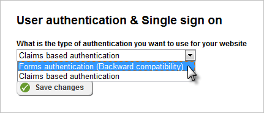
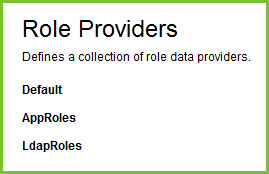

Authentication and Security
===========================

Operations in Sitefinity frequently require certain permissions.
Permissions require authentication, that is, you are who you say you
are, for Sitefinity to know what permissions to give you.

Claims vs. Forms Authentication
-------------------------------

Using the default claims authentication within Sitefinity, you will no
longer \"hit the wall\" when trying to integrate your site within a
larger security framework. Prior to version 5.x, Sitefinity used forms
authentication to verify user credentials and allow access to Sitefinity
applications. Forms authentication essentially retrieved the user\'s
name/password and checked it against user data stored in the database
for that particular application. That works well enough but comes up
short in scenarios required by many organizations:

-   Single Sign On (SSO) where you have several Sitefinity sites that
    should have only one login for the user. SSO allows you to show a
    single site to the user that is actually made up of multiple sites.

-   When you need to use authentication provided from outside the
    Sitefinity application, e.g. Active Directory domains, another
    application or certificate authorities.

-   When the login comes from a non-standard source such as biometric
    authentication.

-   When authentication lifespan should not be tied to cookie
    expiration. Using Forms Authentication, the authentication
    information is stored in a cookie and the user is logged out when
    the cookie expires.

Claims Authentication is a more robust approach that uncouples
authentication from the application logic. Claims authentication uses
these components:

-   Subject is an entity that is being authenticated, e.g. a user.

-   An Issuer makes claims about the subject and issues security tokens.

-   A Claim is an assertion about the subject, e.g. the user\'s name or
    thumbprint.

-   A Token is a digitally signed string created when the issuer makes a
    claim about a subject. The token contains authentic details about
    the subject.

The Sitefinity Claims Authentication implementation doesn\'t directly
impact backend administration or even API programming within the web
site. The real boost comes in integrating with other Sitefinity sites,
applications and services. Sitefinity REST web services for example
require a call up front to retrieve the claims token. After that, you
just pass the token in the request headers of each REST web service
call.

By default, user authentication is handled through Claims based
authentication. If you have a site built with an older version of
Sitefinity that uses web services, you may revert to Forms authentication. 
To toggle this setting, go to Administration \> Settings (Basic Settings) \> User Authentication.

For all projects going forward, Claims authentication is the stronger
choice.

Authenticate Programmatically
-----------------------------

To login programmatically, use the *SecurityManager* object and call the
*AuthenticateUser()* method. There are several overloads of this method
that all take some combination of user name and password. The example
below passes a Credentials object that simply packages up the user name,
password, persistence and provider. If the Persistent property is true,
then the authentication cookie is retained between sessions.

Credentials credentials = new Credentials()

{

UserName = \"admin\",

Password = \"password\",

Persistent = true,

};

var result = SecurityManager.AuthenticateUser(credentials);

if (result == UserLoggingReason.Unknown)

{

throw ApplicationException(\"Unable to login\");

}

The AuthenticateUser() method returns a *UserLoggingReason* enum member
that you check before taking action. For example,
*UserLoggingReason.Unknown* indicates an invalid username or password.
You can use the other members of UserLoggingReason if you need even more
specific information about how the site is being used:

  |**UserLoggingReason Enum Member**|     **Description**|
  |---|---|
  |Success                           |User was successfully registered as logged in|
  |UserLimitReached                  |The limit of maximum simultaneous logged in users is reached|
  |UserNotFound                      |User not found in any provider|
  |UserLoggedFromDifferentIp         |User is already logged in from a different IP address|
  |SessionExpired                    |Indicates that the user logical session has expired|
  |UserLoggedOff                     |User has the authentication cookie but is not logged in the database or user is already logged out.|
  |UserLoggedFromDifferentComputer   |More than one user trying to login from the same IP but from different computers.|
  |Unknown                           |Invalid username or password specified.|
  |NeedAdminRights                   |User is not administrator to logout other users|
  |UserAlreadyLoggedIn               |User already is logged in. We need to ask the user to logout or to logout someone else.|
  |UserRevoked                       |User was revoked: the user was deleted or user rights and role membership was changed.|

To logout programmatically, call the static SecurityManager.Logout()
method. This logs out the user making the current request.

SecurityManager.Logout();

You can also use a Logout() overload if you need to pass specific
credentials:

Credentials credentials = new Credentials()

{

UserName = \"admin\",

Password = \"password\",

};

SecurityManager.Logout(credentials);

**Note**: You must have administrative rights to logout other users or
match the credentials of the user to perform the logout, otherwise a
*UnauthorizedAccessException* is thrown.

Create a User
-------------

To create a user, first get an instance of the *UserManager* by calling
*GetManager()*. Then call the *CreateUser()* method and pass the login
name. Populate the returned *User* object properties, then finally call
the *SaveChanges()* method.

UserManager userManager = UserManager.GetManager();

User user = userManager.CreateUser(\"ayamada\");

user.Password = \"password\";

user.Email = \"ayamda\@mydomain.net\";

// user first and last are deprecated

user.Comment = \"Popular blogger\";

userManager.SaveChanges();

Another overload of CreateUser() allows you to set many of the
properties of the User at one time and also returns a
*MembershipCreateStatus*. If the status is equal to Success, then you
can call the SaveChanges() method.

MembershipCreateStatus createStatus;

UserManager userManager = UserManager.GetManager();

User user = userManager.CreateUser(

// user name

\"ayamada\",

// password

\"password\",

// email

\"ayamda\@mydomain.net\",

// security question

\"what is your favorite pet\'s name?\",

// security answer

\"spot\",

// isApproved

true,

// provider user key

null,

// create status

out createStatus

);

if (createStatus == MembershipCreateStatus.Success)

{

userManager.SaveChanges();

}

Create Roles and Permissions
----------------------------

You now have a user in the system, but what can they do? Not a thing. A
new user is not associated with any roles in the system and therefore
has no permissions to do anything. To give the user permissions to do
something, you must add the person to a role. The basic elements to
associating a role with a user are:

-   Get an instance of a *RoleManager* for a particular provider. The
    built-in providers available out-of-the-box are listed in
    Settings \> Security \> Role Providers. Use the *AppRoles* provider
    when trying to get at roles already in the system, such as
    *Administrators* or *BackendUsers*. For roles you create yourself,
    use the *Default* provider.

-   Get a specific Role such as BackendUsers or Authors.

-   Add the User to a Role.

-   Save the changes.

The code below adds an existing user to the Backend and Authors roles:

User user = UserManager.GetManager().GetUser(\"ayamada\");

// get the built in roles

RoleManager roleManager =
RoleManager.GetManager(SecurityManager.ApplicationRolesProviderName);

// retrieve the \"BackendUsers\" role

Role backendUserRole = roleManager.GetRoles()

.Where(r =\> r.Name.Equals(SecurityManager.BackendUsersRoleName))

.Single();

// retrieve the \"Authors\" role

Role authorRole = roleManager.GetRoles()

.Where(r =\> r.Name.Equals(\"Authors\"))

.Single();

// add the user to both roles

roleManager.AddUserToRole(user, backendUserRole);

roleManager.AddUserToRole(user, authorRole);

// save the new role settings

roleManager.SaveChanges();

The user listing shows the addition of the roles:

