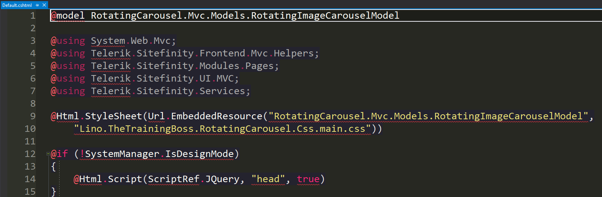
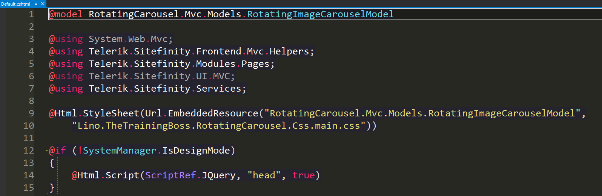

If you followed all the steps in my sample project on [Github](https://github.com/TheTrainingBoss/Lino.TheTrainingBoss.RotatingCarousel) for the **Lino.TheTrainingBoss.RotatingCarousel** you would have been able to rebuild the project successfully and deploy it to any sitefinity site with no problem.
The only thing that might have been annoying is that when you went ahead to work with your **Default.cshtml** file, you might have notices that the editor in Visual Studio is showing a lot of red lines under so many words in the file and you can't really get any help from code completion in Visual Studio.  The truth of the matter is, everything will compile fine and the cshtml file is perfectly ok and will work great, except the intellisense part which is, of course, an important piece for any developers for speed and less errors during development.



The Good news is that there is a way to work around that and make Intellisense work in Class Libraries too.

- Right click the class library project and click Properties, Navigate to the Build tab and change the Output path to "bin\"
-  Create a web.config file in the root of the class library project and insert the following:

```
<?xml version="1.0" encoding="utf-8" ?>
<configuration>
  <configSections>
    <sectionGroup name="system.web.webPages.razor" type="System.Web.WebPages.Razor.Configuration.RazorWebSectionGroup, System.Web.WebPages.Razor, Version=3.0.0.0, Culture=neutral, PublicKeyToken=31BF3856AD364E35">
      <section name="host" type="System.Web.WebPages.Razor.Configuration.HostSection, System.Web.WebPages.Razor, Version=3.0.0.0, Culture=neutral, PublicKeyToken=31BF3856AD364E35" requirePermission="false" />
      <section name="pages" type="System.Web.WebPages.Razor.Configuration.RazorPagesSection, System.Web.WebPages.Razor, Version=3.0.0.0, Culture=neutral, PublicKeyToken=31BF3856AD364E35" requirePermission="false" />
    </sectionGroup>
  </configSections>
  <system.web.webPages.razor>
    <host factoryType="System.Web.Mvc.MvcWebRazorHostFactory, System.Web.Mvc, Version=5.0.0.0, Culture=neutral, PublicKeyToken=31BF3856AD364E35" />
    <pages pageBaseType="System.Web.Mvc.WebViewPage">
      <namespaces>
        <add namespace="System.Web.Mvc" />
        <add namespace="System.Web.Mvc.Ajax" />
        <add namespace="System.Web.Mvc.Html" />
        <add namespace="System.Web.Optimization"/>
        <add namespace="System.Web.Routing" />
        <!-- add other namespaces for views here -->
      </namespaces>
    </pages>
  </system.web.webPages.razor>
  <runtime>
    <assemblyBinding xmlns="urn:schemas-microsoft-com:asm.v1">
      <dependentAssembly>
        <assemblyIdentity name="System.Web.Mvc" publicKeyToken="31bf3856ad364e35" culture="neutral" />
        <bindingRedirect oldVersion="0.0.0.0-5.2.3.0" newVersion="5.2.3.0" />
      </dependentAssembly>
      <dependentAssembly>
        <assemblyIdentity name="System.Web.WebPages" publicKeyToken="31bf3856ad364e35" culture="neutral" />
        <bindingRedirect oldVersion="0.0.0.0-3.0.0.0" newVersion="3.0.0.0" />
      </dependentAssembly>
    </assemblyBinding>
  </runtime>
</configuration>
```

- Clean the Project
- Build the project
- Restart the solution for good measure.
- Your editor now in the class library for cshtml files are ready with intellisense

