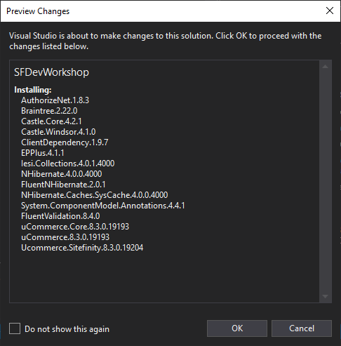

First, upon loading your Sitefinity project in Visual Studio, right click on the project in the Solution Explorer and choose "Manage NuGet Packages"

Next, you will search the online packages for "UCommerce.Sitefinity" Nuget package.

Install the latest package into your solution (or whichever version compatible with your site)

Notice all the dependencies that will be installed alongside UCommerce in Sitefinity

During the installation, you will need to accept several license agreements

and finally UCommerce is installed in your solution of Sitefinity with the final screen in Visual Studio looking something like this:

Build your project of Sitefinity in Visual Studio and browse the project in your favorite browser.

Login to the backend and you should be able to see a new menu item next to "Marketing" that says **UCommerce**.

Now UCommerce is installed and ready to setup in the backend.
