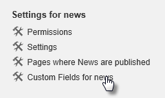
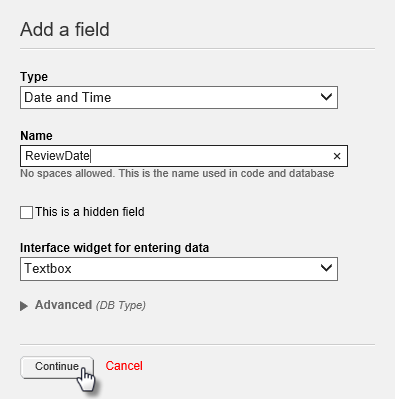
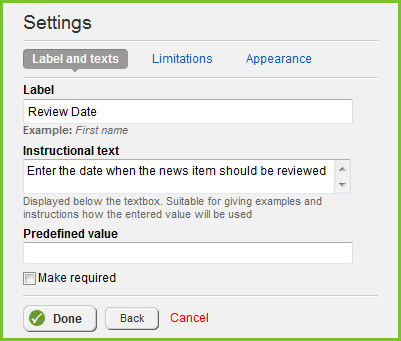
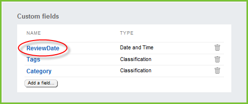
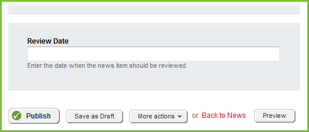
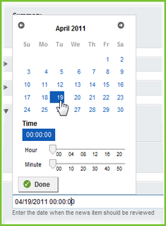
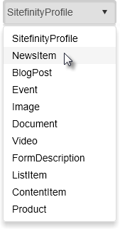
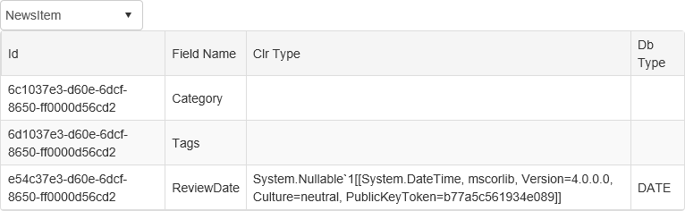

Dynamic Data
------------

Each type of content in Sitefinity has just about every property you
need. Almost. For example, news items have *SourceName* and *SourceSite*
properties to track where the news comes from originally. What if you
needed a *SourceDate* property to denote the date the source material
was obtained? Sitefinity User objects have properties for *UserName*,
*LastActivityDate* and *Email*. What if your organization needs to track
*HireDate*, *HireReason* and *NextReviewDate*?

Sitefinity allows you to create custom fields without having to register
them in code-behind or referencing libraries.

Adding Custom Fields
--------------------

You can create your own custom fields that come along for the ride when
the user enters data. Custom fields are associated with a specific type
of data, for example, *NewsItem*, *SitefinityProfile*, *Document* etc.
Custom fields can be created directly in Sitefinity administration.

1.  In the Sitefinity Administration menu, select Content \> News.
    Before proceeding, make sure that at least one news item is already
    created.

2.  Click the *Custom Fields for news* link.



3.  Choose *Date* and *Time* from the *Type* drop down list. Enter
    *ReviewDate* as the *Name* for the custom field. Click the
    *Continue* button to accept the custom field settings.\
    \
    You can choose a predefined data type from the Type drop down list.
    You can prevent the field from displaying in the editor by selecting
    the This is a hidden field check box. The *Interface widget for
    entering data* will list an appropriate editor for the type. You can
    also select the *Custom* item to use a custom control to edit the
    field. The *Advanced* section allows you to map the custom field
    data type against database types.



> In the *Settings, Label and text* tab, enter the *Label* *Review Date*
> and *Instructional text* as *Enter the date when the news item should
> be reviewed*. Click the *Done* button to close the dialog.
>
> You can also enter a default in the *Predefined value* space. Quite
> often you will want a particular field filled out every time a content
> item is created, so check the *Make required* box for ensure that the
> user can\'t save the item without making an entry.
>
> The *Limitations* tab allows you to set minimum and maximum values and
> an error message if the user entry falls outside the range. The
> *Appearance* tab determines where the field will be shown in the
> backend.



> The new *ReviewDate* field should display in the list of custom fields
> for news item. Notice that the list starts out with *Tags* and
> *Category* classification field types and that these are considered to
> be custom fields.
>


4.  Create a News Item. Scroll to the bottom of the news item to see
    your new custom \"Review Date\" field label and instruction text.



5.  Click the entry box to see the popup calendar editor.



**Note**: The Type drop down list also includes Short text, Long text,
Multiple choice, Yes / No, Currency, Number, Classification and more. You can
add multiple fields to a content type. The screenshot below shows
examples of Date-Time, Long text, Multiple choice and Currency.


Reading and Writing Custom Field Values
---------------------------------------

The most frequently asked question about custom fields is *\"how do I
read or write my custom field value\"*? The magic is in the
*DataExtensions* class from the *Telerik.Sitefinity.Model* namespace. As
the name suggests, the class contains **extension methods**, so you need to
have Telerik.Sitefinity.Model in your *using* (C\#) or *Imports* (VB)
section of code. The three key methods of DataExtensions that can be
used with Sitefinity content items are:

-   *GetValue*(<field name>)

-   *SetValue*(<field name>, <value>)

-   *DoesFieldExist*(<value>)

For example, if we retrieve a particular NewsItem, we can call the
*SetValue()* method from that NewsItem. The example below retrieves a
NewsItem where the Title property is \"Southern France Car Rally\", then
calls the SetValue() extension method, passing the field name
*ReviewDate* and a *DateTime* 30 days into the future.

```
NewsManager manager = NewsManager.GetManager();

manager.GetNewsItems().Where(n => n.Title.Equals("Southern France Car Rally"))

    .ToList()

    .ForEach(n => n.SetValue("ReviewDate", DateTime.UtcNow.AddDays(30)));

manager.SaveChanges();
```

A variation on this example uses the *GetValue()* method to pick up only
the news items that have a null *ReviewDate* and sets the field values.

```
NewsManager manager = NewsManager.GetManager();

manager.GetNewsItems().Where(n => !n.GetValue<DateTime?>("ReviewDate").HasValue)

    .ToList()

    .ForEach(n => n.SetValue("ReviewDate", DateTime.UtcNow.AddDays(30)));

manager.SaveChanges();
```

### Walk-through

This walk-through example demonstrates how to show all dynamic fields
for a selected type.

1.  In an ASP.NET web form, add a RadScriptManager, a RadComboBox and a
    RadGrid. Set the RadComboBox AutoPostBack property to \"true\". The
    markup should look like the example below. Note: be sure to drag
    these controls onto the page so that they are registered properly.

```
<form id="form1" runat="server">

    <telerik:radscriptmanager id="RadScriptManager1" runat="server">

    </telerik:radscriptmanager>

    <telerik:radskinmanager id="RadSkinManager1" runat="server" skin="Bootstrap">

    </telerik:radskinmanager>

    <div>

    </div>

    <telerik:radcombobox id="RadComboBox1" runat="server">

    </telerik:radcombobox>

    <telerik:radgrid id="RadGrid1" runat="server">

    </telerik:radgrid>

</form>
```

2.  In the code-behind, add the code below to the Page_Load event
    handler.

```
protected void Page_Load(object sender, EventArgs e)
{

    if (!IsPostBack)

    {

        MetadataManager manager = MetadataManager.GetManager();

        var types = manager.GetMetaTypes().Where(t => !t.IsDynamic);

        RadComboBox1.DataSource = types;

        RadComboBox1.DataTextField = "ClassName";

        RadComboBox1.DataValueField = "Id";

        RadComboBox1.DataBind();

    }

}
```

3.  In the page designer, double-click the RadComboBox to create a
    SelectedIndexChanged event handler.

4.  Replace the code for the SelectedIndexChanged event handler with the
    code below. The event handler converts the selected combo box item
    value back into a Guid. Next, the CLR type for the selected type is
    retrieved. Finally, all the fields for the selected item type are
    retrieved, reshaped to only use a few columns and bound to the grid.

```
protected void RadComboBox1_SelectedIndexChanged(object sender, RadComboBoxSelectedIndexChangedEventArgs e)
{

    MetadataManager manager = MetadataManager.GetManager();

    Guid typeId = new Guid(e.Value);

    var metaType = manager.GetMetaType(typeId);

    var fields = metaType.Fields

        .Select(f => new

            {

                Id = f.Id,

                FieldName = f.FieldName,

                ClrType = f.ClrType,

                DbType = f.DBType

            });

    RadGrid1.DataSource = fields;

    RadGrid1.DataBind();

}
```

5.  Run the application.



When an item is selected from the drop-down list, the fields for the
type display in the grid. In the screenshot below, the NewsItem type is
selected and shows custom \"ReviewDate\" field.

