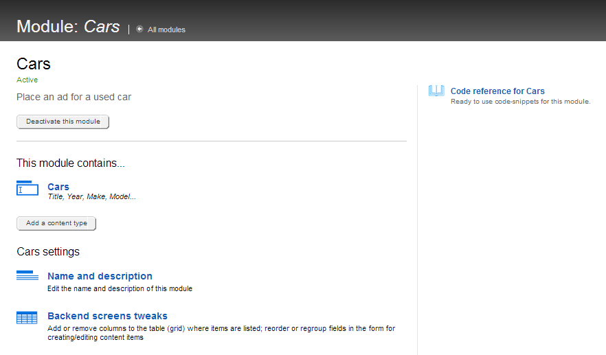
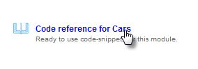
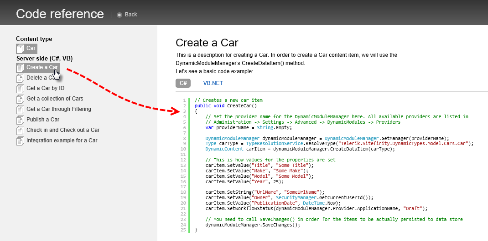
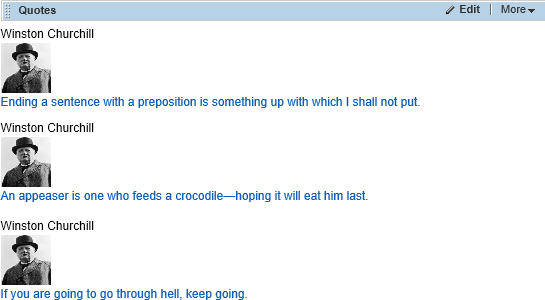

Dynamic Types
--------------------

You can build custom code against a new dynamic data module starting
from automatically generated examples. We won't be discussing how to
build a module in Administration \> Module builder, but will be using
pre-generated code sample snippets generated from an existing module:

1.  Click Administration \> Module builder.

2.  Click the module name to open that specific custom content module.

> The module appears with sections devoted to editing the content types,
> settings and, on the right-hand side of the screen, a code reference
> link for the module.
>

3.  Click the code reference link.

4.  Click the *Create* option link in the left side menu.

The list on the left has starting points for all the critical areas
you\'re likely to need: create, delete, find by id, get a collection,
filter, check in/out and integration with ASP.NET. The corresponding
code for each item shows on the right side, followed by a short
explanation of the generated code and a listing of required namespaces.

Here\'s the generated code that creates a *Car* content item. This just
creates a draft version of the Car item.

// Creates a new car item

public void CreateCar()

{

// Set the provider name for the DynamicModuleManager here.

// All available providers are listed in

// Administration \> Settings \> Advanced \> DynamicModules \> Providers

var providerName = String.Empty;

DynamicModuleManager dynamicModuleManager =

DynamicModuleManager.GetManager(providerName);

Type carType = TypeResolutionService.ResolveType(

\"Telerik.Sitefinity.DynamicTypes.Model.Cars.Car\");

DynamicContent carItem =

dynamicModuleManager.CreateDataItem(carType);

// This is how values for the properties are set

carItem.SetValue(\"Title\", \"Some Title\");

carItem.SetValue(\"Make\", \"Some Make\");

carItem.SetValue(\"Model\", \"Some Model\");

carItem.SetValue(\"Year\", 25);

carItem.SetString(\"UrlName\", \"SomeUrlName2\");

carItem.SetValue(\"Owner\", SecurityManager.GetCurrentUserId());

carItem.SetValue(\"PublicationDate\", DateTime.Now);

carItem.SetWorkflowStatus(

dynamicModuleManager.Provider.ApplicationName, \"Draft\");

// You need to call SaveChanges() in order for the items

// to be actually persisted to data store

dynamicModuleManager.SaveChanges();

}

Here's another example with a custom module called Quotations. The Title
field is the name of the person being quoted, Picture is an image field
of the person being quoted and the Text of the quote is a short string.
The example iterates an array of quotations for raw material, creates
each Quote item, then publishes each item.

private string\[\] quotations =

{

\"Ending a sentence with a preposition is something up with which I
shall not put.\",

\"An appeaser is one who feeds a crocodile---hoping it will eat him
last.\",

\"If you are going to go through hell, keep going.\",

\"History will be kind to me for I intend to write it.\",

\"It has been said that democracy is the worst form of government
except\" +

\" all the others that have been tried.\"

};

The quotations are added en masse to the Quotations custom module. The
custom *CreateQuote()* method is a copy of the generated code from the
*Publish a Quote* link. The one-time tasks like getting the manager for
the module and retrieving a single image from the library are all put up
front, before the loop that iterates the quotation strings.

public void CreateQuote()

{

var providerName = String.Empty;

DynamicModuleManager dynamicModuleManager =

DynamicModuleManager.GetManager(providerName);

Type quoteType = TypeResolutionService.ResolveType

(\"Telerik.Sitefinity.DynamicTypes.Model.Quotations.Quote\");

// get winston\'s picture from the library

LibrariesManager pictureManager = LibrariesManager.GetManager();

var pictureItem = pictureManager.GetImages().FirstOrDefault(i =\>

i.Status == ContentLifecycleStatus.Master &&

i.Title.Equals(\"winston\"));

var count = 1;

}

Inside the loop that iterates the quotes, each data item is created and
the values are set. The *Lifecycle.Publish()* method publishes the quote
item and the *SetWorkflowStatus()* method tracks the current state of
the quote item.

foreach (var quote in quotations)

{

// create a single quote item

DynamicContent quoteItem =

dynamicModuleManager.CreateDataItem(quoteType);

// set quote item properties

quoteItem.SetValue(\"Title\", \"Winston Churchill\");

quoteItem.SetValue(\"Text\", quote);

quoteItem.CreateRelation(pictureItem, \"Picture\");

quoteItem.SetString(\"UrlName\", \"winston-quote\" + count.ToString());

quoteItem.SetValue(\"Owner\", SecurityManager.GetCurrentUserId());

quoteItem.SetValue(\"PublicationDate\", DateTime.UtcNow);

// create a draft of the quote item

quoteItem.SetWorkflowStatus(

dynamicModuleManager.Provider.ApplicationName, \"Draft\");

dynamicModuleManager.SaveChanges();

// publish the quote item

ILifecycleDataItem publishedQuoteItem =

dynamicModuleManager.Lifecycle.Publish(quoteItem);

quoteItem.SetWorkflowStatus(

dynamicModuleManager.Provider.ApplicationName, \"Published\");

dynamicModuleManager.SaveChanges();

count++;

}

A default Quotes widget is added to the toolbox automatically when you
create the module. The widget shows a generic list titles. You will need
to edit the widget template to show all the data from your module item.
The template for single items will show all fields, so you can steal
markup from there to update the widget's list template.

