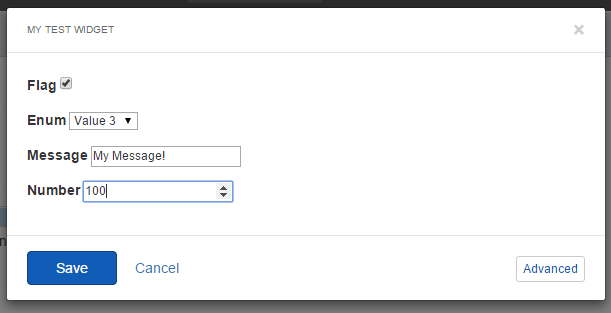
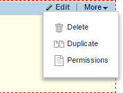
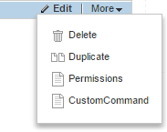
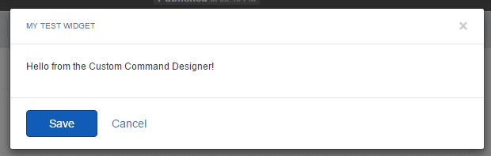

Sitefinity Feather
==================

What is Feather?
----------------

The Sitefinity Feather module is a collection of resources and
conventions to simplify the creation and management of widgets, layouts,
and templates. It is a free module, built into Sitefinity and is enabled
by default on new Sitefinity installations, adding a complete framework
to take control the site's layout and markup.

Designer Features
-----------------

Many of the features offered by Feather are relevant to designers, as
they relate to creating and editing custom templates for Page Templates
and Widgets using MVC Layouts and Views. These features are covered in
more detail in the [Sitefinity Designer Workshop](https://github.com/TheTrainingBoss/Sitefinity-Designers-Workshop):

-   MVC Stock Widgets

-   Dynamic Module Widgets

-   Widget designers with Angular Support

-   Convention-based Customization

-   Templating via Routing

-   Layout Widget Templates

-   Resource Packages

-   Creating Page Templates from MVC Layout Files

If you need more customization than the stock MVC widgets provided by
Feather, you can always create your own. While creating Sitefinity
widgets with MVC is not new to Feather, it adds helpful new routing
features, making it easier to support Master/Detail relationships, as
well as filtering by category or Tag. Just add the appropriate methods
to your controller and Feather takes care of the rest.

Editing one of these widgets also reveals the new Widget Designers from
feather, which leverage AngularJS to create responsive, performant
designers.

MVC Widgets
-----------

If the default widgets provided by Feather don't have the functionality
you require, you can replace them with your own custom versions.

Sitefinity has had the ability to create MVC widgets since version 5.1.
However, Feather has some helpful features to enhance your Sitefinity
MVC widgets by following a few conventions.

**Note**: these features are expressly intended for use within widgets
that handle Sitefinity-specific content (like News, Blogs, etc.). If you
are creating custom widgets that do not interact with Sitefinity content
items, these features would not apply.

Adding Master Detail Actions
----------------------------

The "Master" view of a widget is intended to present a list of the
specified content items, and often will require paging to partition them
for easier reading. Feather offers a convention to accept the page
number as a Url route parameter, automatically passing it to your widget
to help you page your results.

For this to work you simply need to create the method *Index(int? page)*
in your MVC Controller.

```
public ActionResult Index(int? page)
{

    //...

    return View(model);

}
```

Feather will automatically route to this command, passing in the page
parameter from the Url. You can then use this value to appropriately
page the results in the action.

Similarly, a "Detail" action can be added to your MVC Controller to
allow Feather to automatically pass an instance of the requested content
item, based on the Url of the page. Simply add the following action to
your controller:

```
public ActionResult Details(NewsItem newsItem)
{

    return View(newsItem);

}
```

As long as the url matches a content item of the type specified
(NewsItem in the sample above, but can be any Sitefinity content type),
your action will be passed the content item via the supplied parameter.

Filter by Taxonomy
------------------

Feather also allows you to easily add route-based filtering to your
Sitefinity MVC content widgets by implementing the following action on
your controller:

```
public ActionResult ListByTaxon(ITaxon taxonFilter, int? page)
{

    var manager = NewsManager.GetManager();

    string fieldName;

    if (taxonFilter.Taxonomy.Name == "Categories")

        fieldName = taxonFilter.Taxonomy.TaxonName;

    else

        fieldName = taxonFilter.Taxonomy.Name;

    var items = manager.GetNewsItems().Where(n => n.GetValue<IList<Guid\>>(fieldName)

        .Contains(taxonFilter.Id) && n.Status == ContentLifecycleStatus.Live)

        .ToList();

    return View(\"Index\", items);

}
```

If the url contains a parameter that matches a taxonomy defined in
Sitefinity, it will be populated in the *ListByTaxon()* method. The
method includes the type of the taxonomy (such as Category or Tag) and
allows custom filtering on the items returned to the view.

RelativeRoutes
---------------

Standard MVC controllers can use the *Route* attribute to explicitly
specify routing configuration. Feather enhances this feature by adding
the *RelativeRoute* attribute. This performs similarly to the regular
Route attribute, but instead of the defined route being determined from
the root path of the application (or controller), it instead defines the
route starting from the url path of the Sitefinity page node on which
the MVC Widget is placed.

Combining these two attributes give your custom widgets powerful routing
options to cover a wide variety of scenarios, including allowing the
widget itself to serve API calls.

**Note**: If the *RelativeRoute* attribute is used on an action, all of
the default routing, both from Sitefinity and Feather, is ignored.
Instead, you must apply at least one of the routing attributes to every
action in your Controllers for them to respond to requests.

Also note that a regular *Route* attribute cannot include a path that
matches an existing page url, as this route would be prioritized to the
Sitefinity page handler, attempt to resolve the route as relative, and
result in a 404 error.

We'll demonstrate this feature by creating a simple widget with two
routes, showing how the attributes control how the widget renders
content.

1.  In Visual Studio Solution Explorer, navigate to the path
    /Mvc/Controllers.

2.  Create a new class file called MyRouteTestController.cs and enter
    the code below.

```
using System;

using System.Collections.Generic;

using System.Linq;

using System.Web;

using System.Web.Mvc;

using Telerik.Sitefinity.Mvc;

namespace SitefinityWebApp.Mvc.Controllers

{

    [ControllerToolboxItem(Name = "MyRouteTest", SectionName = "Mvc Widgets", Title = "My Route Test Widget")]
    public class MyRouteTestController : Controller
    {

    [RelativeRoute("")]
    public ActionResult Index()
    {

        return View();

    }

    [RelativeRoute("Relative")]
    public ActionResult RelativeRoute()
    {

        return Content("This is the result of a relative," + " route and is placed directly on the page.");

    }

    [Route("custom/direct")]
    public ActionResult DirectRoute()
    {

        return Content("This result is accessed by navigating" + " to the path: custom/direct/route and returns plain" + " text directly to the caller.");

    }

    [Route("test/direct")]
    public ActionResult Invalid()
    {

        return Content("This result will never be seen, " + " because the test route will be first intercepted" + " by the page, so the direct route parameter " + " will result in a 404.");

    }

    [RelativeRoute("dual")]
    [Route("custom/dual")]
    public ActionResult MyRegularRoute()
    {

        return Content("This result can be routed by the" + " relative path (showing this content on the host" + " page) or via the direct route, which returns" + " plain text to the caller.");

    }

    }

}
```

3.  Create a new page called "Test" with *urlname* "test".

4.  Drag the widget from the Mvc section in the toolbar.

5.  Publish the page.

6.  Navigate to the page on the frontend path \~/test and observe that
    the default relative route content is displayed.

7.  Navigate to the other relative route \~/test/relative and observe
    that we now see the content from that assigned route.

8.  Navigate to the regular route \~/custom/direct and observe that we
    now get a plain text result of that route action.

9.  Navigate to the regular route \~/test/direct and observe that this
    route results in a 404 error.

10. Navigate to the dually defined route \~/test/dual and observe that
    we see the content of the route action rendered to the parent page,
    as part of the widget contents.

11. Navigate to the final route \~/custom/dual and observe that we see
    the same content as the previous *RelativeRoute* but instead receive
    a plain-text version of the route.

Widget Designers
----------------

When building custom widgets, you likely have a set of properties that
need to be set by editing the properties of the widget on the page.
Sitefinity does provide a default editor interface for your widgets,
exposing any public properties for edit. However, this editor is a
simple one, showing only a textbox input for all fields, regardless
their underlying type.


Previous to Feather, Sitefinity Thunder attempted to improve things by
generating designers based on existing widgets, creating the code files
and templates necessary to render more interactive inputs and selectors.
However, the components required were numerous and cumbersome, and the
generated code was verbose and error prone.

Fortunately, all of this is alleviated with the introduction of Feather,
which adds a complete framework for creating designers for your widgets.
Like most of the customization provided by Feather, it relies on
conventions for naming and placing your designer templates in the right
location.

ControllerContainer Attribute
------------------------------

Custom designers are actually served as partial views, and by default,
will not be served properly by Sitefinity. If you simply add the
designer templates, although you will see them listed in your widget
designers, selecting them will result in an error similar to this:

> The partial view \'DesignerView.MyDesigner\' was not found or no view
> engine supports the searched locations.

The fix is to configure your Sitefinity application to properly behave
as a container for these partial views. To achieve this in your web
project, open the file located at \~/Properties/AssemblyInfo.cs and add
the following lines:

using Telerik.Sitefinity.Frontend.Mvc.Infrastructure.Controllers.Attributes;

\[assembly: ControllerContainer\]

Now your designer views will be properly served.

Widget Designers Naming Convention
----------------------------------

The naming convention for widget designers is similar to the frontend
portion of the widget template, but using the prefix for the type of
view being shown, for example "DesignerView". To demonstrate this, we'll
create a simple MVC widget by adding the following class to your root
Mvc/Controllers folder.

```
using System.Web.Mvc;
using Telerik.Sitefinity.Mvc;

namespace SitefinityWebApp.Mvc.Controllers

{

    public enum Enumeration
    {
        Value1,
        Value2,
        Value3
    }

    [ControllerToolboxItem(Name = "MyTestWidget", SectionName = "Mvc Widgets", Title = "My Test Widget")]

    public class MyTestWidgetController : Controller
    {
        public string Message { get; set; }
        public bool Flag { get; set; }
        public Enumeration Enum { get; set; }
        public int Number { get; set; }
    }

}
```

Create a new page and place this widget on the page. To keep things
simple, do not use a Resource Package template, but instead use a plain
blank page with no template.

Now that we have a widget with some properties, let's proceed to create
a designer.

1.  Navigate to the path \~/Mvc/Views.

2.  Create a new folder called MyTestWidget.

3.  Create a file in the folder named DesignerView.MyDesigner.cshtml.

4.  Add the following markup to the file's contents:

\<p\>Hello from my custom designer!\</p\>

To see the custom designer in action, open a page which contains the
custom widget and click *Edit* to manage its properties. This action
reveals the standard designer, but at the bottom of the default designer
will be a new button pointing to your custom template.


Clicking it will load that designer into the editor.


Prioritizing the Custom Designer
--------------------------------

Instead of making your designer an option, you can configure Sitefinity
to load your designer by default. To do this, simply create a file
alongside the template, named to match exactly except using the
extension *.json*, and add the following contents:

{

\"priority\": 1

}

For our example, we would create the file DesignerView.MyDesigner.json
and place it in the same folder. Next time we load the editor we'll
automatically see our custom designer template.

Adding Fields with Angular

The designer framework for Sitefinity widgets uses AngularJS, and can be
extended by leveraging Directives. A complete discussion of AngularJS is
outside the scope of this workshop, and for reference we recommend you visit
<http://angularjs.org> to learn more.

Each widget designer is passed an AngularJS *\$scope* which contains all
the appropriate objects necessary to build the designer interface.
Included in that \$scope is the *properties* object, which references
the public properties exposed by the widget being edited. This allows
you to leverage the various Angular directives to bind property values
to editors and allowing simple edits to be saved automatically without
writing code.

For example, we can create a complete (if entirely simple) UI for our
custom widget editor by adding the following markup:

```
<fieldset>

<p>

<label for="flag"\>Flag</label>

<input type="checkbox" id="flag" ng-model="properties.Flag.PropertyValue" /\>

</p>

<p>

<label for="enum">Enum</label>

<select id="enum" ng-model="properties.Enum.PropertyValue"\>

    <option value="Value1">Value 1</option>

    <option value="Value2">Value 2</option>

    <option value="Value3">Value 3</option>

</select>

</p>

<p>

<label for="message">Message</label>

<input id="message" type="text" ng-model="properties.Message.PropertyValue" />

</p>

<p>

<label for="number"\>Number</label>

<input id="number" type="number" ng-model="properties.Number.PropertyValue" />

</p>

</fieldset>
```

Reloading the designer reveals an interface that is more intuitive than
the standard textboxes offered by the stock version.



Adding Custom Commands to Widgets
--------------------------------

Each widget has a simple set of commands in the backend; such as the
Edit and Delete commands we've already seen.



Feather makes it easy for you to expand the list with custom commands,
simply by making a few changes to the widget controller. Specifically,
the controller needs to implement the *IHasEditCommands* interface, and
adding a few methods, as shown here for our sample widget from above:

```
public class MyTestWidgetController : Controller, IHasEditCommands
{
    public string Message { get; set; }
    public bool Flag { get; set; }
    public Enumeration Enum { get; set; }
    public int Number { get; set; }
    private IList<WidgetMenuItem> commands;
    
    public IList<WidgetMenuItem> Commands
    {
        get 
        {
            if (commands == null)
            {
                commands = new List<WidgetMenuItem>();
                // restore the default commands
                commands.Add(new WidgetMenuItem()
                    {
                        Text = Res.Get<Labels>().Delete,
                        CommandName = "beforedelete",
                        CssClass = "sfDeleteItm"
                    });
                commands.Add(new WidgetMenuItem()
                {
                    Text = Res.Get<Labels>().Duplicate,
                    CommandName = "duplicate",
                    CssClass = "sfDuplicateItm"
                });
                commands.Add(new WidgetMenuItem()
                {
                    Text = Res.Get<Labels>().Permissions,
                    CommandName = "permissions",
                    CssClass = "sfPermItm"
                });

                // Add the custom command
                var packageManager = new PackageManager();
                var customActionLink = packageManager.EnhanceUrl(RouteHelper.ResolveUrl(
                    "Telerik.Sitefinity.Frontend/Designer/Master/MyTestWidget?view=CustomCommand", UrlResolveOptions.Rooted));
                
                commands.Add(new WidgetMenuItem()
                {
                    Text = "CustomCommand", 
                    ActionUrl = customActionLink, 
                    NeedsModal = true
                });
            }

            return commands;
        }

    }
}
```

Note that in this case, we've added the original commands to the
Commands collection. This is because adding a custom command to a widget
clears any existing commands. Unless you have no further need for the
original commands, be sure to add them back as shown in this example.

Also, notice that we create the path to the *ActionUrl* for the custom
command by using the *PackageManager* class, specifically the
*EnhanceUrl* method. This allows us to map the *CustomCommand* to the
appropriate route for its designer.

Refreshing the page editor reveals the new command in the widget menu:



Clicking CustomCommand will result in an error, since the command also
needs a designer.

Fortunately, this is simply another template file that follows the same
naming convention as the editor designer templates. We can simply add
the file DesignerView.CustomCommand.cshtml alongside the existing
designer with the following markup:

\<p\>Hello from the Custom Command Designer!\</p\>

Now clicking the new command reveals our designer, completing the custom
command.



Finally, to prevent this designer from mistakenly being presented as an
option in the regular editor designer, simply add a matching json file
(in this case DesignerView.CustomCommand.json) to the folder with the
following contents:

```
{
  "hidden": true
}
```

The template will now be hidden from the designer, but still visible
when launched from the custom command.

You can then use these templates to create a separate section of your
website that display mobile content, then detecting and redirecting
mobile devices to those pages.
