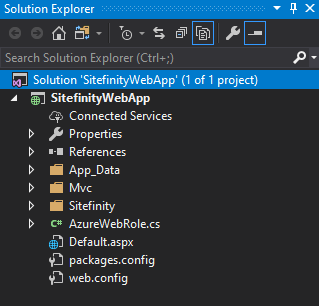

What Flavor API?
----------------

To work with Sitefinity programmatically:

- Use the Sitefinity API. This is the full-featured API that provides the deepest set of features for controlling Sitefinity functionality. Use the Sitefinity API to access everything that Sitefinity has to offer. Here is an example of the Sitefinity API that returns all blog posts:

BlogsManager manager = BlogsManager.GetManager();

IQueryable\<BlogPost\> blogs = manager.GetBlogPosts();

You can also use the Fluent API. The Fluent API is a wrapper around the
Sitefinity API that surfaces the most commonly used features.

var blogs = App.WorkWith().BlogPosts().Get().ToList();

-   Use Sitefinity Web services. Sitefinity offers two ways to work with REST web services from any client platform that can hit a URL, including Linux, Windows, Mac, I-whatever (iPad, iPhone), WPF, Flash, Android, etc.

 The original WCF services can communicate in XML or JSON (for easy access in JavaScript client code). They are mature and offer the most complete coverage, but are more verbose to work with. The example below brings back a list of all blog posts in XML format from \"\<my site\>\".

http://localhost:12345/mysite/sitefinity/services/Content/BlogPostService.svc/xml

Now in Sitefinity is the Web Services module, which gives you the ability to create API endpoints using the familiar Sitefinity Backend interface. The endpoints are lighter, customizable, and easier to use than the WCF services. This example of an API call returns the list of news items in JSON format:

http://localhost:12345/mysite/api/default/newsitems

Sitefinity Projects in Visual Studio
------------------------------------

A Sitefinity web site is really an ASP.NET web site at its heart and can
be worked with just like any other ASP.NET web site. The major
difference is that page creation is performed automatically using
information from the database

The first thing to notice is that we're working with a web application
project, **not a web site**. A web site is a loose collection of files, but
a project is managed as a whole and is compiled into a single DLL
assembly. There is one default.aspx page in the project to keep IIS
happy, but all the pages actually used in the project are stored in the
database. As a result, the project structure may not change much as the
content grows.

Configuration
-------------

In past versions of Sitefinity, the web.config file was huge, but the
Sitefinity architecture has moved all of the Sitefinity-specific
configuration to separate XML files for easier handling. Only ASP.NET
related configuration is left in the web.config. This architecture is
easier to maintain and also handles updates better, even if the
web.config is overwritten.

All these files are written to from the Sitefinity back end
administration, but you can find the XML files in
*\\App\_Data\\Sitefinity\\Configuration*. To make the configuration
folder visible in the Visual Studio Solution Explorer, you will need to
select the project folder, then click the toolbar *Show All Files*
button.

Getting Started with Sitefinity Development
===========================================

In the next several sections, we'll look at how to use the Sitefinity
API to work with Sitefinity content on the server with C\# code. Then in
the final section we'll demonstrate how you can use Web services to do
client-side development with Sitefinity content.

Using the Sitefinity API
------------------------

The Sitefinity API is used to power widgets and to create and edit pages
and content programmatically. For example, you could modify all the
pages on the site in a batch. This opens up possibilities for creating
your own set of utility classes that iterate and modify pages, create
new pages, look for specific keywords, find locked pages, hunt for empty
keywords and so on.

Your custom server-side code can be placed directly into a standard
ASP.NET page or user control code-behind or MVC Controller. Because these are added to the
same Sitefinity application project, your code runs within the
Sitefinity context, and will execute with the same context as the
currently logged in (or anonymous) user.

For the purposes of the examples in this chapter, we'll add a simple
blank ASP.NET web form to the project and add our custom code to its
code-behind. If this code requires administrative privileges, be sure to
login to the Sitefinity backend before loading this custom page.

Prepare the Sitefinity Project in Visual Studio
-----------------------------------------------

This walk-through assumes you already have a Sitefinity web site
created. You can navigate from the Sitefinity Project Manager by
clicking the *Edit in Visual Studio* button.

You can also open the Sitefinity project directly from the Visual Studio
*File \> Open \> Project/Solution* menu. The initial default project
location is in the Sitefinity installation directory under the Projects
folder. Once you have the project open in Visual Studio, you can close
the Sitefinity Project Manager application.

Next, setup a standard web forms .aspx page to contain your API code:

1.  Right-click the project and select *Add \> New Item\...* from the context menu.

2.  In the *Add New Item* dialog, select the *Web \> Web Form item* and set the *Name* to *MyPagesList.aspx*.

3.  Click the *Add* button to create the page and close the dialog.

**Next Topic:**
[Working with Pages](../Working%20with%20Pages/readme.md)