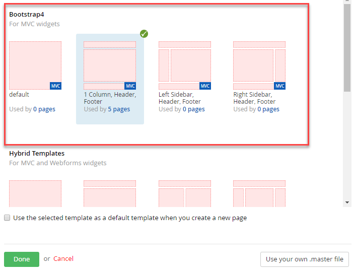
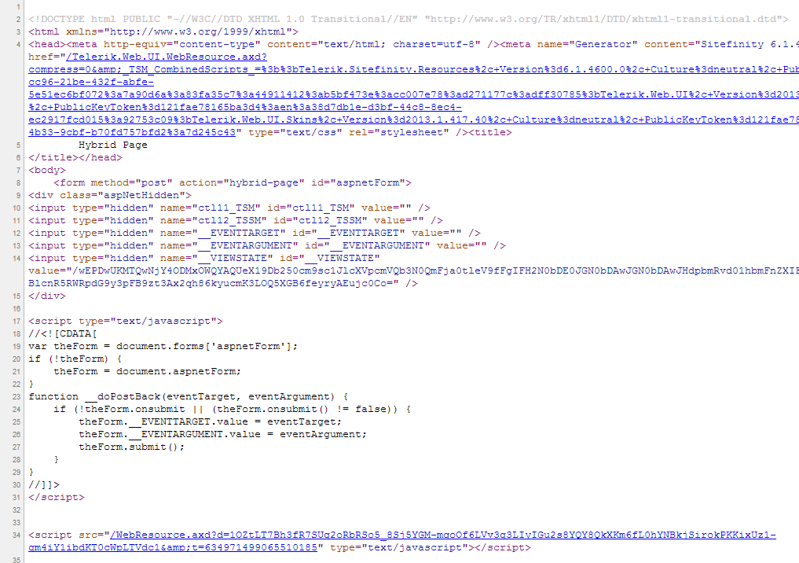

Using MVC in Sitefinity
=======================

In addition to using traditional Web Form User Controls (ascx),
developers can also take advantage of Sitefinity's support for MVC to
create widgets. By using the familiar Model-View-Controller pattern,
developers can quickly create widgets with full control over the markup,
resulting in simpler, testable code.  **This is now the preferred way in Sitefinity going forward!**

Choosing MVC or WebForms
------------------------

It is important to remember that using MVC is **preferred** in
Sitefinity over Web Forms. Sitefinity gives developers the choice of
either (or both) platforms to create widgets that best suit their needs.

Progress has made it clear that MVC development in Sitefinity is the
choice going forward even though Web forms will continue to be supported
for a "while" :)

Choosing MVC
------------

Using MVC for creating widgets offers the following advantages:

-   Using the familiar MVC pattern to separate concerns between data
    processing and data presentation

-   Full control over the rendered HTML markup, including adapting
    output to different devices

-   MVC Controllers and models are testable without requiring a full
    HTTP context

-   Easily port in existing MVC applications, or run them side-by-side
    with Sitefinity

-   Compatible with Telerik MVC Extensions

-   **Does not require ViewState**

It is also important to keep in mind some of the disadvantages of using MVC:

-   Requires that developers understand or learn the MVC pattern

-   It is stateless, which is not a disadvantage in itself, but
    information is not persisted between pages as WebForms does using
    ViewState

-   You cannot leverage existing ASP.NET WebForm controls (such as Telerik RadControls)

Choosing WebForms
-----------------

Widgets developed using traditional WebForm User Controls offer the following advantages:

-   Familiar and mature platform with many existing controls and
    off-the-shelf components from so many vendors

-   Easily port in existing WebForm applications by moving logic and
    markup to User Controls

-   Page state can be easily maintained using ViewState and Post backs

-   Many controls (such as GridView) bind declaratively to data and
    require no additional code

However, choosing WebForms over MVC also exposes the following disadvantages:

-   Code-behind is tightly coupled to the HTML, which can impact
    readability, maintainability, and reusability of complex widgets
    with many controls on the page

-   WebForms require an HTTP Context, and cannot be tested without a
    Mocking framework

-   Less control over HTML output, as this is often defined by the
    controls being used

You can use Both
----------------

The implementation of MVC within Sitefinity allows developers to
leverage both options simultaneously on a page, mixing traditional
WebForm widgets with MVC.  This is called the "HYBRID" way.

Sitefinity MVC Modes
--------------------

Sitefinity MVC can operate in one of three modes: Classic, Pure, and
Hybrid. These three options are what allow Sitefinity to "mix and match"
between WebForms and MVC.

Classic MVC Mode
----------------

Classic MVC is simply the traditional ASP.NET MVC implementation. It is
most useful for porting an existing application into a website to
operate alongside Sitefinity, or creating a separate MVC application
within the solution.

In either case, the MVC application does not interact with Sitefinity,
so you are not able to manage content on pages or controllers using the
Sitefinity Administration. Instead, the MVC application responds to
requests using the traditional ASP.NET MVC routing and architecture.

Pure MVC Mode (PREFERRED)
------------------------

If you are using MVC widgets exclusively, and do not wish to use or
display the existing WebForm widgets, you can enable Sitefinity to work
in Pure MVC mode. Choosing this mode leverages the MVC framework
exclusively, meaning that there will be no ViewState, Post backs, or
server-side controls to maintain, allowing you to develop fully in the
MVC platform.

An advantage of using Pure MVC mode is that it allows a Sitefinity page
to host multiple MVC widgets. A Sitefinity page is able to route the
page request to each widget on the page, allowing each to render its
markup individually to makeup the page contents.

To enable MVC Pure mode, use any of the Bootstrap based templates to be the base of your pages.



Once the template is created you can proceed to edit its contents, or
create a new Sitefinity page using it as a base template. Keep in mind
that in Pure MVC mode, the only widgets that will be displayed in the
Toolbox or useable on the page are those built using MVC.


When viewing the HTML source of a published page using Sitefinity MVC
Pure mode, you will see that the markup is free of the traditional
WebForms content such as ViewState, and instead renders a light, clean
markup.

Hybrid MVC Mode
---------------

Choosing this mode displays both the traditional WebForm toolbox items, as well
as MVC widgets when editing a page, allowing you to mix and match widget types.


When viewing the source of a Sitefinity MVC Hybrid mode page, the more
traditional WebForms markup is present, while still allowing the MVC
widget to control its own rendered markup.



Input Forms with Hybrid Mode
----------------------------

One important note to keep in mind: WebForms require that only a single
FORM tag be present on the page. As a result, if you wish to create an
input form inside an MVC widget using Hybrid mode, you must use a
special Html helper \@Html.BeginFormSitefinity instead of the
traditional MVC \@Html.BeginForm to ensure that your form posts
correctly.

Choosing an MVC Mode
--------------------

The choice of Sitefinity MVC mode depends on how MVC will be used in the
website application, and can all be used simultaneously in different
areas of the site.

If you are running a separate, standalone MVC application, using Classic
mode by registering custom routes will allow it to run alongside the
existing Sitefinity site.

If you want full control over HTML markup by using only MVC-based
widgets, creating your Sitefinity page templates with the MVC-only
option will result in a light, clean HTML output, with full control via
the MVC pattern.

Finally, if you want to be able to leverage the existing Sitefinity
widgets, as well as custom WebForm User Controls and MVC-based widgets
on the same page, the default Hybrid mode will allow you to do this.

Creating MVC Widgets
--------------------

Creating a new MVC widget simply involves creating the traditional
Controller, Model, and View components in the supplied *MVC* folder of
the Sitefinity solution, then registering the Controller as a widget.

To demonstrate this, we'll create a sample widget by first declaring a
sample model. Add a new class file MyMvcWidgetModel.cs to the *Models*
folder of the Sitefinity project Mvc folder with the following code:

```
public class MyMVCWidgetModel
{

    /// <summary>

    /// Gets or sets the message.

    /// \<summary>

    public string Message { get; set; }

}
```

Next, add another class file MyMvcWidgetController.cs to the
*Controllers* folder with the following code:

```
public class MyMVCWidgetController : Controller
{

    public ActionResult Index()

    {

        var model = new MyMVCWidgetModel();

        model.Message = "Hello, World!";

        return View("Default", model);

    }

}
```

As you can see, the Controller is a traditional MVC controller and
indeed even inherits from the standard *System.Web.Mvc.Controller* base
class. Sitefinity is also able to recognize the default *Index* action,
while still being able to pass in a named view, in this case "Default".

Finally, we need a new file named Default.cshtml (to match the "Default"
view being requested by the *Index* action). This file should be added
to the *Views* folder, but in a subfolder named MyMvcWidget, to match
the name of the controller. This is a naming convention used by MVC so
that it can find the desired view by name automatically.

Create a folder under the Views folder named MyMvcWidget, and add the
file Default.cshtml with the following markup:

```
@model SitefinityWebApp.Mvc.Models.MyMVCWidgetModel

<h1>

    @Html.Raw(Model.Message)

</h1>
```

With these three components (Controller, Model, View) in place, we can
now register the controller as a widget for use in the Sitefinity page
toolbox.

Registering the Widget in the Toolbox
--------------------------------------

The only step required here is to decorate the Controller class with the
*ControllerToolboxItem* attribute, which contains parameters for naming
and placing the widget. The attribute below will give the widget the
title of "My MVC Widget", placing it in the Toolbox section named
"MvcWidgets".

[ControllerToolboxItem(Name = "MyMVCWidget", Title = "My MVC Widget", SectionName = "Mvc Widgets")]

Save your changes and build your solution. Sitefinity will now
automatically discover this widget through the attribute, and place it
in the appropriate section. If the section does not exist it will create
it and add it to the toolbox.


Creating a Control Designer
---------------------------

Sitefinity MVC widgets can have control designers just like standard
WebForm User Control widgets. The process for creating and registering
designers is also done via attributes.

Sitefinity Thunder MVC Widget Template
---------------------------------------

**Note: Thunder is not available in Visual studio 2017 or 2019 and newer
versions of Visual Studio. Because Progress is concentrating on MVC and
Thunder is 90% all about Web Forms, it is not expected that Thunder will
have a new revision. Going forward you will need to learn the Sitefinity
VSIX and CLI to generate code-based items in Sitefinity in Visual Studio
2017 and newer.**

Although creating MVC widgets is simple enough, Sitefinity Thunder
includes a helpful MVC Widget template that will generate sample code
for the Controller, Model, and View, and even place the files in the
appropriate sections to get you started. Thunder can even generate the
control designer for the widget automatically, either during creation of
the widget, or to an existing MVC widget.

To generate an MVC widget after installing Sitefinity Thunder,
right-click the *MVC* folder in your Sitefinity solution and select *Add
New Item*. In *the Add New Item* dialog, select *Sitefinity* from the
options on the left, revealing the installed Thunder templates, and
choose *Sitefinity MVC Widget with Designer*.


Name your widget then click *Add* to continue. Thunder will prompt you
to create a designer for the widget as well, which you can do by
checking the appropriate box.


This will create a very basic control designer for the sample widget. If
you plan to add additional properties to the control, it may be a better
idea to skip this option, then come back later to use the Designer for
Existing Widget template.

Alternatively, you can now leverage the MVC platform to create widget
designers more intuitively, using a new Sitefinity module called
Feather using Angular.
