Sitefinity Developers Workshop
=============================

*©2019 Alain "Lino" Tadros*

All rights reserved. No parts of this work may be reproduced in any form
or by any means - graphic, electronic, or mechanical, including
photocopying, recording, taping, or information storage and retrieval
systems - without the written permission of the publisher.

Products that are referred to in this document may be either trademarks
and/or registered trademarks of the respective owners. The publisher and
the author make no claim to these trademarks.

While every precaution has been taken in the preparation of this
document, the publisher and the author assume no responsibility for
errors or omissions, or for damages resulting from the use of
information contained in this document or from the use of programs and
source code that may accompany it. In no event shall the publisher and
the author be liable for any loss of profit or any other commercial
damage caused or alleged to have been caused directly or indirectly by
this document

Table of Contents
=================

[Introduction](./Introduction/readme.md)
--------------------------------------------
[Working with Pages](./Working%20with%20Pages/readme.md)
--------------------------------------------
[Working with Content Items](./Working%20with%20Content/readme.md)
--------------------------------------------
[Working with Forms](./Working%20with%20Forms/readme.md)
--------------------------------------------
[Content Classification - Taxonomy](#content-classification---taxonomy)
--------------------------------------------
[Dynamic Data](#dynamic-data)
--------------------------------------------
[Custom Content Types](#custom-content-types)
--------------------------------------------
[Authentication and Security](#authentication-and-security)
--------------------------------------------
[Claims vs. Forms Authentication](#claims-vs.-forms-authentication)
--------------------------------------------
[Authenticate Programmatically](#authenticate-programmatically)
--------------------------------------------
[Create a User](#create-a-user)
--------------------------------------------
[Create Roles and Permissions](#create-roles-and-permissions)
--------------------------------------------
[Using MVC in Sitefinity](#using-mvc-in-sitefinity)
--------------------------------------------
[Choosing MVC or WebForms](#choosing-mvc-or-webforms)
--------------------------------------------
[Sitefinity MVC Modes](#sitefinity-mvc-modes)
--------------------------------------------
[Creating MVC Widgets4](#creating-mvc-widgets)
--------------------------------------------
[Sitefinity Feather](#sitefinity-feather)
--------------------------------------------
[What is Feather?](#what-is-feather)
--------------------------------------------
[Designer Features](#designer-features)
--------------------------------------------
[MVC Widgets](#mvc-widgets)
--------------------------------------------
[Widget Designers](#widget-designers)
--------------------------------------------
[Sitefinity Web Services](#sitefinity-web-services)
--------------------------------------------
[Choosing the Appropriate Method for Web Services](#choosing-the-appropriate-method-for-web-services)
--------------------------------------------
[Working with the Web Services Module](#working-with-the-web-services-module)
--------------------------------------------
[First, we do it the dotnet way in C\#](#first-we-do-it-the-dotnet-way-in-c)
--------------------------------------------
[Second, let's do this in JavaScript](#second-lets-do-this-in-javascript)
--------------------------------------------
[Working with the Sitefinity WCF Services](#working-with-the-sitefinity-wcf-services)
--------------------------------------------
[Sitefinity Web Services and CORS](#sitefinity-web-services-and-cors)
--------------------------------------------

Developing in Sitefinity
========================

Using only the Sitefinity Administration Backend you can do many things,
but what if you need to work with your Sitefinity data programmatically?
For example, convert records in an Oracle database to a set of blog
posts, or create pages in a user interface you build in a Windows form
or WPF? The Sitefinity API can help with one-time migration tasks,
building interfaces to consume Sitefinity, custom content entry
interfaces or just about anything you can visualize.

Content Classification - Taxonomy
---------------------------------

Sitefinity uses categories and tags to classify content so that items
can be found easily. Categories are a hierarchical arrangement suited to
tiered information, such as CEO \> President \> Vice President,
geographical areas such as Europe \> Eastern Europe \> Bulgaria\... or
biologic classification like Family \> Genus \> Species. Tags are a
\"flat\" organization where each tag has no formal relationship to other
tags.

The word *taxonomy* comes from ancient Greek root words meaning
essentially \"arrangement method\". Telerik has chosen this word to
describe a flexible way of classifying content that\'s not locked down
to hard-coded categories or tags. While categories and tags will handle
most of your requirements, you can also build your own custom
classification.

### Terminology

-   *Taxonomy* is the highest level \"container\" for classification
    information. Categories and tags are the two predefined taxonomies
    in the system. A taxonomy is represented in the Sitefinity system by
    the *ITaxonomy* interface and the *Taxonomy* abstract implementation
    class, with properties that include *TaxonName* and *Taxa* (an
    enumerable of individual categories, tags or custom taxa).

-   *Taxon* is an individual category, tag or some custom item. When a
    user adds a category to a news item, they are adding taxon. A taxon
    is represented by the *ITaxon* interface and the *Taxon* abstract
    implementation class.

-   *Taxa* is the plural of Taxon.

### Getting Started

The first step to working with taxonomies is to get a *TaxonomyManager*
instance by calling the *GetManager()* method. With a *TaxonomyManager*,
you can perform CRUD (Create, Read, Update, and Delete) operations on
taxonomies and individual taxon using methods:

-   GetTaxonomy()

-   GetTaxon()

-   GetTaxa()

-   CreateTaxon()

-   CreateTaxonomy()

-   Delete(\<taxon, taxonomy\>)

### List Taxonomies

You can retrieve either hierarchical or flat taxonomies. The code below
retrieves all flat taxonomies and displays the Title of each in a list
box.

TaxonomyManager taxonomyManager = TaxonomyManager.GetManager();

IQueryable\<FlatTaxonomy\> taxonomies =

taxonomyManager.GetTaxonomies\<FlatTaxonomy\>();

ListBox1.DataValueField = \"Id\";

ListBox1.DataTextField = \"Title\";

ListBox1.DataSource = taxonomies;

ListBox1.DataBind();

To find all tags in your system, make the *GetTaxonomies()* call twice,
first with *FlatTaxonomy* as the type, then with *HierarchicalTaxonomy*.
Use the LINQ *Union()* method to join the two lists together.

TaxonomyManager manager = TaxonomyManager.GetManager();

var flat = manager

.GetTaxonomies\<FlatTaxonomy\>()

.Select(t =\> new

{

Id = t.Id,

Name = t.Name

});

var hierarchical = manager

.GetTaxonomies\<HierarchicalTaxonomy\>()

.Select(t =\> new

{

Id = t.Id,

Name = t.Name

});

var taxonomies = hierarchical.Union(flat);

ListBox1.DataValueField = \"Id\";

ListBox1.DataTextField = \"Name\";

ListBox1.DataSource = taxonomies;

ListBox1.DataBind();

The result of the union is bound to a list box in the screenshot below
and shows the flat tags taxonomy and the hierarchical categories
taxonomy.

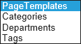{width="1.2081824146981628in"
height="0.6561679790026247in"}

### Listing Taxa

This example uses a sample set of data where the sample tags are
collecting and classic. The sample categories form the following
hierarchy:

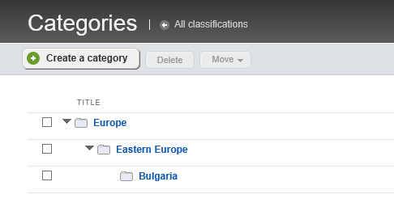{width="3.6716415135608047in"
height="1.9340332458442695in"}

Using the previous example in [Listing Taxonomies](#list-taxonomies),
try adding a handler for the *SelectedIndexChanged* event to receive the
*SelectedValue*. The SelectedValue is the Guid string for the
*Taxonomy*. Create a new Guid object, passing the SelectedValue into the
constructor. Call the TaxonomyManager *GetTaxonomy()* method and pass
the Guid. Add a second ListBox to the form and bind it\'s *DataSource*
to the Taxonomy *Taxa* property.

protected void ListBox1\_SelectedIndexChanged(object sender, EventArgs
e)

{

var value = (sender as ListBox).SelectedValue;

Guid taxonomyId = new Guid(value);

TaxonomyManager manager = TaxonomyManager.GetManager();

ITaxonomy taxonomy = manager.GetTaxonomy(taxonomyId);

ListBox2.DataValueField = \"Id\";

ListBox2.DataTextField = \"Name\";

ListBox2.DataSource = taxonomy.Taxa;

ListBox2.DataBind();

}

Selecting a taxonomy from the first list box fires the
*SelectedIndexChanged* event, the bound taxonomy Id is retrieved and
used to get the *Taxonomy* object. The *Taxonomy* *Taxa* collection is
bound to the second list box.

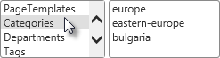{width="2.5725951443569555in"
height="0.6769991251093613in"}

### Find Frequently Used Categories and Tags

*TaxonomyManager* has a nice little goody hidden away called the
*GetStatistics()* method that returns the *MarkedItemsCount* with the
number of items marked with a given taxon. Other properties with
possibilities are:

-   The *ApplicationName* for the project that the statistic belongs to.

-   *DataItemType* determines the kind of content the particular Taxon
    is being used in.

-   *StatisticType* is the *ContentLifecycleStatus* used throughout
    Sitefinity to determine the state of the content item, i.e. Master,
    Temp or Live.

-   The *TaxonomyId* and *TaxonId* Guids are both included so you can
    retrieve the corresponding objects.

We can simply bind this information to a RadGrid in ASP.NET to see the
bulk data. Assign the GetStatistics() result to the RadGrid DataSource.

TaxonomyManager manager = TaxonomyManager.GetManager();

RadGrid1.DataSource = manager.GetStatistics();

RadGrid1.DataBind();

The grid shows the raw statistic data:

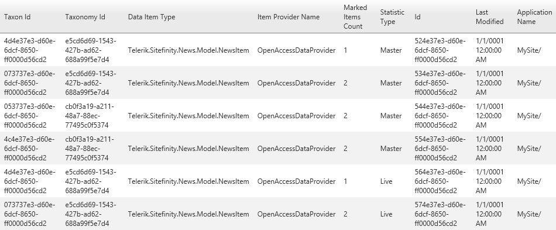{width="6.5in" height="2.689073709536308in"}

If we filter and massage the data a bit with LINQ, we can get useful
information to display. Statistics can be used to populate a RadTagCloud
with \"weighted\" links, where taxons used in more places show in larger
text.

{width="5.624296806649169in"
height="0.6874136045494313in"}

The code to accomplish this is listed below. Filter the results from
GetStatistics() using *Where()* and making sure that the *StatisticType*
is *Live*. Project the items into a new anonymous type using *Select()*.
You can save the *TaxonId* directly. To get the Title to display in each
link, call the *TaxonomyManager GetTaxon()* method and pass the
*TaxonId*. Get the *Name* property from the returned Taxon object.
Finally, to get the comparative weight of each item, use the
*MarkedItemsCount*.

TaxonomyManager manager = TaxonomyManager.GetManager();

var statistics = manager

.GetStatistics()

.Where(s =\> s.StatisticType == ContentLifecycleStatus.Live)

.ToList()

.Select(s =\> new

{

Id = s.TaxonId,

Title = manager.GetTaxon(s.TaxonId).Name,

Weight = s.MarkedItemsCount,

})

.OrderBy(s =\> s.Title).ToList();

StatisticsCloud.DataTextField = \"Title\";

StatisticsCloud.DataWeightField = \"Weight\";

StatisticsCloud.DataValueField = \"Id\";

StatisticsCloud.DataSource = statistics;

StatisticsCloud.DataBind();

### Get Items by Category or Tag

What if I need to find all news items marked with the Europe category or
tagged as collecting? You can get at that functionality through the
content database provider. The database provider can be reached through
the manager of the particular content type you\'re working with, for
example *NewsManager.Provider*. The provider has a *GetItemsByTaxon()*
method that returns an *IEnumerable* of whatever content type you\'re
working with.

The custom *GetTaxonItems()* method below returns an *IEnumerable\<T\>*
for a particular Taxon.

-   The *GetMappedManager()* call returns the appropriate manager for
    the type you pass in. For example, if we pass in NewsItem,
    GetMappedManager() will return a *NewsManager*.

-   The manager\'s *Provider* property is a *DataProviderBase* type, so
    you need to cast up to a *ContentDataProviderBase* that knows how to
    call *GetItemsByTaxon()* later in the method.

-   You also need a *TaxonomyPropertyDescriptor* for the content type
    and taxon combination.

-   Finally, you get to call *GetItemsByTaxon()*, passing in the
    information you\'ve been hoarding up to this point. The returned
    *IEnumerable* is cast to *IEnumerable\<T\>* and returned from this
    method.

**Note**: If there are no content items tagged with the taxon **T**, the
method will return null.

private static IEnumerable\<T\> GetTaxonItems\<T\>(ITaxon taxon)

{

// get the manager for the items, e.g. NewsManager

var manager = ManagerBase.GetMappedManager(typeof(T));

// get the base content database provider

ContentDataProviderBase contentProvider =

manager.Provider as ContentDataProviderBase;

// get a taxonomy property descriptor for this item type and taxon

TaxonomyPropertyDescriptor prop =

TaxonomyManager.GetPropertyDescriptor(typeof(T), taxon);

if (prop != null)

{

int? totalCount = 0;

// use the GetItemsByTaxon() method

// to return IEnumerable of items.

var items = contentProvider.GetItemsByTaxon(taxon.Id,

prop.MetaField.IsSingleTaxon,

prop.Name,

typeof(T),

string.Empty, // filter

string.Empty, // order by

0, // skip

100, // take

ref totalCount);

return items as IEnumerable\<T\>;

}

else return null;

}

To call the method, set the type to be the content type you\'re looking
for and pass in the taxon to search on as a parameter. The example below
is looking for all news items that are marked with a particular taxon.

IEnumerable\<NewsItem\> items = GetTaxonItems\<NewsItem\>(taxon);

If you bind the items directly against a grid, you will see all the
columns for the content item type, in whatever lifecycle status they
happen to be in. The example below bridges off the previous RadTagCloud
example and displays the NewsItem objects for the selected cloud tag.

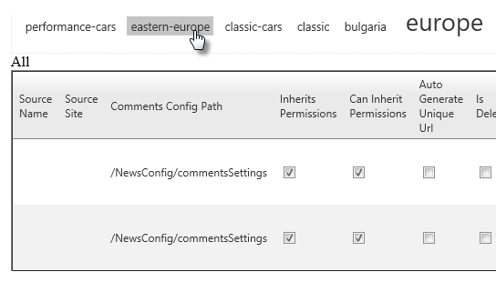{width="5.665958005249344in"
height="3.22876312335958in"}

You can boil this data down a bit using lambda expressions to look only
for live items and only showing certain columns.

The example in the code below handles the RadTagCloud *ItemClick* event.
The event arguments for the handler include the *Item.Value* property
that contains the Guid for the taxon. You can use the
*TaxonomyManager.GetTaxon()* method to retrieve the Taxon corresponding
to the item the user clicked on. Now that you have the *Taxon*, call the
custom *GetTaxonItems()* method and pass the taxon as a parameter. Next,
a lambda expression filters for only items with a live status. Only the
Title and Url columns are selected.

protected void StatisticsCloud\_ItemClick(object sender,
RadTagCloudEventArgs e)

{

TaxonomyManager taxonomyManager = TaxonomyManager.GetManager();

ITaxon taxon = taxonomyManager.GetTaxon(new Guid(e.Item.Value));

IEnumerable\<NewsItem\> items = GetTaxonItems\<NewsItem\>(taxon);

var news = items

.Where(n =\> n.Status == ContentLifecycleStatus.Live)

.Select(n =\> new

{

Title = n.Title.Value,

Url = n.Urls.FirstOrDefault().Url

});

RadGrid1.DataSource = news;

RadGrid1.DataBind();

}

The data bound in the grid looks something like the screenshot below.

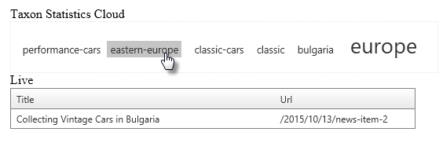{width="5.060518372703412in"
height="1.7586209536307962in"}

### Add Categories and Tags

To create a new taxon, use the TaxonomyManager *CreateTaxon()* method.
Specify the type of taxon you want to create, that is,
*HierarchicalTaxon* or *FlatTaxon*. For HierarchicalTaxon, you need to
specify the *Parent*. In the example below the category *Eastern Europe*
is retrieved using the *GetTaxa()* method and assigned to the new
taxon\'s Parent property. Also notice programmatic login as a user with
permissions to create a taxon.

TaxonomyManager manager = TaxonomyManager.GetManager();

// get the parent taxon

HierarchicalTaxon EasternEuropeTaxon =

manager.GetTaxa\<HierarchicalTaxon\>()

.Where(t =\> t.Title.Value.Equals(\"Eastern Europe\"))

.SingleOrDefault();

// build a new taxon and place it underneath the parent

HierarchicalTaxon HungaryTaxon =
manager.CreateTaxon\<HierarchicalTaxon\>();

HungaryTaxon.Name = \"Hungary\";

HungaryTaxon.Title = \"Hungary\";

HungaryTaxon.UrlName = \"hungary\";

HungaryTaxon.Parent = EasternEuropeTaxon;

**HungaryTaxon.Taxonomy = EasternEuropeTaxon.Taxonomy;**

manager.SaveChanges();

The Categories page shows the new taxon under its parent taxon.

{width="2.1768110236220473in"
height="1.6247965879265092in"}

**Note**: Notice that you need to assign the Taxonomy property, that is,
a category, tag or a custom taxonomy. Not assigning the Taxonomy
property leads to a difficult-to-diagnose \"Null reference object\"
exception.

Dynamic Data
------------

Each type of content in Sitefinity has just about every property you
need. Almost. For example, news items have *SourceName* and *SourceSite*
properties to track where the news comes from originally. What if you
needed a *SourceDate* property to denote the date the source material
was obtained? Sitefinity User objects have properties for *UserName*,
*LastActivityDate* and *Email*. What if your organization needs to track
*HireDate*, *HireReason* and *NextReviewDate*?

Sitefinity allows you to create custom fields without having to register
them in code-behind or referencing libraries.

### Adding Custom Fields

You can create your own custom fields that come along for the ride when
the user enters data. Custom fields are associated with a specific type
of data, for example, *NewsItem*, *SitefinityProfile*, *Document* etc.
Custom fields can be created directly in Sitefinity administration.

1.  In the Sitefinity Administration menu, select Content \> News.
    Before proceeding, make sure that at least one news item is already
    created.

2.  Click the *Custom Fields for news* link.

> 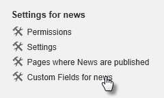{width="2.4996872265966754in"
> height="1.489397419072616in"}

3.  Choose *Date* and *Time* from the *Type* drop down list. Enter
    *ReviewDate* as the *Name* for the custom field. Click the
    *Continue* button to accept the custom field settings.\
    \
    You can choose a predefined data type from the Type drop down list.
    You can prevent the field from displaying in the editor by selecting
    the This is a hidden field check box. The *Interface widget for
    entering data* will list an appropriate editor for the type. You can
    also select the *Custom* item to use a custom control to edit the
    field. The *Advanced* section allows you to map the custom field
    data type against database types.

> 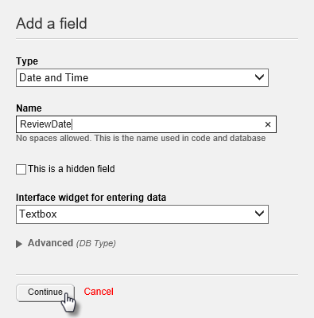{width="4.114069335083115in"
> height="4.15573053368329in"}
>
> In the *Settings, Label and text* tab, enter the *Label* *Review Date*
> and *Instructional text* as *Enter the date when the news item should
> be reviewed*. Click the *Done* button to close the dialog.
>
> You can also enter a default in the *Predefined value* space. Quite
> often you will want a particular field filled out every time a content
> item is created, so check the *Make required* box for ensure that the
> user can\'t save the item without making an entry.
>
> The *Limitations* tab allows you to set minimum and maximum values and
> an error message if the user entry falls outside the range. The
> *Appearance* tab determines where the field will be shown in the
> backend.
>
> 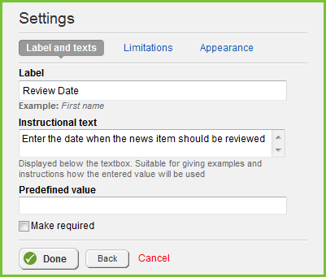{width="4.182638888888889in"
> height="3.5479166666666666in"}
>
> The new *ReviewDate* field should display in the list of custom fields
> for news item. Notice that the list starts out with *Tags* and
> *Category* classification field types and that these are considered to
> be custom fields.
>
> 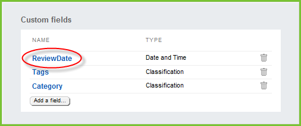{width="5.269444444444445in"
> height="2.192361111111111in"}

4.  Create a News Item. Scroll to the bottom of the news item to see
    your new custom \"Review Date\" field label and instruction text.

> 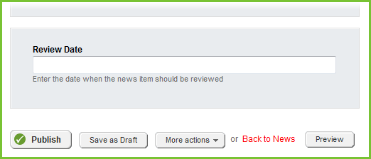{width="5.442361111111111in"
> height="2.3368055555555554in"}

5.  Click the entry box to see the popup calendar editor.

> 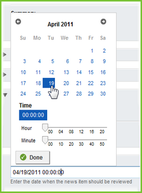{width="2.4520833333333334in"
> height="3.2881944444444446in"}

**Note**: The Type drop down list also includes Short text, Long text,
Multiple choice, Yes / No, Currency, Number and Classification. You can
add multiple fields to a content type. The screenshot below shows
examples of Date-Time, Long text, Multiple choice and Currency.

> 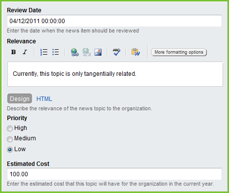{width="4.845833333333333in"
> height="4.086805555555555in"}

### Reading and Writing Custom Field Values

The most frequently asked question about custom fields is *\"how do I
read or write my custom field value\"*? The magic is in the
*DataExtensions* class from the *Telerik.Sitefinity.Model* namespace. As
the name suggests, the class contains extension methods, so you need to
have Telerik.Sitefinity.Model in your *uses* (C\#) or *Imports* (VB)
section of code. The three key methods of DataExtensions that can be
used with Sitefinity content items are:

-   *GetValue*(\<field name\>)

-   *SetValue*(\<field name\>, \<value\>)

-   *DoesFieldExist*(\<value\>)

For example, if we retrieve a particular NewsItem, we can call the
*SetValue()* method from that NewsItem. The example below retrieves a
NewsItem where the Title property is \"Southern France Car Rally\", then
calls the SetValue() extension method, passing the field name
*ReviewDate* and a *DateTime* 30 days into the future.

NewsManager manager = NewsManager.GetManager();

manager.GetNewsItems().Where(n =\>

n.Title.Equals(\"Southern France Car Rally\"))

.ToList()

.ForEach(n =\> n.SetValue(\"ReviewDate\", DateTime.UtcNow.AddDays(30)));

manager.SaveChanges();

A variation on this example uses the *GetValue()* method to pick up only
the news items that have a null *ReviewDate* and sets the field values.

NewsManager manager = NewsManager.GetManager();

manager.GetNewsItems().Where(n =\>

!n.GetValue\<DateTime?\>(\"ReviewDate\").HasValue)

.ToList()

.ForEach(n =\> n.SetValue(\"ReviewDate\", DateTime.UtcNow.AddDays(30)));

manager.SaveChanges();

### Walk-through

This walk-through example demonstrates how to show all dynamic fields
for a selected type.

1.  In an ASP.NET web form, add a RadScriptManager, a RadComboBox and a
    RadGrid. Set the RadComboBox AutoPostBack property to \"true\". The
    markup should look like the example below. Note: be sure to drag
    these controls onto the page so that they are registered properly.

\<form id=\"form1\" runat=\"server\"\>

\<telerik:radscriptmanager id=\"RadScriptManager1\" runat=\"server\"\>

\</telerik:radscriptmanager\>

\<telerik:radskinmanager id=\"RadSkinManager1\" runat=\"server\"

skin=\"Bootstrap\"\>

\</telerik:radskinmanager\>

\<div\>

\</div\>

\<telerik:radcombobox id=\"RadComboBox1\" runat=\"server\"\>

\</telerik:radcombobox\>

\<telerik:radgrid id=\"RadGrid1\" runat=\"server\"\>

\</telerik:radgrid\>

\</form\>

2.  In the code-behind, add the code below to the Page\_Load event
    handler.

protected void Page\_Load(object sender, EventArgs e)

{

if (!IsPostBack)

{

MetadataManager manager = MetadataManager.GetManager();

var types = manager.GetMetaTypes().Where(t =\>

!t.IsDynamic);

RadComboBox1.DataSource = types;

RadComboBox1.DataTextField = \"ClassName\";

RadComboBox1.DataValueField = \"Id\";

RadComboBox1.DataBind();

}

}

3.  In the page designer, double-click the RadComboBox to create a
    SelectedIndexChanged event handler.

4.  Replace the code for the SelectedIndexChanged event handler with the
    code below. The event handler converts the selected combo box item
    value back into a Guid. Next, the CLR type for the selected type is
    retrieved. Finally, all the fields for the selected item type are
    retrieved, reshaped to only use a few columns and bound to the grid.

protected void RadComboBox1\_SelectedIndexChanged(object sender,

RadComboBoxSelectedIndexChangedEventArgs e)

{

MetadataManager manager = MetadataManager.GetManager();

Guid typeId = new Guid(e.Value);

var metaType = manager.GetMetaType(typeId);

var fields = metaType.Fields

.Select(f =\> new

{

Id = f.Id,

FieldName = f.FieldName,

ClrType = f.ClrType,

DbType = f.DBType

});

RadGrid1.DataSource = fields;

RadGrid1.DataBind();

}

5.  Run the application.

> 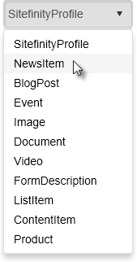{width="1.206357174103237in"
> height="2.298507217847769in"}

When an item is selected from the drop-down list, the fields for the
type display in the grid. In the screenshot below, the NewsItem type is
selected and shows custom \"ReviewDate\" field.

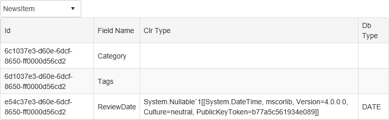{width="6.5in" height="2.002361111111111in"}

Custom Content Types
--------------------

You can build custom code against a new dynamic data module starting
from automatically generated examples. We won't be discussing how to
build a module in Administration \> Module builder, but will be using
pre-generated code sample snippets generated from an existing module:

1.  Click Administration \> Module builder.

2.  Click the module name to open that specific custom content module.

> 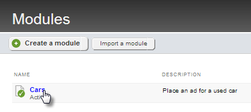{width="4.31196084864392in"
> height="1.926842738407699in"}
>
> The module appears with sections devoted to editing the content types,
> settings and, on the right-hand side of the screen, a code reference
> link for the module.
>
> 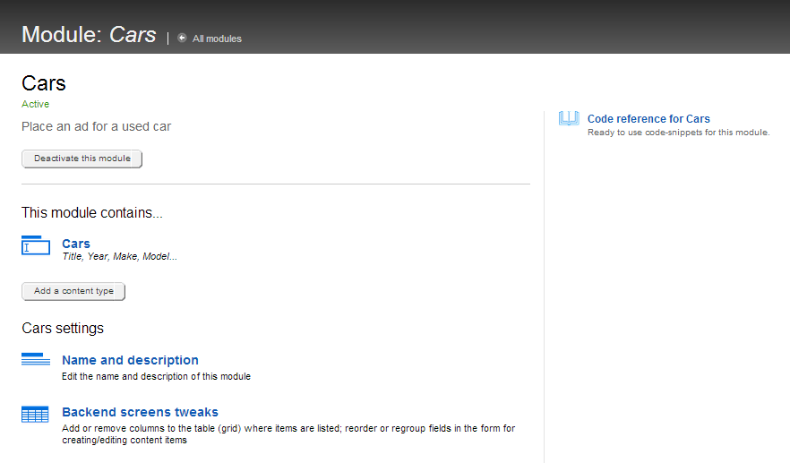{width="6.0in" height="3.5172233158355204in"}

3.  Click the code reference link.

> 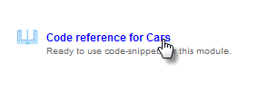{width="2.9579636920384953in"
> height="1.0415365266841645in"}

4.  Click the *Create* option link in the left side menu.

The list on the left has starting points for all the critical areas
you\'re likely to need: create, delete, find by id, get a collection,
filter, check in/out and integration with ASP.NET. The corresponding
code for each item shows on the right side, followed by a short
explanation of the generated code and a listing of required namespaces.

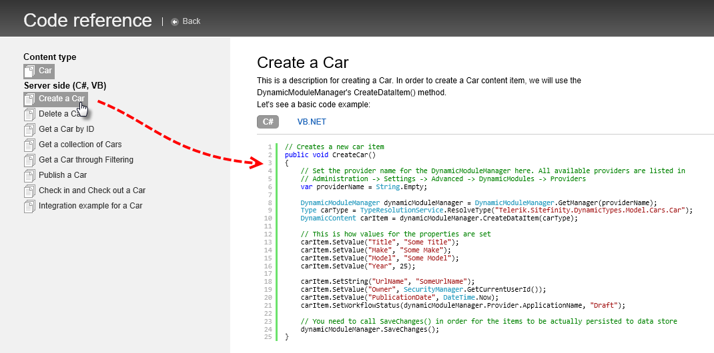{width="6.5in" height="3.2199070428696412in"}

Here\'s the generated code that creates a *Car* content item. This just
creates a draft version of the Car item.

// Creates a new car item

public void CreateCar()

{

// Set the provider name for the DynamicModuleManager here.

// All available providers are listed in

// Administration \> Settings \> Advanced \> DynamicModules \> Providers

var providerName = String.Empty;

DynamicModuleManager dynamicModuleManager =

DynamicModuleManager.GetManager(providerName);

Type carType = TypeResolutionService.ResolveType(

\"Telerik.Sitefinity.DynamicTypes.Model.Cars.Car\");

DynamicContent carItem =

dynamicModuleManager.CreateDataItem(carType);

// This is how values for the properties are set

carItem.SetValue(\"Title\", \"Some Title\");

carItem.SetValue(\"Make\", \"Some Make\");

carItem.SetValue(\"Model\", \"Some Model\");

carItem.SetValue(\"Year\", 25);

carItem.SetString(\"UrlName\", \"SomeUrlName2\");

carItem.SetValue(\"Owner\", SecurityManager.GetCurrentUserId());

carItem.SetValue(\"PublicationDate\", DateTime.Now);

carItem.SetWorkflowStatus(

dynamicModuleManager.Provider.ApplicationName, \"Draft\");

// You need to call SaveChanges() in order for the items

// to be actually persisted to data store

dynamicModuleManager.SaveChanges();

}

Here's another example with a custom module called Quotations. The Title
field is the name of the person being quoted, Picture is an image field
of the person being quoted and the Text of the quote is a short string.
The example iterates an array of quotations for raw material, creates
each Quote item, then publishes each item.

private string\[\] quotations =

{

\"Ending a sentence with a preposition is something up with which I
shall not put.\",

\"An appeaser is one who feeds a crocodile---hoping it will eat him
last.\",

\"If you are going to go through hell, keep going.\",

\"History will be kind to me for I intend to write it.\",

\"It has been said that democracy is the worst form of government
except\" +

\" all the others that have been tried.\"

};

The quotations are added en masse to the Quotations custom module. The
custom *CreateQuote()* method is a copy of the generated code from the
*Publish a Quote* link. The one-time tasks like getting the manager for
the module and retrieving a single image from the library are all put up
front, before the loop that iterates the quotation strings.

public void CreateQuote()

{

var providerName = String.Empty;

DynamicModuleManager dynamicModuleManager =

DynamicModuleManager.GetManager(providerName);

Type quoteType = TypeResolutionService.ResolveType

(\"Telerik.Sitefinity.DynamicTypes.Model.Quotations.Quote\");

// get winston\'s picture from the library

LibrariesManager pictureManager = LibrariesManager.GetManager();

var pictureItem = pictureManager.GetImages().FirstOrDefault(i =\>

i.Status == ContentLifecycleStatus.Master &&

i.Title.Equals(\"winston\"));

var count = 1;

}

Inside the loop that iterates the quotes, each data item is created and
the values are set. The *Lifecycle.Publish()* method publishes the quote
item and the *SetWorkflowStatus()* method tracks the current state of
the quote item.

foreach (var quote in quotations)

{

// create a single quote item

DynamicContent quoteItem =

dynamicModuleManager.CreateDataItem(quoteType);

// set quote item properties

quoteItem.SetValue(\"Title\", \"Winston Churchill\");

quoteItem.SetValue(\"Text\", quote);

quoteItem.CreateRelation(pictureItem, \"Picture\");

quoteItem.SetString(\"UrlName\", \"winston-quote\" + count.ToString());

quoteItem.SetValue(\"Owner\", SecurityManager.GetCurrentUserId());

quoteItem.SetValue(\"PublicationDate\", DateTime.UtcNow);

// create a draft of the quote item

quoteItem.SetWorkflowStatus(

dynamicModuleManager.Provider.ApplicationName, \"Draft\");

dynamicModuleManager.SaveChanges();

// publish the quote item

ILifecycleDataItem publishedQuoteItem =

dynamicModuleManager.Lifecycle.Publish(quoteItem);

quoteItem.SetWorkflowStatus(

dynamicModuleManager.Provider.ApplicationName, \"Published\");

dynamicModuleManager.SaveChanges();

count++;

}

A default Quotes widget is added to the toolbox automatically when you
create the module. The widget shows a generic list titles. You will need
to edit the widget template to show all the data from your module item.
The template for single items will show all fields, so you can steal
markup from there to update the widget's list template.

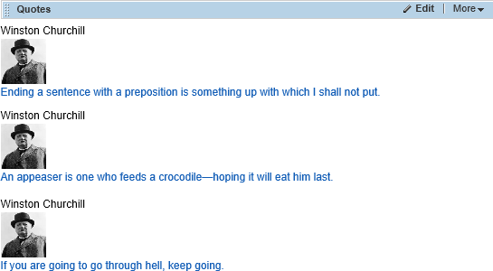{width="5.7in" height="3.14in"}

Authentication and Security
===========================

Operations in Sitefinity frequently require certain permissions.
Permissions require authentication, that is, you are who you say you
are, for Sitefinity to know what permissions to give you.

Claims vs. Forms Authentication
-------------------------------

Using the default claims authentication within Sitefinity, you will no
longer \"hit the wall\" when trying to integrate your site within a
larger security framework. Prior to version 5.x, Sitefinity used forms
authentication to verify user credentials and allow access to Sitefinity
applications. Forms authentication essentially retrieved the user\'s
name/password and checked it against user data stored in the database
for that particular application. That works well enough but comes up
short in scenarios required by many organizations:

-   Single Sign On (SSO) where you have several Sitefinity sites that
    should have only one login for the user. SSO allows you to show a
    single site to the user that is actually made up of multiple sites.

-   When you need to use authentication provided from outside the
    Sitefinity application, e.g. Active Directory domains, another
    application or certificate authorities.

-   When the login comes from a non-standard source such as biometric
    authentication.

-   When authentication lifespan should not be tied to cookie
    expiration. Using Forms Authentication, the authentication
    information is stored in a cookie and the user is logged out when
    the cookie expires.

Claims Authentication is a more robust approach that uncouples
authentication from the application logic. Claims authentication uses
these components:

-   Subject is an entity that is being authenticated, e.g. a user.

-   An Issuer makes claims about the subject and issues security tokens.

-   A Claim is an assertion about the subject, e.g. the user\'s name or
    thumbprint.

-   A Token is a digitally signed string created when the issuer makes a
    claim about a subject. The token contains authentic details about
    the subject.

The Sitefinity Claims Authentication implementation doesn\'t directly
impact backend administration or even API programming within the web
site. The real boost comes in integrating with other Sitefinity sites,
applications and services. Sitefinity REST web services for example
require a call up front to retrieve the claims token. After that, you
just pass the token in the request headers of each REST web service
call.

By default, user authentication is handled through Claims based
authentication. If you have a site built with an older version of
Sitefinity that uses [web services](#sitefinity-web-services), you may
revert to Forms authentication. To toggle this setting, go to
Administration \> Settings (Basic Settings) \> User Authentication.

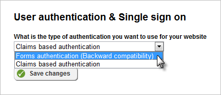{width="4.490277777777778in"
height="1.9423611111111112in"}

For all projects going forward, Claims authentication is the stronger
choice.

Authenticate Programmatically
-----------------------------

To login programmatically, use the *SecurityManager* object and call the
*AuthenticateUser()* method. There are several overloads of this method
that all take some combination of user name and password. The example
below passes a Credentials object that simply packages up the user name,
password, persistence and provider. If the Persistent property is true,
then the authentication cookie is retained between sessions.

Credentials credentials = new Credentials()

{

UserName = \"admin\",

Password = \"password\",

Persistent = true,

};

var result = SecurityManager.AuthenticateUser(credentials);

if (result == UserLoggingReason.Unknown)

{

throw ApplicationException(\"Unable to login\");

}

The AuthenticateUser() method returns a *UserLoggingReason* enum member
that you check before taking action. For example,
*UserLoggingReason.Unknown* indicates an invalid username or password.
You can use the other members of UserLoggingReason if you need even more
specific information about how the site is being used:

  UserLoggingReason Enum Member     Description
  --------------------------------- -----------------------------------------------------------------------------------------------------
  Success                           User was successfully registered as logged in
  UserLimitReached                  The limit of maximum simultaneous logged in users is reached
  UserNotFound                      User not found in any provider
  UserLoggedFromDifferentIp         User is already logged in from a different IP address
  SessionExpired                    Indicates that the user logical session has expired
  UserLoggedOff                     User has the authentication cookie but is not logged in the database or user is already logged out.
  UserLoggedFromDifferentComputer   More than one user trying to login from the same IP but from different computers.
  Unknown                           Invalid username or password specified.
  NeedAdminRights                   User is not administrator to logout other users
  UserAlreadyLoggedIn               User already is logged in. We need to ask the user to logout or to logout someone else.
  UserRevoked                       User was revoked: the user was deleted or user rights and role membership was changed.

To logout programmatically, call the static SecurityManager.Logout()
method. This logs out the user making the current request.

SecurityManager.Logout();

You can also use a Logout() overload if you need to pass specific
credentials:

Credentials credentials = new Credentials()

{

UserName = \"admin\",

Password = \"password\",

};

SecurityManager.Logout(credentials);

**Note**: You must have administrative rights to logout other users or
match the credentials of the user to perform the logout, otherwise a
*UnauthorizedAccessException* is thrown.

Create a User
-------------

To create a user, first get an instance of the *UserManager* by calling
*GetManager()*. Then call the *CreateUser()* method and pass the login
name. Populate the returned *User* object properties, then finally call
the *SaveChanges()* method.

UserManager userManager = UserManager.GetManager();

User user = userManager.CreateUser(\"ayamada\");

user.Password = \"password\";

user.Email = \"ayamda\@mydomain.net\";

// user first and last are deprecated

user.Comment = \"Popular blogger\";

userManager.SaveChanges();

Another overload of CreateUser() allows you to set many of the
properties of the User at one time and also returns a
*MembershipCreateStatus*. If the status is equal to Success, then you
can call the SaveChanges() method.

MembershipCreateStatus createStatus;

UserManager userManager = UserManager.GetManager();

User user = userManager.CreateUser(

// user name

\"ayamada\",

// password

\"password\",

// email

\"ayamda\@mydomain.net\",

// security question

\"what is your favorite pet\'s name?\",

// security answer

\"spot\",

// isApproved

true,

// provider user key

null,

// create status

out createStatus

);

if (createStatus == MembershipCreateStatus.Success)

{

userManager.SaveChanges();

}

Create Roles and Permissions
----------------------------

You now have a user in the system, but what can they do? Not a thing. A
new user is not associated with any roles in the system and therefore
has no permissions to do anything. To give the user permissions to do
something, you must add the person to a role. The basic elements to
associating a role with a user are:

-   Get an instance of a *RoleManager* for a particular provider. The
    built-in providers available out-of-the-box are listed in
    Settings \> Security \> Role Providers. Use the *AppRoles* provider
    when trying to get at roles already in the system, such as
    *Administrators* or *BackendUsers*. For roles you create yourself,
    use the *Default* provider.

> {width="2.779166666666667in"
> height="1.8173611111111112in"}

-   Get a specific Role such as BackendUsers or Authors.

-   Add the User to a Role.

-   Save the changes.

The code below adds an existing user to the Backend and Authors roles:

User user = UserManager.GetManager().GetUser(\"ayamada\");

// get the built in roles

RoleManager roleManager =
RoleManager.GetManager(SecurityManager.ApplicationRolesProviderName);

// retrieve the \"BackendUsers\" role

Role backendUserRole = roleManager.GetRoles()

.Where(r =\> r.Name.Equals(SecurityManager.BackendUsersRoleName))

.Single();

// retrieve the \"Authors\" role

Role authorRole = roleManager.GetRoles()

.Where(r =\> r.Name.Equals(\"Authors\"))

.Single();

// add the user to both roles

roleManager.AddUserToRole(user, backendUserRole);

roleManager.AddUserToRole(user, authorRole);

// save the new role settings

roleManager.SaveChanges();

The user listing shows the addition of the roles:

{width="6.5in" height="0.4664348206474191in"}

Using MVC in Sitefinity
=======================

In addition to using traditional Web Form User Controls (ascx),
developers can also take advantage of Sitefinity's support for MVC to
create widgets. By using the familiar Model-View-Controller pattern,
developers can quickly create widgets with full control over the markup,
resulting in simpler, testable code.

Choosing MVC or WebForms
------------------------

It is important to remember that using MVC is **preferred** in
Sitefinity over Web Forms. Sitefinity gives developers the choice of
either (or both) platforms to create widgets that best suit their needs.

Progress has made it clear that MVC development in Sitefinity is the
choice going forward even though Web forms will continue to be supported
for a long time to come.

### Choosing MVC

Using MVC for creating widgets offers the following advantages:

-   Using the familiar MVC pattern to separate concerns between data
    processing and data presentation

-   Full control over the rendered HTML markup, including adapting
    output to different devices

-   MVC Controllers and models are testable without requiring a full
    HTTP context

-   Easily port in existing MVC applications, or run them side-by-side
    with Sitefinity

-   Compatible with Telerik MVC Extensions

-   **Does not require ViewState**

It is also important to keep in mind some of the disadvantages of using
MVC:

-   Requires that developers understand or learn the MVC pattern

-   It is stateless, which is not a disadvantage in itself, but
    information is not persisted between pages as WebForms does using
    ViewState

-   You cannot leverage existing ASP.NET WebForm controls (such as
    Telerik RadControls)

### 

### Choosing WebForms

Widgets developed using traditional WebForm User Controls offer the
following advantages:

-   Familiar and mature platform with many existing controls and
    off-the-shelf components

-   Easily port in existing WebForm applications by moving logic and
    markup to User Controls

-   Page state can be easily maintained using ViewState and Post backs

-   Many controls (such as GridView) bind declaratively to data and
    require no additional code

However, choosing WebForms over MVC also exposes the following
disadvantages:

-   Code-behind is tightly coupled to the HTML, which can impact
    readability, maintainability, and reusability of complex widgets
    with many controls on the page

-   WebForms require an HTTP Context, and cannot be tested without a
    Mocking framework

-   Less control over HTML output, as this is often defined by the
    controls being used

### You can use Both

The implementation of MVC within Sitefinity allows developers to
leverage both options simultaneously on a page, mixing traditional
WebForm widgets with MVC.

Sitefinity MVC Modes
--------------------

Sitefinity MVC can operate in one of three modes: Classic, Pure, and
Hybrid. These three options are what allow Sitefinity to "mix and match"
between WebForms and MVC.

### Classic MVC Mode

Classic MVC is simply the traditional ASP.NET MVC implementation. It is
most useful for porting an existing application into a website to
operate alongside Sitefinity, or creating a separate MVC application
within the solution.

In either case, the MVC application does not interact with Sitefinity,
so you are not able to manage content on pages or controllers using the
Sitefinity Administration. Instead, the MVC application responds to
requests using the traditional ASP.NET MVC routing and architecture.

### Pure MVC Mode

If you are using MVC widgets exclusively, and do not wish to use or
display the existing WebForm widgets, you can enable Sitefinity to work
in Pure MVC mode. Choosing this mode leverages the MVC framework
exclusively, meaning that there will be no ViewState, Post backs, or
server-side controls to maintain, allowing you to develop fully in the
MVC platform.

An advantage of using Pure MVC mode is that it allows a Sitefinity page
to host multiple MVC widgets. A Sitefinity page is able to route the
page request to each widget on the page, allowing each to render its
markup individually to makeup the page contents.

To enable MVC Pure mode, create a new Page Template, and assign the MVC
only option for Web framework under Advanced Settings.

{width="4.989583333333333in"
height="4.164455380577428in"}

Once the template is created you can proceed to edit its contents, or
create a new Sitefinity page using it as a base template. Keep in mind
that in Pure MVC mode, the only widgets that will be displayed in the
Toolbox or useable on the page are those built using MVC.

{width="3.98in" height="2.79in"}

When viewing the HTML source of a published page using Sitefinity MVC
Pure mode, you will see that the markup is free of the traditional
WebForms content such as ViewState, and instead renders a light, clean
markup.

### Hybrid MVC Mode

This mode is the default mode for Sitefinity Page Templates. Choosing
this mode displays both the traditional WebForm toolbox items, as well
as MVC widgets when editing a page, allowing you to mix and match widget
types.

{width="6.5in" height="3.1416666666666666in"}

When viewing the source of a Sitefinity MVC Hybrid mode page, the more
traditional WebForms markup is present, while still allowing the MVC
widget to control its own rendered markup.

{width="6.5in" height="4.575879265091864in"}

### Input Forms with Hybrid Mode

One important note to keep in mind: WebForms require that only a single
FORM tag be present on the page. As a result, if you wish to create an
input form inside an MVC widget using Hybrid mode, you must use a
special Html helper \@Html.BeginFormSitefinity instead of the
traditional MVC \@Html.BeginForm to ensure that your form posts
correctly.

### Choosing an MVC Mode

The choice of Sitefinity MVC mode depends on how MVC will be used in the
website application, and can all be used simultaneously in different
areas of the site.

If you are running a separate, standalone MVC application, using Classic
mode by registering custom routes will allow it to run alongside the
existing Sitefinity site.

If you want full control over HTML markup by using only MVC-based
widgets, creating your Sitefinity page templates with the MVC-only
option will result in a light, clean HTML output, with full control via
the MVC pattern.

Finally, if you want to be able to leverage the existing Sitefinity
widgets, as well as custom WebForm User Controls and MVC-based widgets
on the same page, the default Hybrid mode will allow you to do this.

Creating MVC Widgets
--------------------

Creating a new MVC widget simply involves creating the traditional
Controller, Model, and View components in the supplied *MVC* folder of
the Sitefinity solution, then registering the Controller as a widget.

To demonstrate this, we'll create a sample widget by first declaring a
sample model. Add a new class file MyMvcWidgetModel.cs to the *Models*
folder of the Sitefinity project with the following code:

public class MyMVCWidgetModel

{

/// \<summary\>

/// Gets or sets the message.

/// \</summary\>

public string Message { get; set; }

}

Next, add another class file MyMvcWidgetController.cs to the
*Controllers* folder with the following code:

public class MyMVCWidgetController : Controller

{

public ActionResult Index()

{

var model = new MyMVCWidgetModel();

model.Message = \"Hello, World!\";

return View(\"Default\", model);

}

}

As you can see, the Controller is a traditional MVC controller and
indeed even inherits from the standard *System.Web.Mvc.Controller* base
class. Sitefinity is also able to recognize the default *Index* action,
while still being able to pass in a named view, in this case "Default".

Finally, we need a new file named Default.cshtml (to match the "Default"
view being requested by the *Index* action). This file should be added
to the *Views* folder, but in a subfolder named MyMvcWidget, to match
the name of the controller. This is a naming convention used by MVC so
that it can find the desired view by name automatically.

Create a folder under the Views folder named MyMvcWidget, and add the
file Default.cshtml with the following markup:

\@model SitefinityWebApp.Mvc.Models.MyMVCWidgetModel

\<h1\>

\@Html.Raw(Model.Message)

\</h1\>

With these three components (Controller, Model, View) in place, we can
now register the controller as a widget for use in the Sitefinity page
toolbox.

### Registering the Widget in the Toolbox

The only step required here is to decorate the Controller class with the
*ControllerToolboxItem* attribute, which contains parameters for naming
and placing the widget. The attribute below will give the widget the
title of "My MVC Widget", placing it in the Toolbox section named
"MvcWidgets".

\[ControllerToolboxItem(Name = \"MyMVCWidget\", Title = \"My MVC
Widget\",

SectionName = \"Mvc Widgets\")\]

Save your changes and build your solution. Sitefinity will now
automatically discover this widget through the attribute, and place it
in the appropriate section. If the section does not exist it will create
it and add it to the toolbox.

{width="3.54122375328084in"
height="2.947548118985127in"}

### Creating a Control Designer

Sitefinity MVC widgets can have control designers just like standard
WebForm User Control widgets. The process for creating and registering
designers is also done via attributes.

### Sitefinity Thunder MVC Widget Template

**Note: Thunder is not available in Visual studio 2017 and newer
versions of Visual Studio. Because Progress is concentrating on MVC and
Thunder is 90% all about Web Forms, it is not expected that Thunder will
have a new revision. Going forward you will need to learn the Sitefinity
VSIX and CLI to generate code-based items in Sitefinity in Visual Studio
2017 and newer.**

Although creating MVC widgets is simple enough, Sitefinity Thunder
includes a helpful MVC Widget template that will generate sample code
for the Controller, Model, and View, and even place the files in the
appropriate sections to get you started. Thunder can even generate the
control designer for the widget automatically, either during creation of
the widget, or to an existing MVC widget.

To generate an MVC widget after installing Sitefinity Thunder,
right-click the *MVC* folder in your Sitefinity solution and select *Add
New Item*. In *the Add New Item* dialog, select *Sitefinity* from the
options on the left, revealing the installed Thunder templates, and
choose *Sitefinity MVC Widget with Designer*.

{width="6.5in" height="4.491620734908136in"}

Name your widget then click *Add* to continue. Thunder will prompt you
to create a designer for the widget as well, which you can do by
checking the appropriate box.

{width="4.020330271216098in"
height="3.572470472440945in"}

This will create a very basic control designer for the sample widget. If
you plan to add additional properties to the control, it may be a better
idea to skip this option, then come back later to use the Designer for
Existing Widget template.

Alternatively, you can now leverage the MVC platform to create widget
designers more intuitively, using a new Sitefinity module called
Feather.

Sitefinity Feather
==================

What is Feather?
----------------

The Sitefinity Feather module is a collection of resources and
conventions to simplify the creation and management of widgets, layouts,
and templates. It is a free module, built into Sitefinity and is enabled
by default on new Sitefinity installations, adding a complete framework
to take control the site's layout and markup.

Designer Features
-----------------

Many of the features offered by Feather are relevant to designers, as
they relate to creating and editing custom templates for Page Templates
and Widgets using MVC Layouts and Views. These features are covered in
more detail in the [Admin and Designers
book](http://store.falafel.com/collections/training-guides/products/sitefinity-9-training-guide-for-admins-and-designers):

-   MVC Stock Widgets

-   Dynamic Module Widgets

-   Widget designers with Angular Support

-   Convention-based Customization

-   Templating via Routing

-   Layout Widget Templates

-   Resource Packages

-   Creating Page Templates from MVC Layout Files

If you need more customization than the stock MVC widgets provided by
Feather, you can always create your own. While creating Sitefinity
widgets with MVC is not new to Feather, it adds helpful new routing
features, making it easier to support Master/Detail relationships, as
well as filtering by category or Tag. Just add the appropriate methods
to your controller and Feather takes care of the rest.

Editing one of these widgets also reveals the new Widget Designers from
feather, which leverage AngularJS to create responsive, performant
designers.

MVC Widgets
-----------

If the default widgets provided by Feather don't have the functionality
you require, you can replace them with your own custom versions.

Sitefinity has had the ability to create MVC widgets since version 5.1.
However, Feather has some helpful features to enhance your Sitefinity
MVC widgets by following a few conventions.

**Note**: these features are expressly intended for use within widgets
that handle Sitefinity-specific content (like News, Blogs, etc.). If you
are creating custom widgets that do not interact with Sitefinity content
items, these features would not apply.

### Adding Master Detail Actions

The "Master" view of a widget is intended to present a list of the
specified content items, and often will require paging to partition them
for easier reading. Feather offers a convention to accept the page
number as a Url route parameter, automatically passing it to your widget
to help you page your results.

For this to work you simply need to create the method *Index(int? page)*
in your MVC Controller.

public ActionResult Index(int? page)

{

//\...

return View(model);

}

Feather will automatically route to this command, passing in the page
parameter from the Url. You can then use this value to appropriately
page the results in the action.

Similarly, a "Detail" action can be added to your MVC Controller to
allow Feather to automatically pass an instance of the requested content
item, based on the Url of the page. Simply add the following action to
your controller:

public ActionResult Details(NewsItem newsItem)

{

return View(newsItem);

}

As long as the url matches a content item of the type specified
(NewsItem in the sample above, but can be any Sitefinity content type),
your action will be passed the content item via the supplied parameter.

### Filter by Taxonomy

Feather also allows you to easily add route-based filtering to your
Sitefinity MVC content widgets by implementing the following action on
your controller:

public ActionResult ListByTaxon(ITaxon taxonFilter, int? page)

{

var manager = NewsManager.GetManager();

string fieldName;

if (taxonFilter.Taxonomy.Name == \"Categories\")

fieldName = taxonFilter.Taxonomy.TaxonName;

else

fieldName = taxonFilter.Taxonomy.Name;

var items = manager.GetNewsItems().Where(n =\>

n.GetValue\<IList\<Guid\>\>(fieldName)

.Contains(taxonFilter.Id) &&

n.Status == ContentLifecycleStatus.Live)

.ToList();

return View(\"Index\", items);

}

If the url contains a parameter that matches a taxonomy defined in
Sitefinity, it will be populated in the *ListByTaxon()* method. The
method includes the type of the taxonomy (such as Category or Tag) and
allows custom filtering on the items returned to the view.

### RelativeRoutes

Standard MVC controllers can use the *Route* attribute to explicitly
specify routing configuration. Feather enhances this feature by adding
the *RelativeRoute* attribute. This performs similarly to the regular
Route attribute, but instead of the defined route being determined from
the root path of the application (or controller), it instead defines the
route starting from the url path of the Sitefinity page node on which
the MVC Widget is placed.

Combining these two attributes give your custom widgets powerful routing
options to cover a wide variety of scenarios, including allowing the
widget itself to serve API calls.

**Note**: If the *RelativeRoute* attribute is used on an action, all of
the default routing, both from Sitefinity and Feather, is ignored.
Instead, you must apply at least one of the routing attributes to every
action in your Controllers for them to respond to requests.

Also note that a regular *Route* attribute cannot include a path that
matches an existing page url, as this route would be prioritized to the
Sitefinity page handler, attempt to resolve the route as relative, and
result in a 404 error.

We'll demonstrate this feature by creating a simple widget with two
routes, showing how the attributes control how the widget renders
content.

1.  In Visual Studio Solution Explorer, navigate to the path
    /Mvc/Controllers.

2.  Create a new class file called MyRouteTestController.cs and enter
    the code below.

> using System;
>
> using System.Collections.Generic;
>
> using System.Linq;
>
> using System.Web;
>
> using System.Web.Mvc;
>
> using Telerik.Sitefinity.Mvc;
>
> namespace SitefinityWebApp.Mvc.Controllers
>
> {
>
> \[ControllerToolboxItem(Name = \"MyRouteTest\",
>
> SectionName = \"Mvc Widgets\",
>
> Title = \"My Route Test Widget\")\]
>
> public class MyRouteTestController : Controller
>
> {
>
> \[RelativeRoute(\"\")\]
>
> public ActionResult Index()
>
> {
>
> return View();
>
> }
>
> \[RelativeRoute(\"Relative\")\]
>
> public ActionResult RelativeRoute()
>
> {
>
> return Content(\"This is the result of a relative,\" +
>
> \" route and is placed directly on the page.\");
>
> }
>
> \[Route(\"custom/direct\")\]
>
> public ActionResult DirectRoute()
>
> {
>
> return Content(\"This result is accessed by navigating\" +
>
> \" to the path: custom/direct/route and returns plain\" +
>
> \" text directly to the caller.\");
>
> }
>
> \[Route(\"test/direct\")\]
>
> public ActionResult Invalid()
>
> {
>
> return Content(\"This result will never be seen, \" +
>
> \" because the test route will be first intercepted\" +
>
> \" by the page, so the direct route parameter \" +
>
> \" will result in a 404.\");
>
> }
>
> \[RelativeRoute(\"dual\")\]
>
> \[Route(\"custom/dual\")\]
>
> public ActionResult MyRegularRoute()
>
> {
>
> return Content(\"This result can be routed by the\" +
>
> \" relative path (showing this content on the host\" +
>
> \" page) or via the direct route, which returns\" +
>
> \" plain text to the caller.\");
>
> }
>
> }
>
> }

3.  Create a new page called "Test" with *urlname* "test".

4.  Drag the widget from the Mvc section in the toolbar.

5.  Publish the page.

6.  Navigate to the page on the frontend path \~/test and observe that
    the default relative route content is displayed.

7.  Navigate to the other relative route \~/test/relative and observe
    that we now see the content from that assigned route.

8.  Navigate to the regular route \~/custom/direct and observe that we
    now get a plain text result of that route action.

9.  Navigate to the regular route \~/test/direct and observe that this
    route results in a 404 error.

10. Navigate to the dually defined route \~/test/dual and observe that
    we see the content of the route action rendered to the parent page,
    as part of the widget contents.

11. Navigate to the final route \~/custom/dual and observe that we see
    the same content as the previous *RelativeRoute* but instead receive
    a plain-text version of the route.

Widget Designers
----------------

When building custom widgets, you likely have a set of properties that
need to be set by editing the properties of the widget on the page.
Sitefinity does provide a default editor interface for your widgets,
exposing any public properties for edit. However, this editor is a
simple one, showing only a textbox input for all fields, regardless
their underlying type.

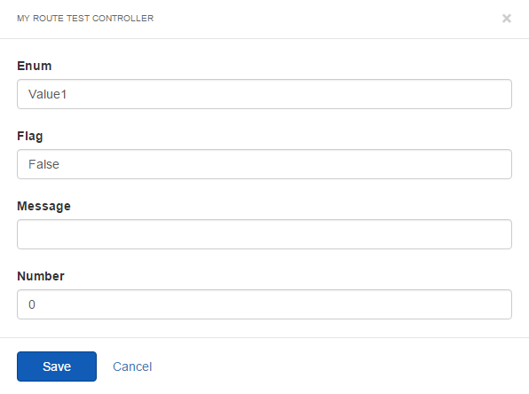{width="6.27in" height="4.67in"}

Previous to Feather, Sitefinity Thunder attempted to improve things by
generating designers based on existing widgets, creating the code files
and templates necessary to render more interactive inputs and selectors.
However, the components required were numerous and cumbersome, and the
generated code was verbose and error prone.

Fortunately, all of this is alleviated with the introduction of Feather,
which adds a complete framework for creating designers for your widgets.
Like most of the customization provided by Feather, it relies on
conventions for naming and placing your designer templates in the right
location.

### ControllerContainer Attribute

Custom designers are actually served as partial views, and by default,
will not be served properly by Sitefinity. If you simply add the
designer templates, although you will see them listed in your widget
designers, selecting them will result in an error similar to this:

> The partial view \'DesignerView.MyDesigner\' was not found or no view
> engine supports the searched locations.

The fix is to configure your Sitefinity application to properly behave
as a container for these partial views. To achieve this in your web
project, open the file located at \~/Properties/AssemblyInfo.cs and add
the following lines:

using
Telerik.Sitefinity.Frontend.Mvc.Infrastructure.Controllers.Attributes;

\[assembly: ControllerContainer\]

Now your designer views will be properly served.

### Widget Designers Naming Convention

The naming convention for widget designers is similar to the frontend
portion of the widget template, but using the prefix for the type of
view being shown, for example "DesignerView". To demonstrate this, we'll
create a simple MVC widget by adding the following class to your root
Mvc/Controllers folder.

using System.Web.Mvc;

using Telerik.Sitefinity.Mvc;

namespace SitefinityWebApp.Mvc.Controllers

{

public enum Enumeration

{

Value1,

Value2,

Value3

}

\[ControllerToolboxItem(Name = \"MyTestWidget\",

SectionName = \"Mvc Widgets\",

Title = \"My Test Widget\")\]

public class MyTestWidgetController : Controller

{

public string Message { get; set; }

public bool Flag { get; set; }

public Enumeration Enum { get; set; }

public int Number { get; set; }

}

}

Create a new page and place this widget on the page. To keep things
simple, do not use a Resource Package template, but instead use a plain
blank page with no template.

Now that we have a widget with some properties, let's proceed to create
a designer.

1.  Navigate to the path \~/Mvc/Views.

2.  Create a new folder called MyTestWidget.

3.  Create a file in the folder named DesignerView.MyDesigner.cshtml.

4.  Add the following markup to the file's contents:

\<p\>Hello from my custom designer!\</p\>

To see the custom designer in action, open a page which contains the
custom widget and click *Edit* to manage its properties. This action
reveals the standard designer, but at the bottom of the default designer
will be a new button pointing to your custom template.

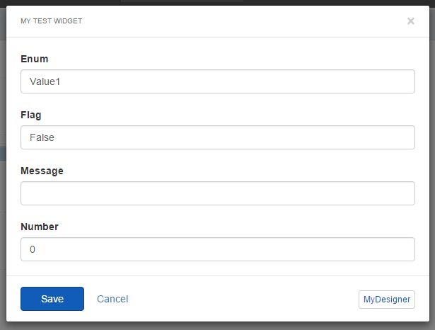{width="6.41in" height="4.86in"}

Clicking it will load that designer into the editor.

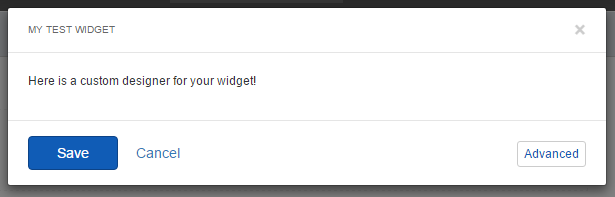{width="6.405449475065617in"
height="2.051826334208224in"}

### Prioritizing the Custom Designer

Instead of making your designer an option, you can configure Sitefinity
to load your designer by default. To do this, simply create a file
alongside the template, named to match exactly except using the
extension *.json*, and add the following contents:

{

\"priority\": 1

}

For our example, we would create the file DesignerView.MyDesigner.json
and place it in the same folder. Next time we load the editor we'll
automatically see our custom designer template.

### Adding Fields with Angular

The designer framework for Sitefinity widgets uses AngularJS, and can be
extended by leveraging Directives. A complete discussion of AngularJS is
outside the scope of this book, and for reference we recommend you visit
<http://angularjs.org> to learn more.

Each widget designer is passed an AngularJS *\$scope* which contains all
the appropriate objects necessary to build the designer interface.
Included in that \$scope is the *properties* object, which references
the public properties exposed by the widget being edited. This allows
you to leverage the various Angular directives to bind property values
to editors and allowing simple edits to be saved automatically without
writing code.

For example, we can create a complete (if entirely simple) UI for our
custom widget editor by adding the following markup:

\<fieldset\>

\<p\>

\<label for=\"flag\"\>Flag\</label\>

\<input type=\"checkbox\" id=\"flag\"

ng-model=\"properties.Flag.PropertyValue\" /\>

\</p\>

\<p\>

\<label for=\"enum\"\>Enum\</label\>

\<select id=\"enum\"

ng-model=\"properties.Enum.PropertyValue\"\>

\<option value=\"Value1\"\>Value 1\</option\>

\<option value=\"Value2\"\>Value 2\</option\>

\<option value=\"Value3\"\>Value 3\</option\>

\</select\>

\</p\>

\<p\>

\<label for=\"message\"\>Message\</label\>

\<input id=\"message\" type=\"text\"

ng-model=\"properties.Message.PropertyValue\" /\>

\</p\>

\<p\>

\<label for=\"number\"\>Number\</label\>

\<input id=\"number\" type=\"number\"

ng-model=\"properties.Number.PropertyValue\" /\>

\</p\>

\</fieldset\>

Reloading the designer reveals an interface that is more intuitive than
the standard textboxes offered by the stock version.

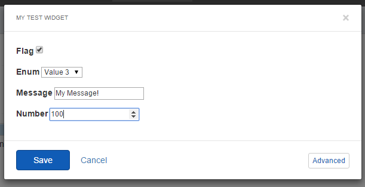{width="6.363788276465442in"
height="3.2600087489063867in"}

### Adding Custom Commands to Widgets

Each widget has a simple set of commands in the backend; such as the
Edit and Delete commands we've already seen.

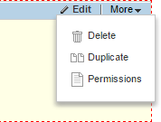{width="1.853934820647419in"
height="1.4060739282589676in"}

Feather makes it easy for you to expand the list with custom commands,
simply by making a few changes to the widget controller. Specifically,
the controller needs to implement the *IHasEditCommands* interface, and
adding a few methods, as shown here for our sample widget from above:

public class MyTestWidgetController : Controller, IHasEditCommands

{

public string Message { get; set; }

public bool Flag { get; set; }

public Enumeration Enum { get; set; }

public int Number { get; set; }

private IList\<WidgetMenuItem\> commands;

public IList\<WidgetMenuItem\> Commands

{

get

{

if (commands == null)

{

commands = new List\<WidgetMenuItem\>();

// restore the default commands

commands.Add(new WidgetMenuItem()

{

Text = Res.Get\<Labels\>().Delete,

CommandName = \"beforedelete\",

CssClass = \"sfDeleteItm\"

});

commands.Add(new WidgetMenuItem()

{

Text = Res.Get\<Labels\>().Duplicate,

CommandName = \"duplicate\",

CssClass = \"sfDuplicateItm\"

});

commands.Add(new WidgetMenuItem()

{

Text = Res.Get\<Labels\>().Permissions,

CommandName = \"permissions\",

CssClass = \"sfPermItm\"

});

// Add the custom command

var packageManager = new PackageManager();

var customActionLink =

packageManager.EnhanceUrl(RouteHelper.ResolveUrl(

\"Telerik.Sitefinity.Frontend/Designer/Master/MyTestWidget?view=CustomCommand\",

UrlResolveOptions.Rooted));

commands.Add(new WidgetMenuItem()

{

Text = \"CustomCommand\",

ActionUrl = customActionLink,

NeedsModal = true

});

}

return commands;

}

}

}

Note that in this case, we've added the original commands to the
Commands collection. This is because adding a custom command to a widget
clears any existing commands. Unless you have no further need for the
original commands, be sure to add them back as shown in this example.

Also, notice that we create the path to the *ActionUrl* for the custom
command by using the *PackageManager* class, specifically the
*EnhanceUrl* method. This allows us to map the *CustomCommand* to the
appropriate route for its designer.

Refreshing the page editor reveals the new command in the widget menu:

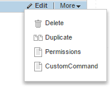{width="1.9060115923009624in"
height="1.5102274715660542in"}

Clicking CustomCommand will result in an error, since the command also
needs a designer.

Fortunately, this is simply another template file that follows the same
naming convention as the editor designer templates. We can simply add
the file DesignerView.CustomCommand.cshtml alongside the existing
designer with the following markup:

\<p\>Hello from the Custom Command Designer!\</p\>

Now clicking the new command reveals our designer, completing the custom
command.

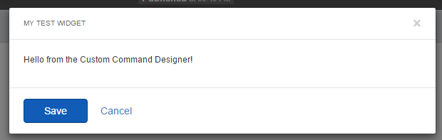{width="6.45752624671916in"
height="2.051826334208224in"}

Finally, to prevent this designer from mistakenly being presented as an
option in the regular editor designer, simply add a matching json file
(in this case DesignerView.CustomCommand.json) to the folder with the
following contents:

{

\"hidden\": true

}

The template will now be hidden from the designer, but still visible
when launched from the custom command.

You can then use these templates to create a separate section of your
website that display mobile content, then detecting and redirecting
mobile devices to those pages.

Sitefinity Web Services
=======================

The latest version of Sitefinity introduces a new *Web Services* module
designed to simplify the process of exposing an API for your site's
content that can be consumed by various clients, including mobile
applications, external websites, and even custom widgets within your
site.

Web services are not new to Sitefinity; the administrative backend of
Sitefinity has relied upon and used the existing WCF endpoints in the
/Sitefinity folder. However, although you can make use of these
services, they were primarily designed to support the administrative
operations of the website and using them for custom applications
requires additional configuration.

The requirements for parameters of items to be processed by the API are
also complex and heavy, requiring inclusion of many Sitefinity-specific
fields that can be outside the scope of your domain object and difficult
to populate correctly.

This partial sample schema shows just how many fields are required to
create a news item using the original WCF NewsItem service:

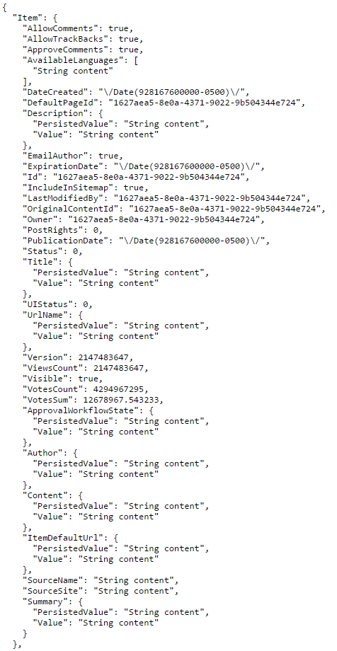{width="4.65625in" height="9.0in"}

The new Web Services module aims to reduce this complexity to enable
creation of simple, yet fully-featured API endpoints for your content
that support the full range of content operations (Create, Read, Update,
Delete) as well as managing permissions for each using the familiar
Sitefinity UI.

In addition, the created endpoints are much simpler to work with, as
they are more closely aligned to the domain objects that represent the
content being accessed, resulting in a much more intuitive developer
experience. This screenshot from the API help documentation shows a much
simpler payload for creating news items:

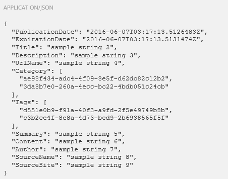{width="4.707744969378828in"
height="3.707869641294838in"}

However, although this new module simplifies the process of working with
simple CRUD operations, it is also limited to the set of predefined
operations exposed by the module. If you have custom needs or want to
simplify the interface for working with Sitefinity data via web
services, you might consider creating your own set of services from
scratch.

Choosing the Appropriate Method for Web Services
------------------------------------------------

Because there are several ways to work with web services in Sitefinity,
it is important to understand the limitations of each option and choose
the path that makes the most sense for your requirements. Here are some
considerations to help you decide.

### Supported Content Types

As of the date of publication of this edition, only the following
content areas are supported by the new Web Services module:

-   News items

-   Blogs and Blog posts

-   Events and Calendars

-   Images and Image libraries

-   Videos and Video libraries

-   Documents and Document libraries

-   Lists and List items

-   Comments

-   Dynamic content

-   Shared content blocks

-   Flat and Hierarchical taxonomies

Although this covers the most commonly used content areas of Sitefinity,
if you need to perform operations related to any other modules you must
rely on the original WCF services or create your own.

Of special note is the area of Security; if you need to manipulate Users
or Roles, only the older WCF services expose endpoints to support these
types of operations.

### Recreating or Migrating Items

If you intend to use Sitefinity web services to migrate or copy content
from an existing Sitefinity site, and must retain the original content
in full, including the Id, Owner, creation date and other relevant
metadata, you must use the older WCF services. The newer Web Services
module work with simpler object models designed for working with new
content, or updating existing content, and do not allow you to specify
these properties.

If you need full control over the created object, you must use the WCF
services or create your own API.

### Custom Payloads

Both the new Web Services module and the previous WCF endpoints have
predefined endpoints that require specific payload definitions for
creating, updating, or deleting items. While they are extensible enough
to handle custom fields, they still require Sitefinity-specific
constructs that may not be easily supplied by an external application.

A good example of this is supplying a taxonomy (such as Category or Tag)
to associate a content item. Both the new Web Services and WCF services
require and accept only a Guid to identify the classification, meaning
your application must either query these ahead of time or have knowledge
of the specific IDs you want to associate.

If you want to be able to specify such arguments by name, or otherwise
transform the API request or response, your best bet is to create a
custom API using Sitefinity's support for Web API.

Working with the Web Services Module
------------------------------------

The simplest and fastest way to get started with web services is to use
the new Web Services module introduced in version 9, available in the
Administration \> Web Services.

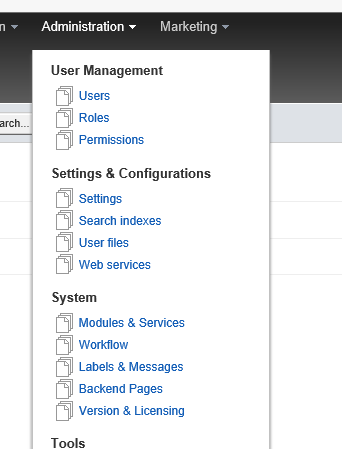{width="3.5620548993875767in"
height="4.676498250218723in"}

For new installs this module is automatically enabled, and a default
service is also created for you with default settings.

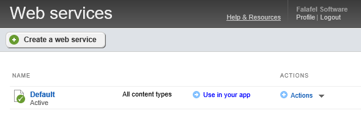{width="6.1450656167979005in"
height="2.166395450568679in"}

**Note**: If you are upgrading from a previous version of Sitefinity you
may need to enable the module and create a new service, which is fully
documented on the Sitefinity website here: [Create a Web
Service](http://docs.sitefinity.com/create-a-web-service).

### Managing Web Services

Sitefinity gives you control over what content is served as well as
permissions for CRUD operations on your content. The default setup is
configured to automatically expose all content types, granting access
rights only to users in the Administrators role.

You can modify this by editing the existing service or creating a new
one and specifying the content and permissions in the editor dialog.

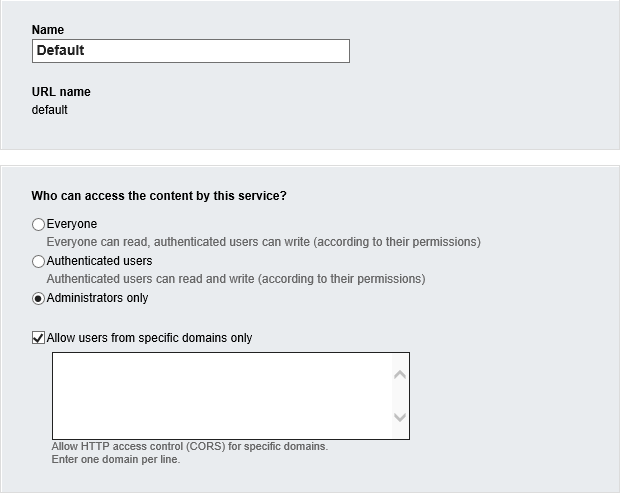{width="6.45752624671916in"
height="5.1347747156605426in"}

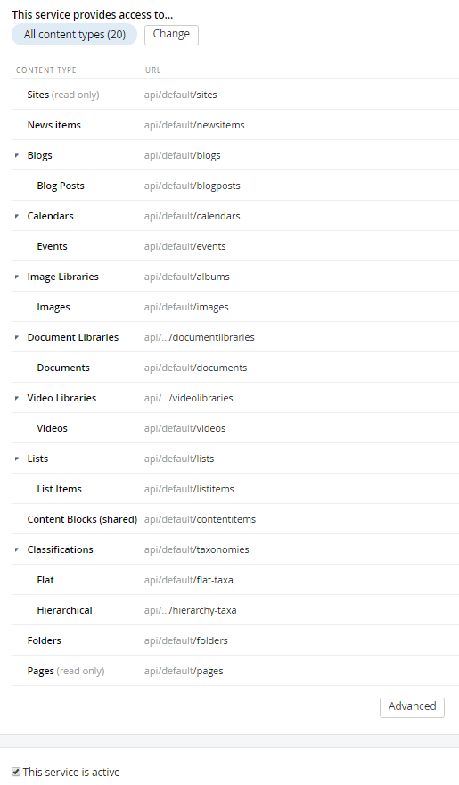{width="5.104166666666667in"
height="8.721161417322834in"}

The default configuration to include all content types is a special
case; in addition to exposing an API for all the *currently* supported
modules, when this option is selected, any *future* modules that gain
support for this module will also automatically be enabled when
Sitefinity is upgraded.

If you want to prevent the automatic registration of newly supported
modules or want to restrict APIs to only the supported modules you want
to expose, you can change your selection on this screen.

The default permissions also restrict access to administrators only,
meaning you must be logged in with a user of that role to consume the
API; even read operations are restricted for other users. Besides this
default option there are two others:

-   Authenticated: Read access is no longer restricted to
    Administrators, but the users must be authenticated, and must have
    read permissions within Sitefinity to access the content. Write
    operations are also extended to non-administrators, but only if they
    have the appropriate permissions.

-   Anonymous: Read-only access is allowed for all users, even those
    that are not authenticated. Write operations are restricted to any
    authenticated users that have the appropriate permissions.

### Other configuration settings

The Web Services module gives you a lot of control over many aspects of
its usage. The details of these options are officially documented here:
[Advanced Configuration of
Types](http://docs.sitefinity.com/advanced-configuration-of-types)

However, here are some of the highlights of these features.

### Customizing the API Path

By default, the path to the API follows this pattern:

http(s)://\<www.yoursite.com\>/\<RouteUrlName\>/\<ServiceUrlName\>/\<TypeUrlName\>

The default value for \<RouteUrlName\> is "api", but if this conflicts
with an existing route in your site (such as for a custom API you're
already using), you can override this setting in Administration \>
Settings \> Advanced \> WebServices \> Routes \> Frontend.

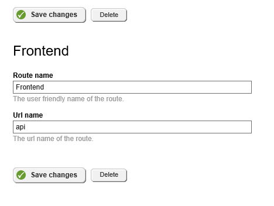{width="4.874390857392826in"
height="3.6662084426946633in"}

The \<ServiceUrlName\> in the route represents the *Name* property
entered when the service was created, which has a default value of
"default".

Finally, the \<TypeUrlName\> indicates the content type being accessed,
such as "newsitems" or "taxonomies".

The typical request url for news might look something like this:

http://mysite.com/api/default/newsitems

### Showing or Hiding Content Item Fields

By default, the Web Services module exposes a specific set of properties
for each type. For example, it automatically includes the Author field
for the NewsItem type and EventStart field for the Events type.

You can override these properties in the Advanced Settings under Web
Services \> Routes \> Frontend \> Services \> \[default\] \> Types \>
\[type\] \> Property Mappings, where \[default\] is the name of the API
service, and \[type\] is the content type you wish to modify.

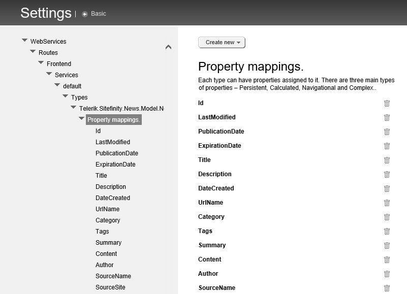{width="6.5in" height="4.697916666666667in"}

In addition to defining which fields are exposed, you can also modify
additional properties for each field, such as enabling or disabling
filtering and sorting on the field or marking it as read-only.

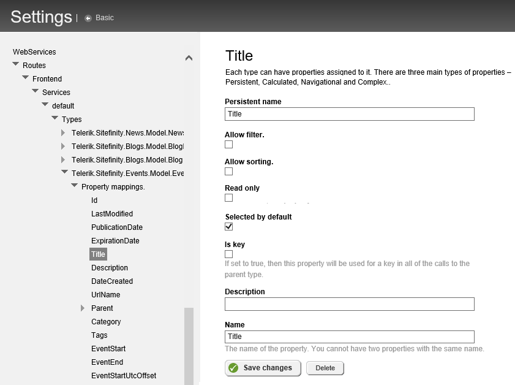{width="6.5in" height="4.853472222222222in"}

### Creating Semantic URLs

Another helpful feature exposed by the Web Services module is the
ability to create predefined endpoints that function like aliases to
more complex requests.

For example, instead of having to specify a complete ODATA filter like:

/api/default/newsitems?\$filter=startswith(Title, \'test\')

You can create a simpler endpoint that represents that same request in a
simpler format like this:

/api/default/newsitems/testitems

This is done in the Advanced Settings under Web Services \> Routes \>
Frontend \> Services \> \[default\] \> Types \> \[type\] \> Predefined
methods, where \[default\] is the name of the API service, and \[type\]
is the content type for which you want to define the alias.

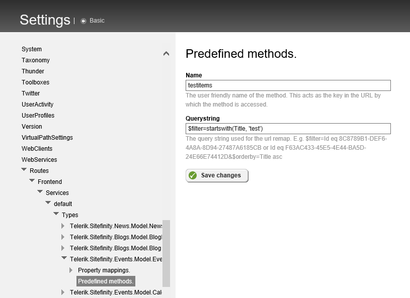{width="6.069569116360455in"
height="4.41599956255468in"}

Now that we have a basic understanding of the setup and configuration of
the Web Services module, let's look at how we can execute different
operations against the APIs.

You can use your favorite tool for this such as Fiddler to follow along,
but we'll be using the Postman extension for Chrome, which makes it easy
to send AJAX requests to an API and observe the results.

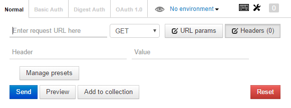{width="6.051326552930884in"
height="2.2601345144356957in"}

Also, for the purposes of these tests we are ignoring the issue of
Cross-Origin Resource Sharing, which restricts external access to
web-based resources such as our API. For more information about CORS and
how to configure Sitefinity to allow external access, including some
working samples, please see the section [Sitefinity Web Services and
CORS](#_Sitefinity_Web_Services_2).

### Consuming the Web Service Module API

The APIs exposed by the Web Services are simple REST endpoints, meaning
that you simply need to issue the proper request to the appropriate
endpoint to perform the desired operation.

Thankfully, each endpoint is fully and automatically documented by the
Web Services module, and this information is available from right within
Sitefinity by clicking the link labeled "Use in your app."

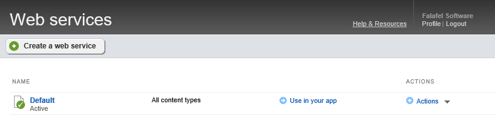{width="6.5in" height="1.51875in"}

This reveals a help page with a complete list of all the endpoints for
your service, the required request type (GET, POST, etc.) as well as
examples of both the required input parameter format and sample output
responses.

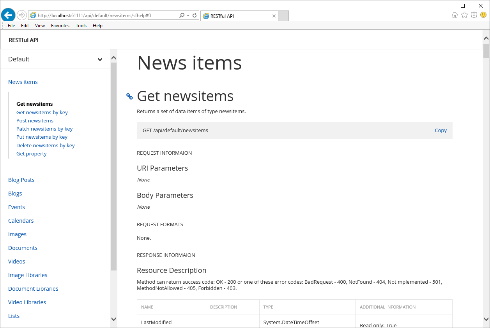{width="6.5in" height="4.364583333333333in"}

To start let's get all the NewsItems in the system via REST API, to make
this simple in the beginning, let's change the permission to access
these API to "everyone".

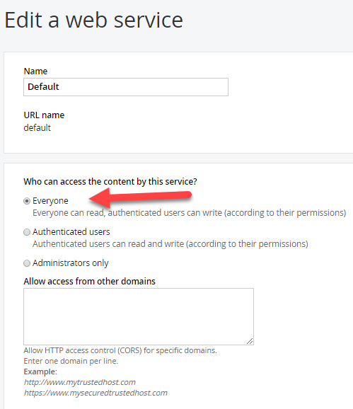{width="5.197267060367454in"
height="6.020080927384077in"}

Using this we can create a sample GET request for the list of news items
in our site using Postman as shown in this sample request:

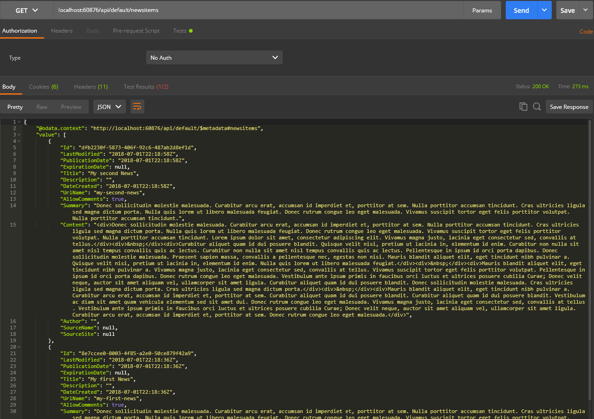{width="6.8767968066491685in"
height="4.854166666666667in"}

Notice that in this case we didn't have to supply any parameters for
authorization or content type, because we are making a simple GET
request that has been configured for **anonymous** access.

If we were to modify the Web Service to only accept **authenticated**
requests and repeat the above request, we would get an invalid result:

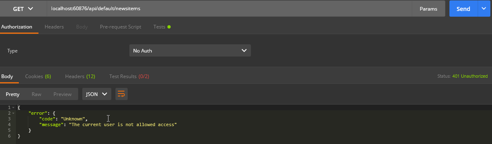{width="6.5in" height="1.9145833333333333in"}

### 

### Authenticating Requests to Web Service Module APIs

If the API is restricted to authorized users, or you want to perform
write operations to content via the API, you must first authenticate and
receive an **access token** which you must include with all subsequent
requests.

To start you will need to set up the authentication for a Client in the
Administration -\> Setting -\> Advanced -\> Authentication area

Under SecurityTokenService -\> Clients, add a new Client and call it
whatever you like, in my case I called it "linoapp"

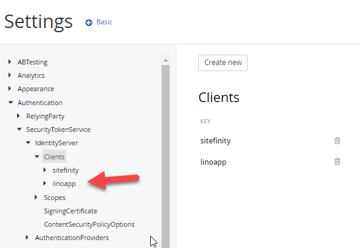{width="6.165895669291339in"
height="4.249468503937008in"}

Make sure you name the client and the client id, enable the client and
choose **ResourceOwner** for the Client Flow. Finally allow access to
all scopes. You can leave all the other defaults on that page.

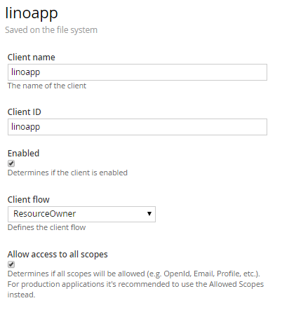{width="4.186976159230096in"
height="4.603591426071741in"}

For the secret, you can enter that under the Client Secrets for the app
"linoapp"

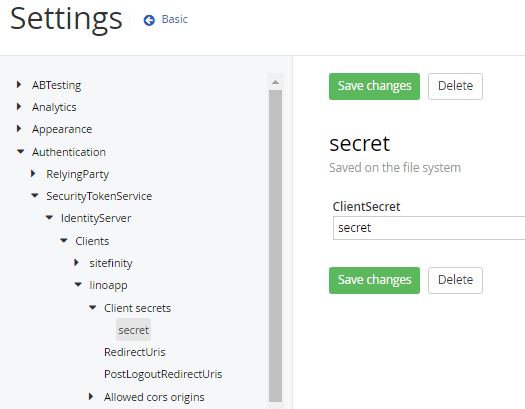{width="4.653115704286964in" height="3.625in"}

### Making Authenticated Requests

We need to obtain a token before making any API requests to the
Sitefinity APIs, we can pass it as a value to the Authorization header
parameter later.

Let's do this in two different ways so that you can get a sense of how
to do it in C\# and also in JavaScript in case you need to accomplish
this on a web page outside of Sitefinity or in a dotnet application,
Xamarin mobile app or a Nativescript mobile app for iOS or Android.

First, we do it the dotnet way in C\#
-------------------------------------

Whether you are using a Windows Form application, WPF, MVC or Xamarin
Mobile app in C\#, you need to establish 4 things:

First, establish your constants that will be needed during the execution

public const string ClientId = \"linoApp\";

public const string ClientSecret = \"secret\";

public const string TokenEndpoint =
\"http://\<yousitefinitysite\>/Sitefinity/Authenticate/OpenID/connect/token\";

public const string Username = \"test\@test.test\";

public const string Password = \"password\";

public const string Scopes = \"openid offline\_access\";

public static readonly Dictionary\<string, string\> AdditionalParameters
= new Dictionary\<string, string\>()

{

{ \"membershipProvider\", \"Default\" }

};

public const string WebApiNewsEndPoint =
"http://\<yoursitefinitysite\>/api/default/newsitems\";

Second, we will need to call a function that will help us get an
**AccessToken**

public static TokenResponse RequestToken()

{

//This is call to the token endpoint with the parameters that are set

TokenResponse tokenResponse =
tokenClient.RequestResourceOwnerPasswordAsync(Username, Password,
Scopes, AdditionalParameters).Result;

if (tokenResponse.IsError)

{

throw new ApplicationException(\"Couldn\'t get access token. Error: \" +
tokenResponse.Error);

}

return tokenResponse;

}

Third, we can now execute a Sitefinity API once we received an
AccessToken already from the previous "RequestToken" function

public static string CallApi(string accessToken)

{

HttpWebRequest request =
(HttpWebRequest)WebRequest.Create(WebApiNewsEndPoint);

request.ContentType = \"application/json\";

request.Method = \"GET\";

request.Headers.Add(\"Authorization\", \"Bearer \" + accessToken);

string html = string.Empty;

WebResponse response = request.GetResponse();

using (Stream stream = response.GetResponseStream())

using (StreamReader reader = new StreamReader(stream))

{

html = reader.ReadToEnd();

}

return html;

}

Don't forget also to establish a Refresh of the token in case it is
needed

public static TokenResponse RefreshToken(string refreshToken)

{

//This is call to the token endpoint that can retrieve new access and

//refresh token from the current refresh token

return tokenClient.RequestRefreshTokenAsync(refreshToken).Result;

}

Finally, the 4^th^ and final step is to bring it all together in a
function of your choice in any platform to call these established
functions:

tokenClient = new TokenClient(TokenEndpoint, ClientId, ClientSecret,

AuthenticationStyle.PostValues);

TokenResponse tokenResponse = RequestToken();

string **accessToken** = tokenResponse.AccessToken;

//The purpose of the refresh token is to retrieve new access token when
//the it expires

string refreshToken = tokenResponse.RefreshToken;

string reponseHtml = CallApi(accessToken);

Voila, you can now access authenticated REST API calls in Sitefinity in
C\# from any kind of applications (Web MVC, Web Forms, Windows Forms,
WPF, Xamarin Forms, Xamarin Native, etc...)

Second, let's do this in JavaScript
-----------------------------------

In any HTML page, php, ascx or cshtml, etc... you can load the following
JavaScript to establish exactly what we accomplished in C\# above.

\<script\>

//The token end point from where we can retrieve the access token

var tokenEndPoint =
\"http://\<yourSFsite\>/Sitefinity/Authenticate/OpenID/connect/token\";

var apiUrl=\"http://\<yoursitefinitysite\>/api/default/newsitems\";

var client\_id = \"linoApp\";

var client\_secret = \"secret\";

var accessToken;

var refreshToken;

\$(\"\#getTokenBtn\").on(\"click\", getToken);

\$(\"\#getTokenWithRefreshBtn\").on(\"click\",

getAccessTokenFromRefreshToken);

\$(\"\#apiCallBtn\").on(\"click\", callApi);

function getToken() {

//Have an input element on the page for the username

var username = \$(\'\#username\').val();

//Have an input element on the page for the password

var password = \$(\'\#password\').val();

//Call that gets the access and refresh token

\$.ajax({

url:tokenEndPoint,

data:{

username:username,

password:password,

grant\_type:\'password\',

scope:\'openid offline\_access\',

client\_id:client\_id,

client\_secret:client\_secret

},

method:\'POST\',

success:function(data){

console.log(data.access\_token);

console.log(data.refresh\_token);

\$(\'\#token\').text(data.access\_token);

\$(\'\#refreshToken\').text(data.refresh\_token);

accessToken=data.access\_token;

refreshToken=data.refresh\_token;

},

error:function(err){

alert(err.responseText);

}

})

}

//Call that gets new access and refresh token from the current refresh
//token

function getAccessTokenFromRefreshToken() {

\$.ajax({

url:tokenEndPoint,

data:{

refresh\_token:refreshToken,

grant\_type: \'refresh\_token\',

client\_id:client\_id,

client\_secret:client\_secret

},

method:\'POST\',

success:function(data){

console.log(data.access\_token);

console.log(data.refresh\_token);

\$(\'\#token\').text(data.access\_token);

\$(\'\#refreshToken\').text(data.refresh\_token);

accessToken=data.access\_token;

refreshToken=data.refresh\_token;

},

error:function(err){

alert(err.responseText);

}

})

}

//Sitefinity Web API call with access token as a bearer token

function callApi() {

\$.ajax({

url:apiUrl,

method:\'GET\',

beforeSend:function (xhr) {

xhr.setRequestHeader (\"Authorization\", \"**Bearer** \" + accessToken);

},

success:function(data){

if(data.value.length!==0){

\$(\"\#apiResult\").text(\"Item content:\"+ data.value\[0\].Content)

}

else{

\$(\"\#apiResult\").text(\"No news items\");

}

},

error:function(err){

alert(err.responseText);

}

})

}

\</script\>

Working with the Sitefinity WCF Services
----------------------------------------

The original WCF Services introduced with Sitefinity 4 still remain
available and are still utilized by the backend to perform
Administrative tasks in Sitefinity. As such, they are fully featured and
offer complete coverage of the Sitefinity API.

The new Web Services module in the latest Sitefinity is certainly the
recommended option for creating an API for consuming data. However, as
it is still a new feature, it does not offer the full coverage of the
WCF services.

The list of features (as of the publication of this book) is listed in
the previous section [Supported Content
Types](#_Supported_Content_Types). If you require access to any content
type or feature not listed, you would need to leverage the WCF services
instead.

The most likely scenario in which you'll encounter this limitation is
when working with Security, such as Creating or adding users, including
their roles and permissions. Another is when you need to create content
items or users with a specific ID (such as when you are migrating items
from another Sitefinity instance).

In this section, we will look at a few samples showing how you can
perform these operations.

### Requirements for Sitefinity WCF Services

As previously mentioned, the WCF services Sitefinity offers are
primarily intended to be used by the backend administration for the
website. Operations such as creating or updating pages, content items,
users, etc., all execute their operations through these services.

As such, they are designed to be consumed from an authenticated context,
namely the logged in user in the backend, sending the user's
authorization (usually via cookies in the user's browser session) to
authenticate the request.

In order to consume these services in your own applications, you need to
authenticate your requests. This is described in a later section:
[Authenticating Requests to WCF Services](#_Authenticating_Requests_to).

In addition, if your application runs on a different website and domain,
you must configure Cross-Origin Resource Sharing (CORS) so that the
requests are not rejected. This is covered in a later section: [CORS for
WCF Services](#_CORS_for_WCF).

### Help Pages for WCF Services

Each WCF endpoint in Sitefinity exposes a help section with metadata
information which describes and shows examples for all of the supported
operations for each service.

You can access these by following the path described here:

/sitefinity/Services/\<service folder\>/\<service\>.svc/help

Where \<servicefolder\> is the physical folder in the Sitefinity web
application and \<service\> is the filename that corresponds to the
service you wish to explore. For reference, these endpoints are visible
in the Visual Studio explorer:

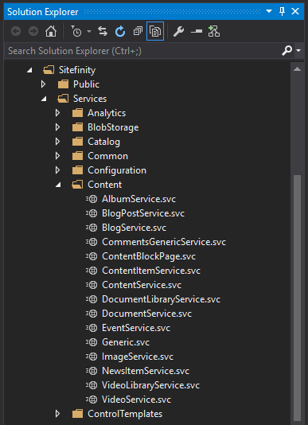{width="3.568899825021872in"
height="4.924527559055118in"}

Fill in the path to any of these services and append /help to see the
list of operations and the required parameters for use:

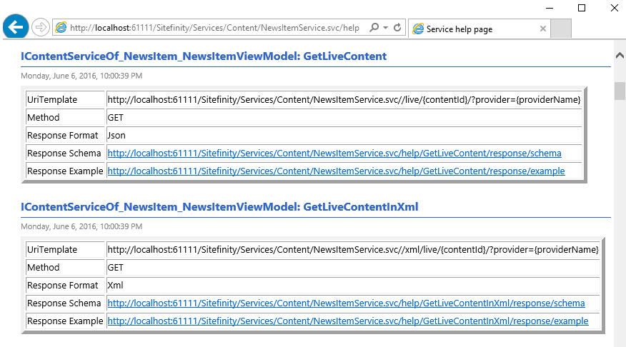{width="6.5in" height="3.60625in"}

**Important Note**: Accessing these pages in the browser requires that
you are logged in as an Administrator.

Now that we know how to get the information required to issue requests,
let's look at some of the operations we can perform. However, before we
can send any requests, we must first authenticate ourselves.

### Authenticating Requests to WCF Services

Unlike the Web Services module, which has an API endpoint for
authentication, WCF services use same system that is used by the default
login screen shown here:

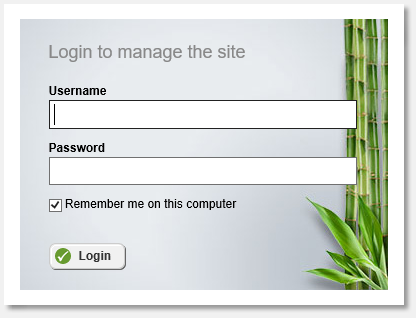{width="4.332791994750656in"
height="3.31208552055993in"}

This form executes a POST operation to the following path:
/Sitefinity/Authenticate/SWT

It accepts FORM parameters for the username and password, using the
respective field names "wrap\_name" and "wrap\_password". This POST
returns the familiar access token required for authorization that should
be included in subsequent requests.

Here is an example of an authentication request using Postman and the
response containing the access token:

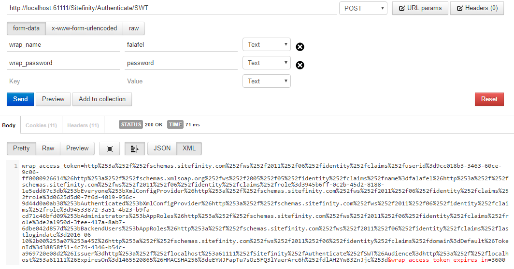{width="6.5in" height="3.408333333333333in"}

The key portion of the result we're interested is the value of the
section titled "wrap\_access\_token", the full contents of which are
shown highlighted here:

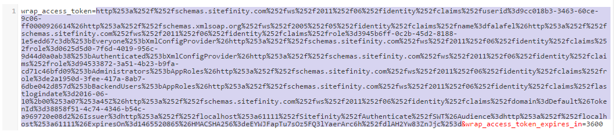{width="6.5in" height="1.4340277777777777in"}

This is the value we want to use to create the Authorization header that
must be included in all subsequent requests.

**Important Note**: Although this token has a name similar to that used
in the previous section for Web Services, the Authorization header for
WCF requests is in a different format, and it's important to remember to
use the correct token for each type of request.

Here is the format for adding the value of the access token above to the
Authorization header:

Authorization: WRAP access\_token=\"\<ACCESS\_TOKEN\>\"

Where \<Access\_Token\> is the value returned from the Login request, an
example of which is shown highlighted above.

**Important Note**: When working with Postman, it is important to
remember that the response shown is URL Encoded. If you copy the value
exactly as shown and use it as-is in the Authorization header for
another Postman request, you will get this error:

Invalid formEncodedstring contains a name/value pair missing an =
character

If you want to use the access token from Postman, you should first
decode the response, which can be done using the Bing URL Encoder tool.
Simply search [Bing](http://www.bing.com/search?q=url+decoder) for "URL
Decoder" and you can paste the token into the tool and decode it before
adding it to the Authorization header:

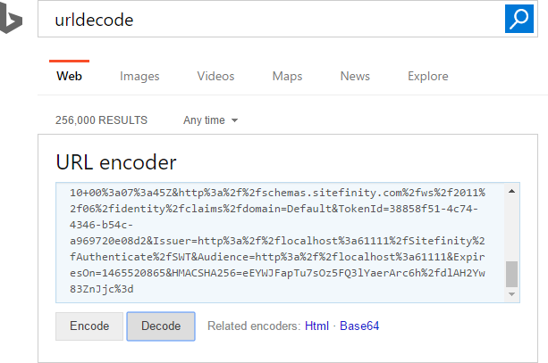{width="6.38461832895888in"
height="4.2390529308836395in"}

This extra step is only required for tools like Postman, and can be
omitted when sending AJAX requests from a webpage.

Before we look at a working sample of logging in using WCF, let's review
some important requirements that you must configure before you can
proceed.

### Backend Login Restrictions

By default, Sitefinity is configured to only allow logins from requests
issued within the same domain, as well as any domains registered and
associated with the Sitefinity.lic license file used by the site.
Internally Sitefinity compares the requested origin header against the
list of *TrustedLoginDomains* property in the SecurityConfig setting.

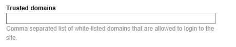{width="4.791067366579178in"
height="0.9582130358705162in"}

If the external request doesn't match, you will get this somewhat
cryptic exception:

> Access denied
>
> Description: An unhandled exception occurred during the execution of
> the current web request. Please review the stack trace for more
> information about the error and where it originated in the code.
>
> Exception Details: System.Web.HttpException: Access denied
>
> Source Error:
>
> An unhandled exception was generated during the execution of the
> current web request. Information regarding the origin and location of
> the exception can be identified using the exception stack trace below.
>
> Stack Trace:
>
> \[HttpException (0x80004005): Access denied\]
>
> Telerik.Sitefinity.Security.Claims.SecurityTokenServiceHttpHandler.ValidateRequestSource(HttpContextBase
> context) +457
>
> Telerik.Sitefinity.Security.Claims.SecurityTokenServiceHttpHandler.ProcessRequest(HttpContextBase
> context) +605
>
> Telerik.Sitefinity.Security.Claims.SecurityTokenServiceHttpHandler.ProcessRequest(HttpContext
> context) +40
>
> System.Web.CallHandlerExecutionStep.System.Web.HttpApplication.IExecutionStep.Execute()
> +188
>
> System.Web.HttpApplication.ExecuteStep(IExecutionStep step, Boolean&
> completedSynchronously) +69

Add any domains or hostnames that should be granted access to the
*Trusted Domains* field and this error will no longer appear.

**Tip**: When working with Postman in Chrome, the request will be
accompanied by a header such as
chrome-extension://fdmmgilgnpjigdojojpjoooidkmcomcm, and you can
discover this property by inspecting the Network tab of the Chrome
Developer Tools when issuing the login request:

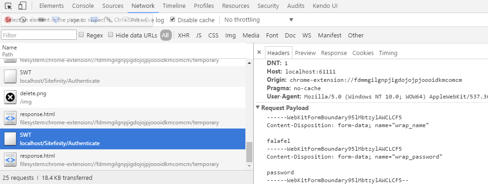{width="6.5in" height="2.46875in"}

Adding the hostname fdmmgilgnpjigdojojpjoooidkmcomcm (or whatever shows
up for your instance of the plugin) to the SecurityConfig setting will
allow the login to succeed.

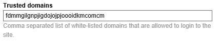{width="4.4681911636045495in"
height="0.9269674103237096in"}

It is important to note, however that accessing WCF services as an
authenticated user counts the user as "logged in" for the purposes of
both the backend user count limitation of your Sitefinity license as
well as the browser session itself. This means if you are logged to the
Sitefinity backend you may be prevented from logging in via WCF, and
vice-versa, since you cannot be logged into more than once
simultaneously.

Attempting to access a WCF service with the same account that is already
logged into the backed will reveal an error that says
UserAlreadyLoggedIn along with a 403 status code:

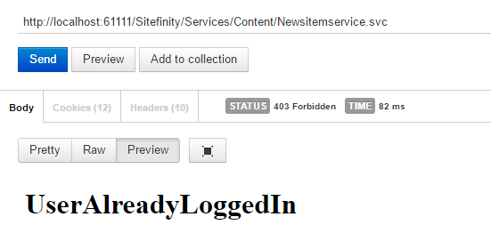{width="5.738865923009624in"
height="2.8225634295713036in"}

This is similar to the message shown when you attempt to login to more
than one browser session:

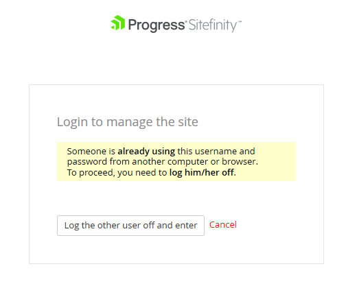{width="4.3848687664042in"
height="2.697579833770779in"}

Although you cannot override this behavior to allow simultaneous logins,
you can automate the process of logging out the previous session so that
the WCF request can logout any other session and continue uninterrupted.

To do this, navigate the backend administration to Administration \>
Settings \> Advanced \> Security and check the option labeled:
Automatically logout backend users from other HTTP clients on login.

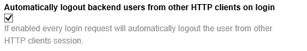{width="4.666083770778653in"
height="0.7811526684164479in"}

This does have the consequence of forcibly ending an active session, so
make sure this is indeed the behavior you require.

Alternatively, it is recommended that you instead create a separate
login specifically for use with WCF services so that you can use that
account without risk of kicking out other users (or yourself!).

### Logging in with WCF Sample

To demonstrate logging in via WCF in the browser to an external site, we
will use the freshly setup sample project with the SecurityConfig
properties at their default blank state, running as
<http://localhost:61111>

We also have a separate HTML web page with the code necessary to execute
the login request on page load, using a helper method to parse the
resulting token from the response, and outputting the token to the
console.

\<!DOCTYPE html\>

\<html\>

\<head\>

\<title\>\</title\>

\<meta charset=\"utf-8\" /\>

\<script src=\"http://code.jquery.com/jquery-1.12.4.min.js\"
type=\"text/javascript\"\>\</script\>

\</head\>

\<body\>

\<script type=\"text/javascript\"\>

\$(function () {

var username = \"lino\@tadros.com\";

var password = \"password\";

\$.post(

\"http://localhost:61111/Sitefinity/Authenticate/SWT\",

{ wrap\_name: username, wrap\_password: password },

function (result) {

var resultParams = parseQuery(result);

var token = resultParams.wrap\_access\_token;

console.log(token);

});

function parseQuery(qstr) {

var query = {};

var a = qstr.split(\'&\');

for (var i = 0; i \< a.length; i++) {

var b = a\[i\].split(\'=\');

query\[decodeURIComponent(b\[0\])\] =

decodeURIComponent(b\[1\] \|\| \'\');

}

return query;

}

});

\</script\>

\</body\>

\</html\>

To keep this example simple, we'll keep the page in the same Sitefinity
site so that the request is in the same domain. For more information
about making requests from external applications (as well as a simple
GET example for retrieving content) take a look at the section titled
[CORS for WCF Services](#_CORS_for_WCF)).

When we load the page we should (assuming we're not already logged in)
execute the login POST and see the token successfully received:

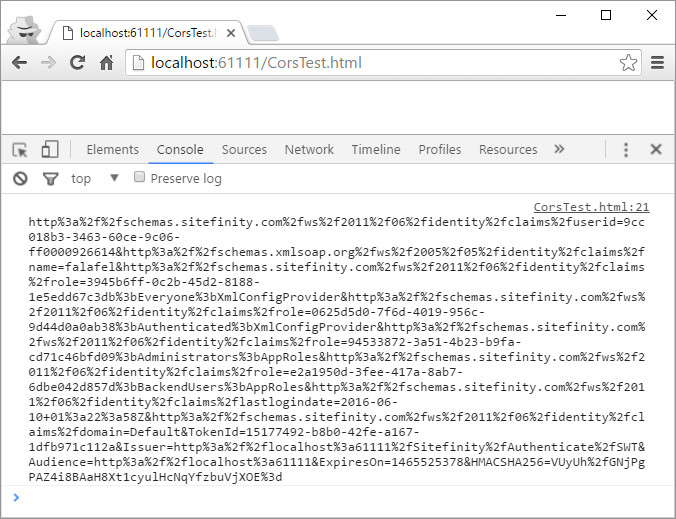{width="5.901280621172353in"
height="4.53125in"}

We are now authenticated and ready to use this token to do something
useful. Remember that many of the content operations are better served
using the new Web Services module (from the earlier section). However,
Users are still not supported there, so let's use that as our example.

### Creating a User with WCF Services

For this sample, we have the same Sitefinity website from the previous
example and the sample HTML page to issue the request, this time
modified to demonstrate one way to create a user.

\<!DOCTYPE html\>

\<html\>

\<head\>

\<title\>\</title\>

\<meta charset=\"utf-8\" /\>

\<script src=\"http://code.jquery.com/jquery-1.12.4.min.js\"
type=\"text/javascript\"\>\</script\>

\</head\>

\<body\>

\<script type=\"text/javascript\"\>

\$(function () {

var username = \"lino\@tadros.com\";

var password = \"password\";

function createUser(access\_token) {

\$.ajax({

url:
\"http://localhost:61111/Sitefinity/Services/Security/Users.svc/create/00000000-0000-0000-0000-00000000/\",

type: \"PUT\",

dataType: \"json\",

contentType: \"application/json\",

data: JSON.stringify(newUser),

beforeSend: function (xhr) {

xhr.setRequestHeader(\'Authorization\', \'WRAP access\_token=\"\' +
access\_token + \'\"\');

},

success: function (result) {

console.log(\"User imported successfully!\");

},

error: function (result) {

console.log(result);

}

});

};

\$.post(

\"http://localhost:61111/Sitefinity/Authenticate/SWT\",

{ wrap\_name: username, wrap\_password: password },

function (result) {

var resultParams = parseQuery(result);

var token = resultParams.wrap\_access\_token;

createUser(token);

});

function parseQuery(qstr) {

var query = {};

var a = qstr.split(\'&\');

for (var i = 0; i \< a.length; i++) {

var b = a\[i\].split(\'=\');

query\[decodeURIComponent(b\[0\])\] = decodeURIComponent(b\[1\] \|\|
\'\');

}

return query;

}

var newUser = {

AvatarImageUrl:
\"\\/SFRes\\/images\\/Telerik.Sitefinity.Resources\\/Images.DefaultPhoto.png\",

AvatarThumbnailUrl:
\"\\/SFRes\\/images\\/Telerik.Sitefinity.Resources\\/Images.DefaultPhoto.png\",

Email: \"testuser\@site.com\",

IsApproved: true,

IsBackendUser: false,

Password: \"password\",

PasswordAnswer: null,

PasswordQuestion: \"\",

ProfileData:
\"{\\\"Telerik.Sitefinity.Security.Model.SitefinityProfile\\\":{\\\"\_\_type\\\":\\\"Telerik.Sitefinity.Security.Model.SitefinityProfile\\\",\\\"FirstName\\\":\\\"Test\\\",\\\"LastName\\\":\\\"User\\\",\\\"ApplicationName\\\":\\\"\\/UserProfiles\\\",\\\"IsProfilePublic\\\":false,\\\"\_\_providerName\\\":\\\"OpenAccessProfileProvider\\\"}}\",

ProviderName: \"Default\",

RoleNamesOfUser: \"RegUser\",

RolesOfUser: \[\],

UserName: \"testuser\"

}

});

\</script\>

\</body\>

\</html\>

Here we've hard-coded a user object (including a required basic profile)
which you would want to create yourself, likely from collecting inputs
on the page, reading from an external source or some other method that
makes sense for your project.

Notice that in this case we have to include an empty Guid in the path,
which indicates to the service that this is a CREATE operation rather
than an UPDATE:

/Sitefinity/Services/Security/Users.svc/create/00000000-0000-0000-0000-00000000/

When the page is loaded, the authentication call from before executes
and passes the token on to the PUT call to create the user.

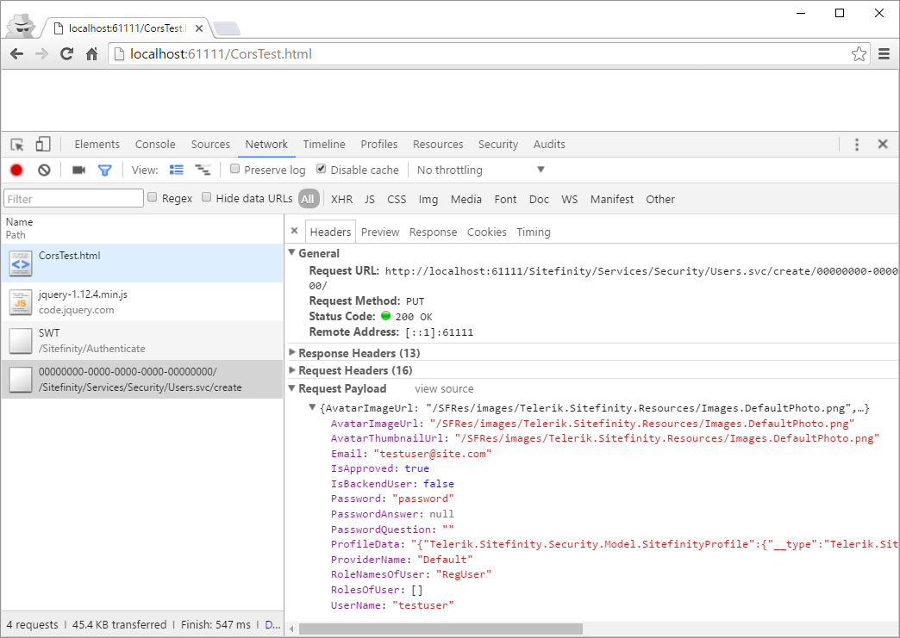{width="6.5in" height="4.613194444444445in"}

Our request shows a success, and logging into the backend to view the
users reveals the newly created user:

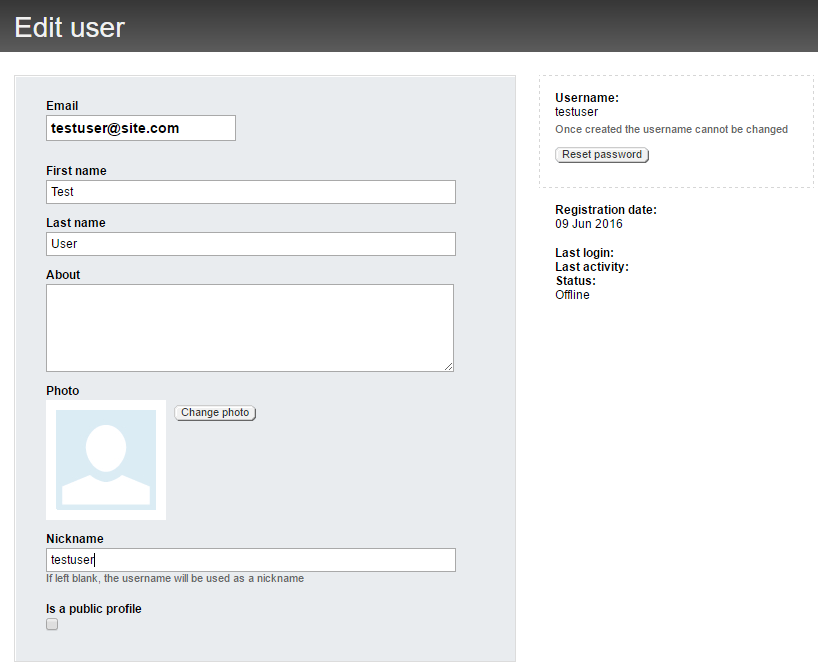{width="6.5in" height="5.323611111111111in"}

### Creating a User with a Specific ID

The previous example will assign a new Guid value for the created user.
If you're using the WCF service to create users programmatically, it's
possible that you'll want to control this ID of the created user, such
as if you are importing users from another Sitefinity website, so that
it can be assigned a specific value.

You might expect to be able to simply specify the UserID or
ProviderUserKey properties of the User object when submitting the PUT
request to the create endpoint. We can try that by modifying our model
from the previous request:

var newUser = {

AvatarImageUrl:
\"\\/SFRes\\/images\\/Telerik.Sitefinity.Resources\\/Images.DefaultPhoto.png\",

AvatarThumbnailUrl:
\"\\/SFRes\\/images\\/Telerik.Sitefinity.Resources\\/Images.DefaultPhoto.png\",

Email: \"testuser\@site.com\",

IsApproved: true,

IsBackendUser: false,

Password: \"password\",

PasswordAnswer: null,

PasswordQuestion: \"\",

ProfileData:
\"{\\\"Telerik.Sitefinity.Security.Model.SitefinityProfile\\\":{\\\"\_\_type\\\":\\\"Telerik.Sitefinity.Security.Model.SitefinityProfile\\\",\\\"FirstName\\\":\\\"Test\\\",\\\"LastName\\\":\\\"User\\\",\\\"ApplicationName\\\":\\\"\\/UserProfiles\\\",\\\"IsProfilePublic\\\":false,\\\"\_\_providerName\\\":\\\"OpenAccessProfileProvider\\\"}}\",

ProviderName: \"Default\",

RoleNamesOfUser: \"RegUser\",

RolesOfUser: \[\],

UserName: \"testuser\",

**UserID: \"3853b90d-19e6-68ee-a860-ff00000a783e\",**

**ProviderUserKey: \"3853b90d-19e6-68ee-a860-ff00000a783e\"**

}

Indeed, these are the properties required to update in order to control
this field.

Unfortunately, as of the publication of this book, there is an issue in
Sitefinity that prevents this from running successfully. The reason is
that while the ProviderUserKey property type is *object*, we are passing
the JSON object as a serialized *string*. As a result, when it is
deserialized within the Users.svc endpoint, it receives the property as
a string, which it attempts to cast to a *guid*.

This conversion fails, throwing an exception and returning the error:
*Invalid provider user key*.

The easiest way to resolve this is to create a proxy service that can
correctly convert the *string* property for ProviderUserKey to a Guid.
This is done by creating a new WCF service that accepts the same
original payload, converts the property, then passes it on to the
original endpoint.

A complete discussion of the different components involved in creating a
WCF service is outside of the scope of this book. However, we can look
at a very simple implementation that solves this problem.

Here is the complete code for such a class:

using System;

using System.ServiceModel;

using System.ServiceModel.Activation;

using System.ServiceModel.Web;

using Telerik.Sitefinity.Security.Web.Services;

using Telerik.Sitefinity.Utilities.MS.ServiceModel.Web;

namespace SitefinityWebApp.Custom

{

\[AspNetCompatibilityRequirements(RequirementsMode =

AspNetCompatibilityRequirementsMode.Required),

ServiceBehavior(IncludeExceptionDetailInFaults = true,

InstanceContextMode = InstanceContextMode.Single,

ConcurrencyMode = ConcurrencyMode.Single)\]

public class UsersCustom : ICustomUser

{

/// \<summary\>

/// Inserts/Updates the user information.

/// The update user information is returned in JSON.

/// \</summary\>

/// \<param name=\"user\"\>User object to be created.\</param\>

/// \<param name=\"userId\"\>Id of the user to be created.\</param\>

/// \<param name=\"provider\"\>The name of membership

/// provider.\</param\>

/// \<returns\>\</returns\>

public WcfMembershipUser CreateUserWithGuid(

WcfMembershipUser user,

string userId, string provider)

{

user.ProviderUserKey =

Guid.Parse(user.ProviderUserKey.ToString());

return new Users().CreateUser(user, userId, provider);

}

}

\[ServiceContract\]

public interface ICustomUser

{

\[OperationContract, WebHelp(Comment =

\"Inserts or updates a user for given membership provider. The results
are returned in JSON format.\"),

WebInvoke(Method = \"PUT\",

UriTemplate = \"/createwithguid/{userId}/?provider={provider}\",

ResponseFormat = WebMessageFormat.Json)\]

WcfMembershipUser CreateUserWithGuid(WcfMembershipUser user,

string userId, string provider);

}

}

As expected, the single "CreateUserWithGuid" method here accepts the
same payload as the original endpoint, converts the property to a Guid
by parsing it, then passes it on to a new instance of the original
intended service.

Next, we must register this service for use within Sitefinity. This is
done by adding the following to your site's Global.asax file:

protected void Application\_Start(object sender, EventArgs e)

{

SystemManager.ApplicationStart +=

new EventHandler\<EventArgs\>(ApplicationStartHandler);

}

private void ApplicationStartHandler(object sender, EventArgs e)

{

SystemManager.RegisterWebService(

typeof(SitefinityWebApp.Custom.UsersCustom),

\"Services/Sitefinity/UsersCustom\");

}

You must also add the UsersCustom.svc file to the matching folder under
/Sitefinity/Services/Security with the following content:

\<%@ ServiceHost

Language=\"C\#\"

Debug=\"false\"

Service=\"SitefinityWebApp.Custom.UsersCustom\"

Factory=\"Telerik.Sitefinity.Web.Services.WcfHostFactory\"

\%\>

Finally, we update the URL in our sample HTML page to call our new
service, replacing the original and matching both the registered
endpoint and the new method name. Now the request will hit our proxy
instead of the original service:

function createUser(access\_token) {

\$.ajax({

url:
\"**http://localhost:61111/Services/Security/UsersCustom.svc/createwithguid/00000000-0000-0000-0000-00000000/\",**

type: \"PUT\",

dataType: \"json\",

contentType: \"application/json\",

data: JSON.stringify(newUser),

beforeSend: function (xhr) {

xhr.setRequestHeader(\'Authorization\',

\'WRAP access\_token=\"\' + access\_token + \'\"\');

},

success: function (result) {

console.log(\"User imported successfully!\");

},

error: function (result) {

console.log(result);

}

});

};

When we reload the page (having deleted the previously created user),
the request succeeds:

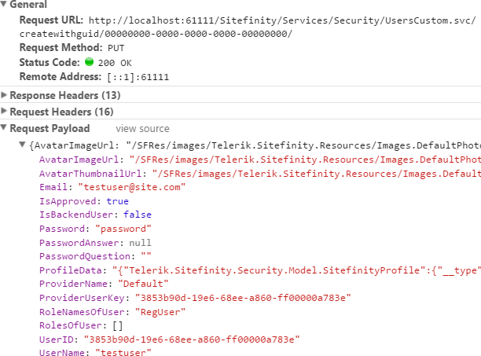{width="6.374202755905512in"
height="4.718160542432196in"}

Looking at the raw SQL data, we can verify that indeed the new user
receives the exact Guid property for ID that we specified:

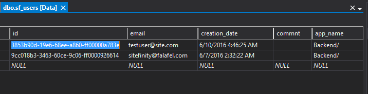{width="6.5in" height="1.6611111111111112in"}

### Sitefinity WCF Gotchas, Pitfalls, and Tips

As we've already seen, working with WCF services can be tricky, as they
are once again primarily designed to be used by the Sitefinity backend.
Here are some tips and notes compiled throughout the production of this
chapter. Some we covered in detail already as well as in the next
section, but hopefully this serves as a quick at-a-glance overview of
some important points to remember.

-   Authentication is done by posting a Sitefinity username and password
    to the same form used to login to the backend, which returns the
    access token for use in each following request

-   The access token should be sent as a header in this format:
    Authorization: WRAP access\_token="\<ACCESS\_TOKEN\>"

-   Logging in and issuing requests as a Sitefinity user using WCF
    counts as a "logged in" against the backend user count limitation
    for your license.

-   You cannot be logged into both the Sitefinity backend and the WCF
    services simultaneously.

-   When using Postman to test authentication, you must first URL-decode
    the token before submitting it in the Authorization header.

-   If you are authenticating from an external domain, you must specify
    the origin in the SecurityConfig under *TrustedDomains*.

-   If you are issuing requests from an external domain, you must
    specify the origin in SecurityConfig under
    *AccessControlAllowOrigin* (See section titled CORS for WCF Services
    for more details and a sample).

-   Most WCF requests should end with the trailing slash / character; if
    omitted, your request will be redirected via 301 to that path and
    this may cause your request to fail.

-   Creating users with a specific User ID (Guid) requires that you
    create a proxy service to overcome an issue with the current version
    of Sitefinity (see section titled: Creating a User with a Specific
    ID)

-   If you are using Single Sign On (SSO) the default login form is no
    longer presented, so you will be unable to authenticate and use WCF
    services.

Sitefinity Web Services and CORS
--------------------------------

Requests to an API via a web browser to an endpoint located outside the
page's host domain require special configuration on the receiving end to
enable Cross-Origin Resource Sharing (or CORS). Attempting to access
your web services from an external domain that does not have CORS
configured to allow access will result in an error similar to this:

> XMLHttpRequest cannot load http://\*\*\*\*\*\*\*. No
> \'Access-Control-Allow-Origin\' header is present on the requested
> resource. Origin \'http://\*\*\*\*\*\*\*\' is therefore not allowed
> access.

If all of your requests will be made from within the context of the same
website running the services (for example, if you are developing widgets
that will run in the same domain as the web services), then you can
ignore this setting and accept the default.

However, if the API is being consumed by a different website you must
specify each domain you wish to grant access.

For the Web Services module, this is done in the Edit (or Create) dialog
for the service in the field labeled "Allow users from specific domains
only." When checked, an additional textarea field is revealed to accept
a list of domains allowed to access your services.

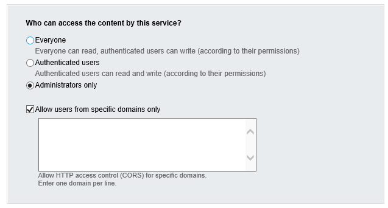{width="6.5in" height="3.4895833333333335in"}

Alternatively, you can also input the wildcard \* character to allow all
external requests, but this can be a security risk and is not
recommended.

You can specify this access for each instance of the Web services module
you create, but if this field is left blank, the configuration will fall
back to the *AccessControlAllowOrigin* setting in SecurityConfig of the
advanced settings:

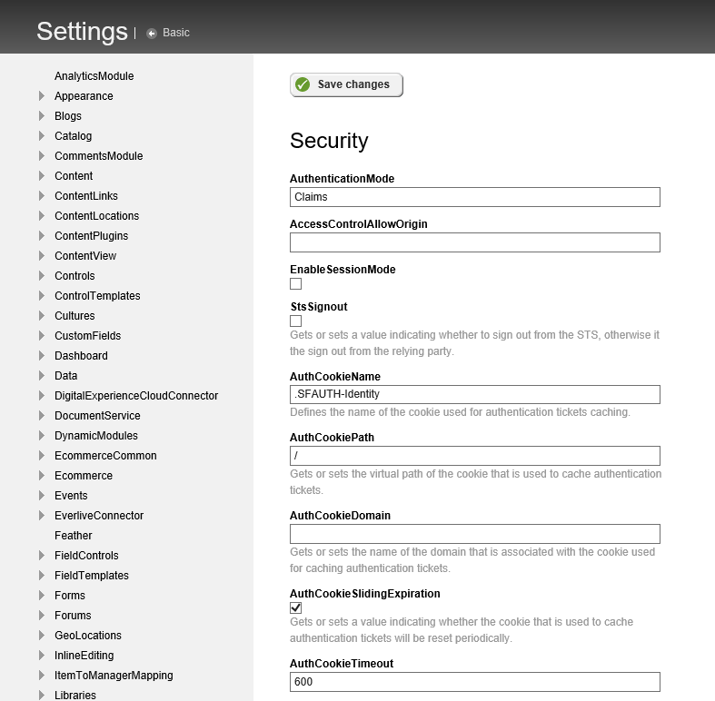{width="6.5in" height="6.376388888888889in"}

This setting is also blank by default, and if left blank, then only
requests from within the same domain will be accepted by the browser.

### CORS for the Web Services Module in Action

To better demonstrate the configuration of CORS in relation to the Web
Services module, let's look at a few different examples and the results.

For this example, we have setup a fresh Sitefinity website with default
Web Services module set to allow Anonymous access, and currently have
both the CORS field and the SecurityConfig properties at their default
blank state, running as <http://localhost:61111>

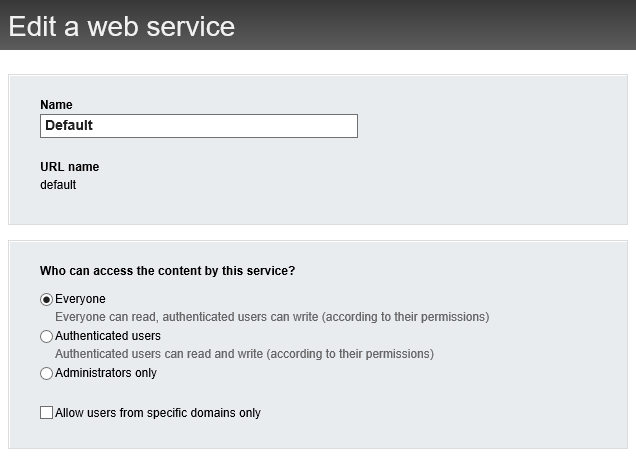{width="6.5in" height="4.670833333333333in"}

We also have a separate webpage with the following contents, which
simply executes a GET request against the API for the list of news:

\<!DOCTYPE html\>

\<html\>

\<head\>

\<title\>\</title\>

\<meta charset=\"utf-8\" /\>

\<script src=\"http://code.jquery.com/jquery-1.12.4.min.js\"

type=\"text/javascript\"\>\</script\>

\</head\>

\<body\>

\<script type=\"text/javascript\"\>

\$(function () {

\$.get(\"http://localhost:61111/api/default/newsitems\",

function (result) {

console.log(result);

});

});

\</script\>

\</body\>

\</html\>

If we place this page inside the same application as Sitefinity, the
page itself and its request are on the same domain, so CORS does not
apply, and we get a successful result, as shown here in the output of
the Chrome developer tools:

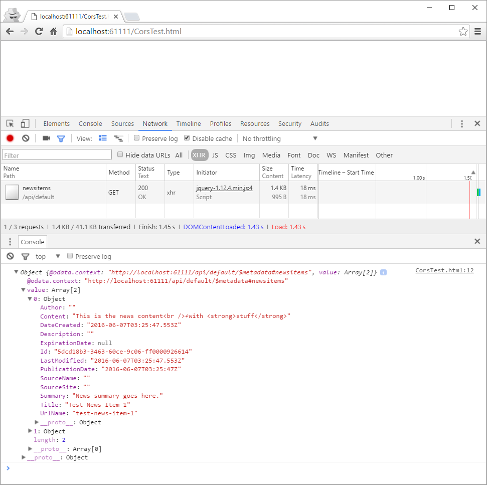{width="6.5in" height="6.472916666666666in"}

Notice that both the hosted page and the requested API call are on the
same domain and port, and therefore succeed in returning results.

However, let's now move our test html page to a different website
application which runs on an entirely different port (or hostname). When
we issue the exact same request from this new site, the results are
different and we get an error:

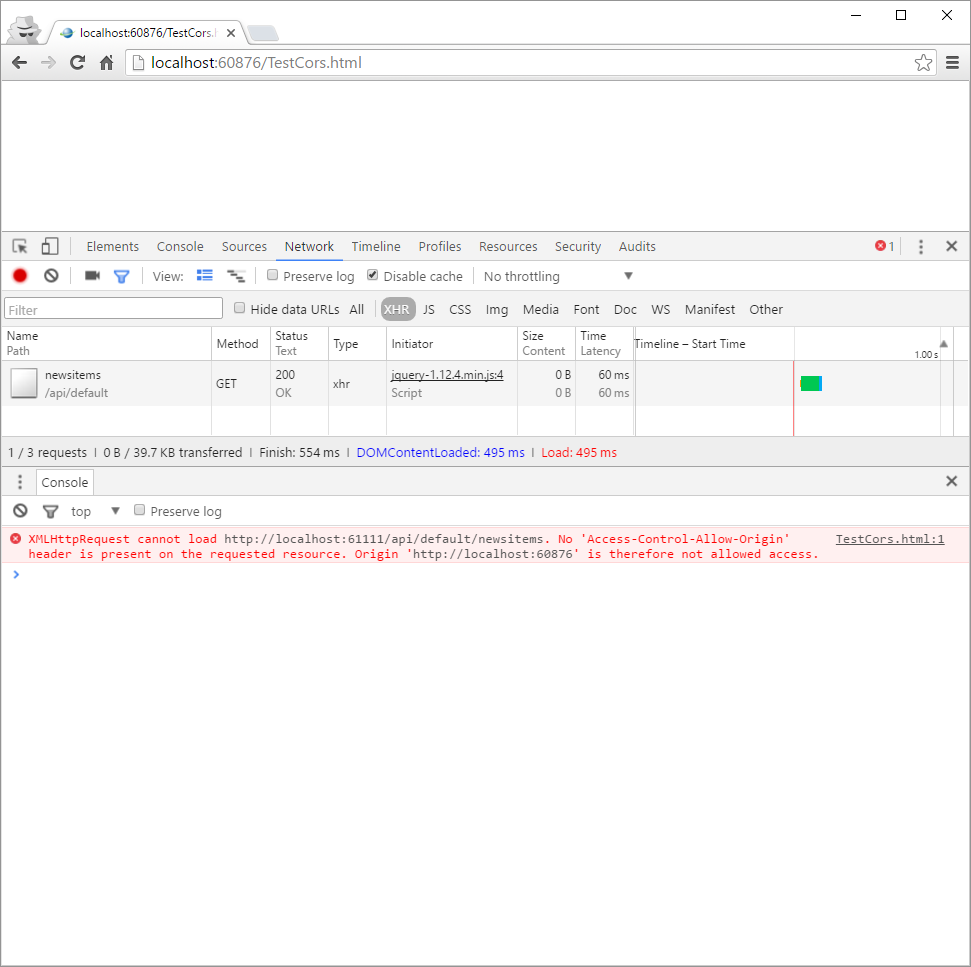{width="6.5in" height="6.472916666666666in"}

Even though both our test html page and the Sitefinity site are both
running on localhost, because the default Sitefinity setting only allows
same-domain access, the browser will reject the request because the
header is not present.

In fact, even if we modify the original Web Services module instance to
allow the localhost domain:

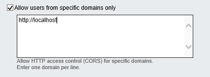{width="4.436945538057743in"
height="1.6352121609798775in"}

Our previous request would still be rejected as shown here, because the
full domain does not exactly match the origin host:

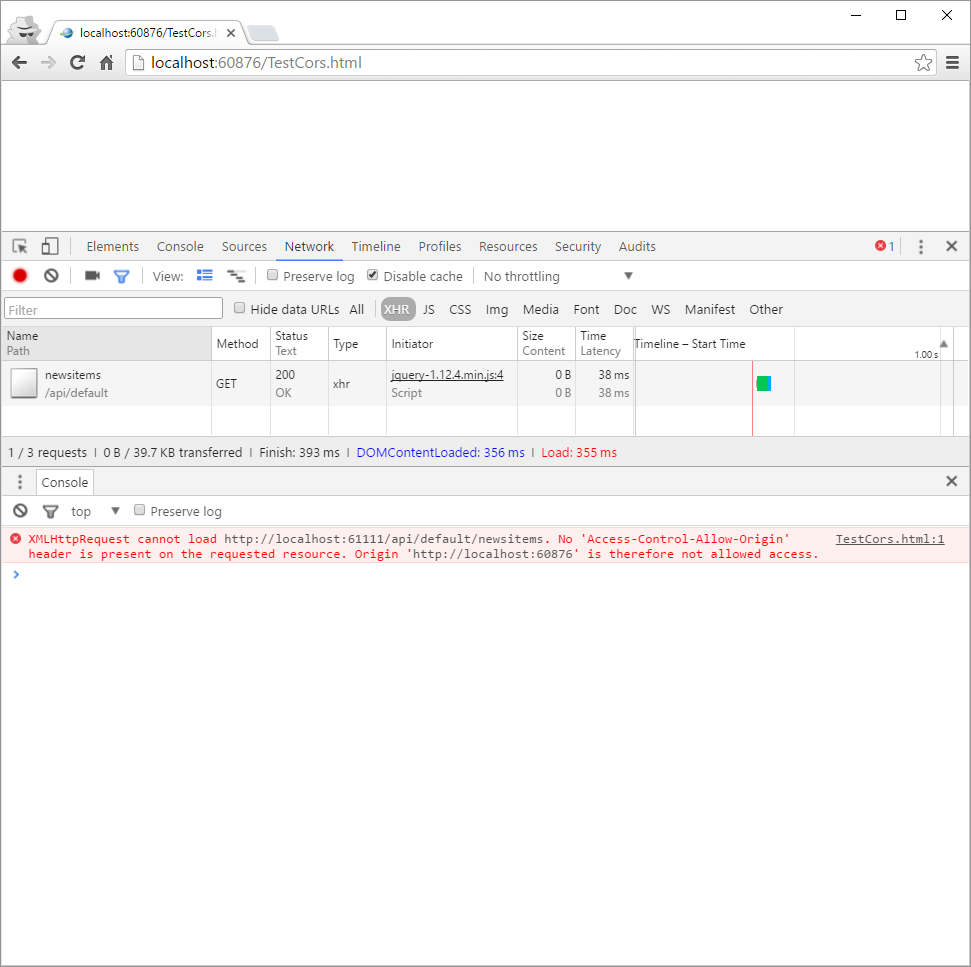{width="6.5in" height="6.472916666666666in"}

If we update the CORS list to exactly match the remote host:

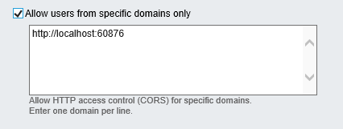{width="4.436945538057743in"
height="1.6768733595800525in"}

The request at last succeeds:

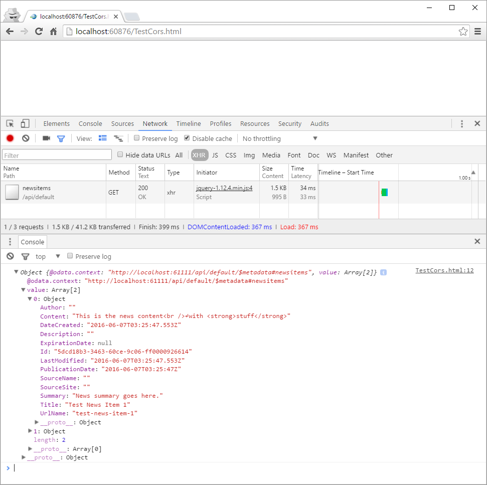{width="6.5in" height="6.472916666666666in"}

Note that we get the same behavior if we clear the CORS input, and
instead populate the SecurityConfig setting:

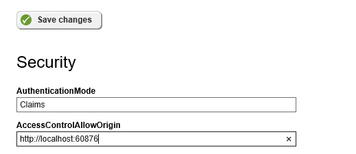{width="5.405574146981627in"
height="2.3434569116360455in"}

### CORS for WCF Services

As previously mentioned, the WCF services in Sitefinity are designed
primarily to support the backend administrative operations, and as a
result, are configured to accept requests only from the within the same
domain.

In the previous section titled "[Backend Login
Restrictions](#_Backend_Login_Restrictions)" we saw how to open up
access to the Login form used by WCF for authorization. However, this is
not the same thing as CORS. To demonstrate the difference (and how to
resolve the issue), let's look at another simple example using the same
Sitefinity sample from that section with the SecurityConfig properties
at their default blank state, running as <http://localhost:61111>

We'll take the same original sample repeated here, modified to instead
issue a simple GET request for news items. This time it will run from a
different web site and port so that the request is going across a
different domain.

\<!DOCTYPE html\>

\<html\>

\<head\>

\<title\>\</title\>

\<meta charset=\"utf-8\" /\>

\<script src=\"http://code.jquery.com/jquery-1.12.4.min.js\"
type=\"text/javascript\"\>\</script\>

\</head\>

\<body\>

\<script type=\"text/javascript\"\>

\$(function () {

var username = \"lino\@tadros.com\";

var password = \"password\";

function getNews(access\_token) {

\$.ajax({

url:
\"http://localhost:61111/Sitefinity/Services/Content/Newsitemservice.svc/\",

type: \"GET\",

beforeSend: function (xhr) {

xhr.setRequestHeader(\'Authorization\', \'WRAP access\_token=\"\'

\+ access\_token + \'\"\');

},

success: function (result) {

console.log(result);

},

error: function (result) {

console.log(result);

}

});

};

\$.post(

\"http://localhost:61111/Sitefinity/Authenticate/SWT\",

{ wrap\_name: username, wrap\_password: password },

function (result) {

var resultParams = parseQuery(result);

var token = resultParams.wrap\_access\_token;

getNews(token);

});

function parseQuery(qstr) {

var query = {};

var a = qstr.split(\'&\');

for (var i = 0; i \< a.length; i++) {

var b = a\[i\].split(\'=\');

query\[decodeURIComponent(b\[0\])\] = decodeURIComponent(b\[1\] \|\|
\'\');

}

return query;

}

});

\</script\>

\</body\>

\</html\>

Because we haven't yet configured the receiving site to accept external
requests, if we try to load the page now, our request will fail.

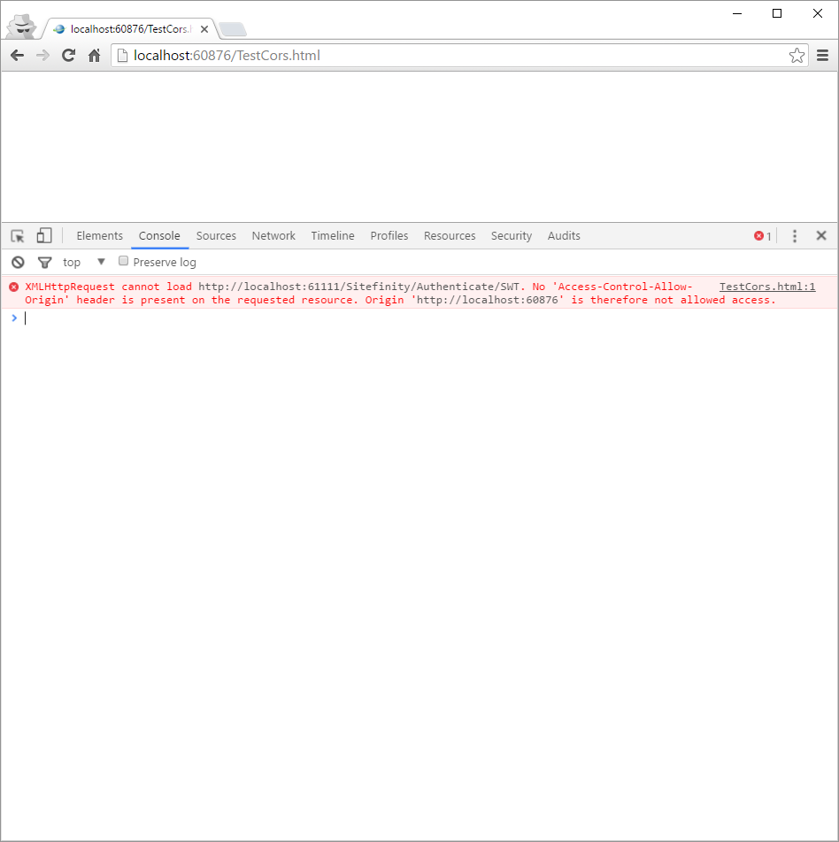{width="6.5in" height="6.527083333333334in"}

To fix this we need to add our external host to the receiving
SecurityConfig setting under *AccessControlAllowOrigin*:

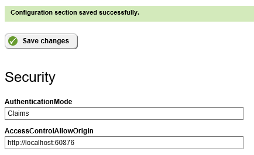{width="4.520267935258093in"
height="2.760071084864392in"}

Running our sample again we'll see that this time, although our login
POST request succeeds and we get a token, the subsequent request to
retrieve the news items fails.

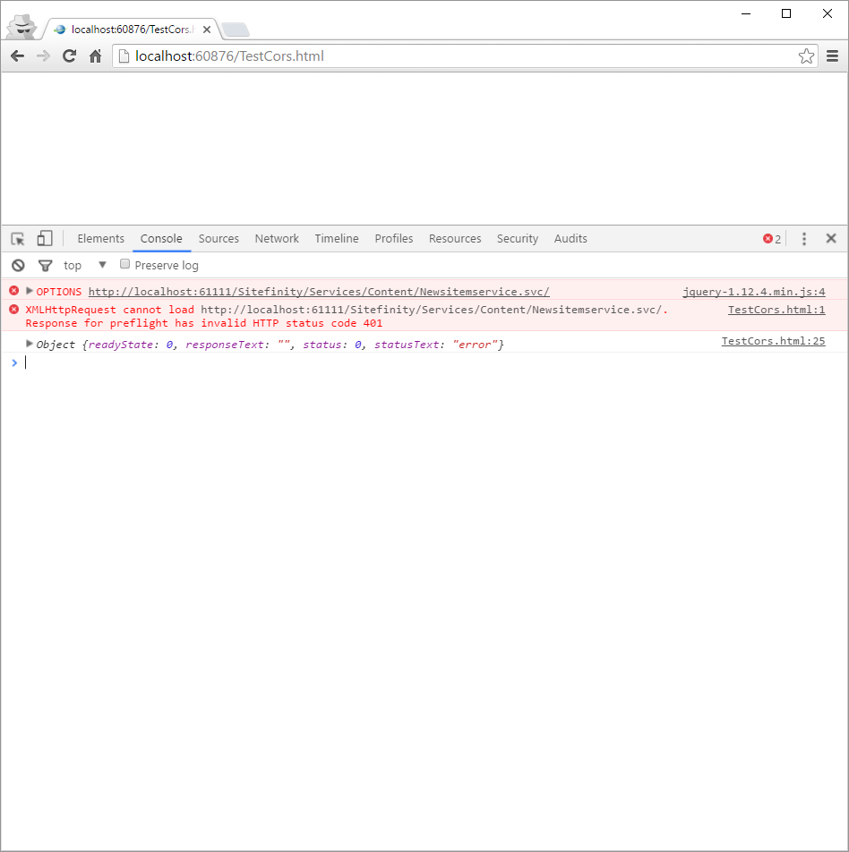{width="6.5in" height="6.527083333333334in"}

In addition, there is a new OPTIONS request that was not part of our
original request or present in the previous attempt when we were on the
same domain.

The reason this was introduced is due to the specification for CORS,
which requires that such requests include a "preflight" to determine
their validity from the external domain. This is handled automatically
by our jQuery \$.get call, which in turn sends the OPTIONS request to
ensure that it has the access to then submit the actual GET request we
originally intended.

Normally, this OPTIONS call should be returned with the appropriate
response headers from the source site indicating both the acceptable
operations (GET, POST, etc.) as well as the Access-Control-Allow-Origin
header allowing our domain access.

However, Sitefinity is instead returning a 401 Unauthorized error, so
our request fails. This is due to a limitation of the way the web
services work internally within Sitefinity. Remember that these services
were primarily designed to drive the Administrative backend of
Sitefinity, which is of course done within the browser on the same
domain.

As a result, the OPTIONS request is rejected as unauthorized instead of
returning the expected headers.

Fortunately, we can override this behavior by modifying the source
website's Global.asax file to return the headers for an OPTIONS request
instead of continuing through its internal pipeline and failing. Open or
create the Global.asax file for the site and add the following code:

protected void Application\_BeginRequest(object sender, EventArgs e)

{

if (HttpContext.Current.Request.HttpMethod == \"OPTIONS\")

{

//These headers are handling the \"pre-flight\"

// OPTIONS call sent by the browser

HttpContext.Current.Response.AddHeader(

\"Access-Control-Allow-Methods\", \"GET, POST, PUT, DELETE\");

HttpContext.Current.Response.AddHeader(

\"Access-Control-Allow-Headers\",

\"Content-Type, Accept, Authorization\");

HttpContext.Current.Response.AddHeader(

\"Access-Control-Max-Age\", \"1728000\");

HttpContext.Current.Response.End();

}

}

Here, we detect the method of the request and if it is of type OPTIONS,
we append the expected headers for the allowed methods and allowed
headers. It's important to include these since we will be specifying the
Authorization header and content type with our request.

Notice that we didn't include the Access-Control-Allow-Origin header
here, because this is again handled automatically by our entry in the
*SecurityConfig* setting.

Once the response is setup appropriately, we immediately end the
response so that the OPTIONS request is returned intact instead of
continuing through Sitefinity's pipeline.

With this last piece in place, we can now issue our original GET
request, which sends the OPTIONS preflight, validating the request and
ultimately returning the list of news items.

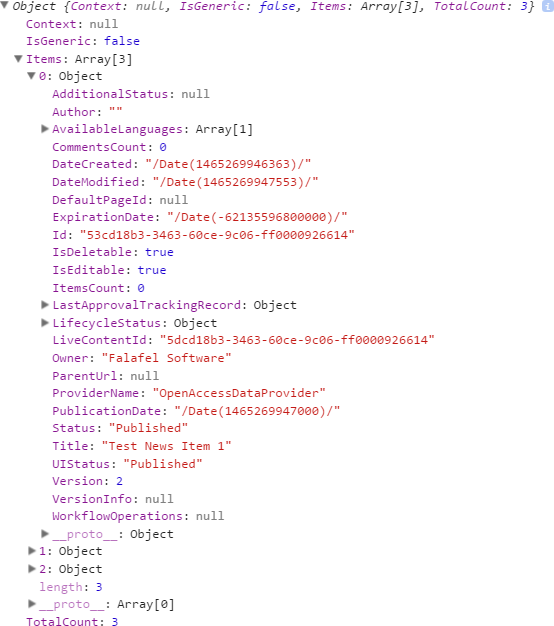{width="5.260416666666667in"
height="5.944082458442694in"}

### 

> Alain \"Lino\" Tadros is a Software Solution Architect and Partner at
> Solliance Inc. Previously, President & CEO of Falafel Software, a
> Silicon Valley based company, dedicated to providing world-class
> consulting, training, and software development for small, medium, and
> enterprise level businesses. Prior to founding Falafel, Lino was a
> well-respected member of the development team at Borland for Delphi
> and C++Builder. Lino has been awarded Microsoft MVP status 15 years in
> a row for his numerous contributions to the C\# community and is an
> expert in Testing, .NET, Azure Cloud, ASP.NET, MVC, iOS, Android,
> Xamarin, Sitefinity and Google Cloud. Lino is an industry renowned
> speaker and has given numerous presentations in 50 countries since
> 1994. He also currently sits on the Board of Directors of 3 Silicon
> Valley corporations.

  ---------------------------------------------------------------------------------------- ---------------------------------------------------------------------------------------------------------------------------------------------------------------------------------------------------------------------------------------------------------------------------------------------------------------------------------------------------------
  {width="2.8645833333333335in" height="2.1484372265966756in"}   I hope you enjoy this training book on Sitefinity Development. This product is very dear to my heart and I have been training and consulting on it for over 10 years. I find Sitefinity to be a very productive and easy to use Content Management System for building quality Web Applications. I wish you the absolute best using this great product!
  ---------------------------------------------------------------------------------------- ---------------------------------------------------------------------------------------------------------------------------------------------------------------------------------------------------------------------------------------------------------------------------------------------------------------------------------------------------------
