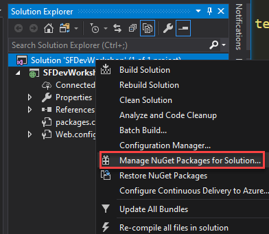

How to create the Sitefinity app in Visual Studio from scratch?
---------------------------------------------------------------

In the previous introduction, we have seen how to open an existing Sitefinity project in Visual Studio.  What if you don't have an existing Sitefinity application or don't have access (for whatever reason) to the Sitefinity Project Manager.
Well, Nuget to the rescue!  It will take literally a couple of minutes to create a new Sitefinity application in Visual Studio from scratch, so let's get started!

- First, create a new project in Visual Studio.  Search for ASP.NET and you will find an ASP.NET Web Application (.NET Framework) type for C#.  Remember, even though you can use MVC and a lot of other technologies in Sitefinity, the base for any Sitefinity Project is still ASP.NET Web Forms.

- Second, you will give your project a name, location, solution name and choose the framework needed. As of this writing for Sitefinity 12.1, .NET Framework 4.7.2 is required.

- Finally, you get to choose the type of ASP.NET application to use, you are free to use "Empty" or "Web Forms", they will both work.  I chose "Empty" for this project.

- Visual Studio will open with the created project in the Solution Explorer ready to go.

Time for Nuget
--------------
- From the Solution Explorer in Visual Studio, right click on the solution name and choose **Manage NuGet Packes for Solution...**

- You will be presented with the currently installed NuGet Packages in the project, the ones that need updating and you will also be able to browse all the thousands of available NuGet packages on nuget.org that you can install in your project.

- Notice that even if you search for Sitefinity NuGet packages, you will not find any.  To be able to find the Sitefinity Nuget packages, you will need to add the **Package Source** to the system.  You accomplish that by clicking on the gear button next to the Package Source dropdown in the picture above.

- Make sure to add the Sitefinity source **http://nuget.sitefinity.com/nuget** to Package Sources

- Now you will be able to use the Sitefinity source to search for Nuget packages pertaining to Sitefinity

- Search for everything that starts with **telerik.Sitefinity.**, you will get tons of packages.  at the top you will notice 2 interesting packages
  - Telerik.Sitefinity (The minimum required modules to get a Sitefinity application to work in IIS)
  - Telerik.Sitefinity.All (All the modules in Sitefinity are installed automatically to work in IIS)

- In this example we are going to go with Telerik.Sitefinity.All to get everything installed all at once.

- You will be able to choose the projects in the solution that will receive the package and also decide on the version that you want installed.  Notice we have tons of versions including internal builds of Sitefinity as well.  I will choose the latest public release as of this writing 12.1.7100, but you can choose whatever you like.

- Click Install 
- Preview the changes that will take place.  Tons of them :)

- Accept the licenses and wait a few minutes until Visual Studio installs tons of dependencies to get this project to **become** a Sitefinity application

- Voila! You got yourself a Sitefinity 12.1 application ready to go and fire up in your browser.

- Build and run the application in your browser

- You will be presented with the License the screen when you can request an evaluation, enter credentials to retrieve the license automatically from your account or best yet, upload your **lic** file for Sitefinity that you have downloaded separately.

- Pick your database and you are on your way to developing in Visual Studio for the rest of this Workshop.

**Next Topic:**
[Working with Pages](../Working%20with%20Pages/readme.md)