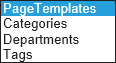
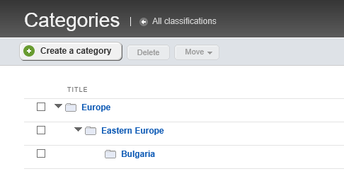
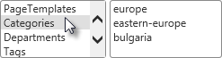
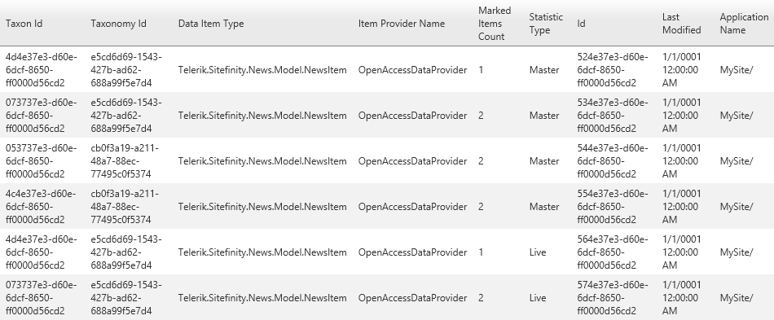
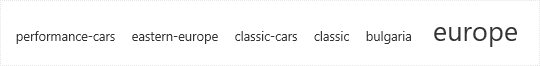
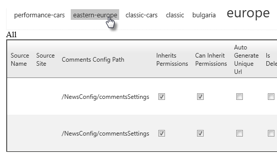
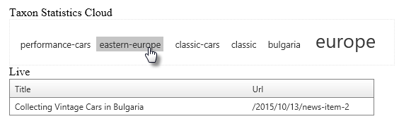
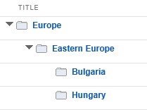

Content Classification - Taxonomy
---------------------------------

Sitefinity uses categories and tags to classify content so that items
can be found easily. Categories are a hierarchical arrangement suited to
tiered information, such as CEO \> President \> Vice President,
geographical areas such as Europe \> Eastern Europe \> Bulgaria\... or
biologic classification like Family \> Genus \> Species. Tags are a
\"flat\" organization where each tag has no formal relationship to other
tags.

The word *taxonomy* comes from ancient Greek root words meaning
essentially \"arrangement method\". Telerik has chosen this word to
describe a flexible way of classifying content that\'s not locked down
to hard-coded categories or tags. While categories and tags will handle
most of your requirements, you can also build your own custom
classification.

### Terminology

-   *Taxonomy* is the highest level \"container\" for classification
    information. Categories and tags are the two predefined taxonomies
    in the system. A taxonomy is represented in the Sitefinity system by
    the *ITaxonomy* interface and the *Taxonomy* abstract implementation
    class, with properties that include *TaxonName* and *Taxa* (an
    enumerable of individual categories, tags or custom taxa).

-   *Taxon* is an individual category, tag or some custom item. When a
    user adds a category to a news item, they are adding taxon. A taxon
    is represented by the *ITaxon* interface and the *Taxon* abstract
    implementation class.

-   *Taxa* is the plural of Taxon.

### Getting Started

The first step to working with taxonomies is to get a *TaxonomyManager*
instance by calling the *GetManager()* method. With a *TaxonomyManager*,
you can perform CRUD (Create, Read, Update, and Delete) operations on
taxonomies and individual taxon using methods:

-   GetTaxonomy()

-   GetTaxon()

-   GetTaxa()

-   CreateTaxon()

-   CreateTaxonomy()

-   Delete(\<taxon, taxonomy\>)

### List Taxonomies

You can retrieve either hierarchical or flat taxonomies. The code below
retrieves all flat taxonomies and displays the Title of each in a list
box.

TaxonomyManager taxonomyManager = TaxonomyManager.GetManager();

IQueryable\<FlatTaxonomy\> taxonomies =

taxonomyManager.GetTaxonomies\<FlatTaxonomy\>();

ListBox1.DataValueField = \"Id\";

ListBox1.DataTextField = \"Title\";

ListBox1.DataSource = taxonomies;

ListBox1.DataBind();

To find all tags in your system, make the *GetTaxonomies()* call twice,
first with *FlatTaxonomy* as the type, then with *HierarchicalTaxonomy*.
Use the LINQ *Union()* method to join the two lists together.

TaxonomyManager manager = TaxonomyManager.GetManager();

var flat = manager

.GetTaxonomies\<FlatTaxonomy\>()

.Select(t =\> new

{

Id = t.Id,

Name = t.Name

});

var hierarchical = manager

.GetTaxonomies\<HierarchicalTaxonomy\>()

.Select(t =\> new

{

Id = t.Id,

Name = t.Name

});

var taxonomies = hierarchical.Union(flat);

ListBox1.DataValueField = \"Id\";

ListBox1.DataTextField = \"Name\";

ListBox1.DataSource = taxonomies;

ListBox1.DataBind();

The result of the union is bound to a list box in the screenshot below
and shows the flat tags taxonomy and the hierarchical categories
taxonomy.

### Listing Taxa

This example uses a sample set of data where the sample tags are
collecting and classic. The sample categories form the following
hierarchy:

Using the previous example in Listing Taxonomies, try adding a handler for the *SelectedIndexChanged* event to receive the
*SelectedValue*. The SelectedValue is the Guid string for the
*Taxonomy*. Create a new Guid object, passing the SelectedValue into the
constructor. Call the TaxonomyManager *GetTaxonomy()* method and pass
the Guid. Add a second ListBox to the form and bind it\'s *DataSource*
to the Taxonomy *Taxa* property.

protected void ListBox1\_SelectedIndexChanged(object sender, EventArgs e)

{

var value = (sender as ListBox).SelectedValue;

Guid taxonomyId = new Guid(value);

TaxonomyManager manager = TaxonomyManager.GetManager();

ITaxonomy taxonomy = manager.GetTaxonomy(taxonomyId);

ListBox2.DataValueField = \"Id\";

ListBox2.DataTextField = \"Name\";

ListBox2.DataSource = taxonomy.Taxa;

ListBox2.DataBind();

}

Selecting a taxonomy from the first list box fires the
*SelectedIndexChanged* event, the bound taxonomy Id is retrieved and
used to get the *Taxonomy* object. The *Taxonomy* *Taxa* collection is
bound to the second list box.

### Find Frequently Used Categories and Tags

*TaxonomyManager* has a nice little goody hidden away called the
*GetStatistics()* method that returns the *MarkedItemsCount* with the
number of items marked with a given taxon. Other properties with
possibilities are:

-   The *ApplicationName* for the project that the statistic belongs to.

-   *DataItemType* determines the kind of content the particular Taxon
    is being used in.

-   *StatisticType* is the *ContentLifecycleStatus* used throughout
    Sitefinity to determine the state of the content item, i.e. Master,
    Temp or Live.

-   The *TaxonomyId* and *TaxonId* Guids are both included so you can
    retrieve the corresponding objects.

We can simply bind this information to a RadGrid in ASP.NET to see the
bulk data. Assign the GetStatistics() result to the RadGrid DataSource.

TaxonomyManager manager = TaxonomyManager.GetManager();

RadGrid1.DataSource = manager.GetStatistics();

RadGrid1.DataBind();

The grid shows the raw statistic data:

If we filter and massage the data a bit with LINQ, we can get useful
information to display. Statistics can be used to populate a RadTagCloud
with \"weighted\" links, where taxons used in more places show in larger
text.

The code to accomplish this is listed below. Filter the results from
GetStatistics() using *Where()* and making sure that the *StatisticType*
is *Live*. Project the items into a new anonymous type using *Select()*.
You can save the *TaxonId* directly. To get the Title to display in each
link, call the *TaxonomyManager GetTaxon()* method and pass the
*TaxonId*. Get the *Name* property from the returned Taxon object.
Finally, to get the comparative weight of each item, use the
*MarkedItemsCount*.

TaxonomyManager manager = TaxonomyManager.GetManager();

var statistics = manager

.GetStatistics()

.Where(s =\> s.StatisticType == ContentLifecycleStatus.Live)

.ToList()

.Select(s =\> new

{

Id = s.TaxonId,

Title = manager.GetTaxon(s.TaxonId).Name,

Weight = s.MarkedItemsCount,

})

.OrderBy(s =\> s.Title).ToList();

StatisticsCloud.DataTextField = \"Title\";

StatisticsCloud.DataWeightField = \"Weight\";

StatisticsCloud.DataValueField = \"Id\";

StatisticsCloud.DataSource = statistics;

StatisticsCloud.DataBind();

### Get Items by Category or Tag

What if I need to find all news items marked with the Europe category or
tagged as collecting? You can get at that functionality through the
content database provider. The database provider can be reached through
the manager of the particular content type you\'re working with, for
example *NewsManager.Provider*. The provider has a *GetItemsByTaxon()*
method that returns an *IEnumerable* of whatever content type you\'re
working with.

The custom *GetTaxonItems()* method below returns an *IEnumerable\<T\>*
for a particular Taxon.

-   The *GetMappedManager()* call returns the appropriate manager for
    the type you pass in. For example, if we pass in NewsItem,
    GetMappedManager() will return a *NewsManager*.

-   The manager\'s *Provider* property is a *DataProviderBase* type, so
    you need to cast up to a *ContentDataProviderBase* that knows how to
    call *GetItemsByTaxon()* later in the method.

-   You also need a *TaxonomyPropertyDescriptor* for the content type
    and taxon combination.

-   Finally, you get to call *GetItemsByTaxon()*, passing in the
    information you\'ve been hoarding up to this point. The returned
    *IEnumerable* is cast to *IEnumerable\<T\>* and returned from this
    method.

**Note**: If there are no content items tagged with the taxon **T**, the
method will return null.

private static IEnumerable\<T\> GetTaxonItems\<T\>(ITaxon taxon)

{

// get the manager for the items, e.g. NewsManager

var manager = ManagerBase.GetMappedManager(typeof(T));

// get the base content database provider

ContentDataProviderBase contentProvider =

manager.Provider as ContentDataProviderBase;

// get a taxonomy property descriptor for this item type and taxon

TaxonomyPropertyDescriptor prop =

TaxonomyManager.GetPropertyDescriptor(typeof(T), taxon);

if (prop != null)

{

int? totalCount = 0;

// use the GetItemsByTaxon() method

// to return IEnumerable of items.

var items = contentProvider.GetItemsByTaxon(taxon.Id,

prop.MetaField.IsSingleTaxon,

prop.Name,

typeof(T),

string.Empty, // filter

string.Empty, // order by

0, // skip

100, // take

ref totalCount);

return items as IEnumerable\<T\>;

}

else return null;

}

To call the method, set the type to be the content type you\'re looking
for and pass in the taxon to search on as a parameter. The example below
is looking for all news items that are marked with a particular taxon.

IEnumerable\<NewsItem\> items = GetTaxonItems\<NewsItem\>(taxon);

If you bind the items directly against a grid, you will see all the
columns for the content item type, in whatever lifecycle status they
happen to be in. The example below bridges off the previous RadTagCloud
example and displays the NewsItem objects for the selected cloud tag.

You can boil this data down a bit using lambda expressions to look only
for live items and only showing certain columns.

The example in the code below handles the RadTagCloud *ItemClick* event.
The event arguments for the handler include the *Item.Value* property
that contains the Guid for the taxon. You can use the
*TaxonomyManager.GetTaxon()* method to retrieve the Taxon corresponding
to the item the user clicked on. Now that you have the *Taxon*, call the
custom *GetTaxonItems()* method and pass the taxon as a parameter. Next,
a lambda expression filters for only items with a live status. Only the
Title and Url columns are selected.

protected void StatisticsCloud\_ItemClick(object sender, RadTagCloudEventArgs e)

{

TaxonomyManager taxonomyManager = TaxonomyManager.GetManager();

ITaxon taxon = taxonomyManager.GetTaxon(new Guid(e.Item.Value));

IEnumerable\<NewsItem\> items = GetTaxonItems\<NewsItem\>(taxon);

var news = items

.Where(n =\> n.Status == ContentLifecycleStatus.Live)

.Select(n =\> new

{

Title = n.Title.Value,

Url = n.Urls.FirstOrDefault().Url

});

RadGrid1.DataSource = news;

RadGrid1.DataBind();

}

The data bound in the grid looks something like the screenshot below.

### Add Categories and Tags

To create a new taxon, use the TaxonomyManager *CreateTaxon()* method.
Specify the type of taxon you want to create, that is,
*HierarchicalTaxon* or *FlatTaxon*. For HierarchicalTaxon, you need to
specify the *Parent*. In the example below the category *Eastern Europe*
is retrieved using the *GetTaxa()* method and assigned to the new
taxon\'s Parent property. Also notice programmatic login as a user with
permissions to create a taxon.

TaxonomyManager manager = TaxonomyManager.GetManager();

// get the parent taxon

HierarchicalTaxon EasternEuropeTaxon =

manager.GetTaxa\<HierarchicalTaxon\>()

.Where(t =\> t.Title.Value.Equals(\"Eastern Europe\"))

.SingleOrDefault();

// build a new taxon and place it underneath the parent

HierarchicalTaxon HungaryTaxon =
manager.CreateTaxon\<HierarchicalTaxon\>();

HungaryTaxon.Name = \"Hungary\";

HungaryTaxon.Title = \"Hungary\";

HungaryTaxon.UrlName = \"hungary\";

HungaryTaxon.Parent = EasternEuropeTaxon;

**HungaryTaxon.Taxonomy = EasternEuropeTaxon.Taxonomy;**

manager.SaveChanges();

The Categories page shows the new taxon under its parent taxon.

**Note**: Notice that you need to assign the Taxonomy property, that is,
a category, tag or a custom taxonomy. Not assigning the Taxonomy
property leads to a difficult-to-diagnose \"Null reference object\"
exception.
