Sitefinity Web Services
=======================

Sitefinity has introduced a new *Web Services* module
designed to simplify the process of exposing an API for your site's
content that can be consumed by various clients, including mobile
applications, external websites, and even custom widgets within your
site.

Web services are not new to Sitefinity; the administrative backend of
Sitefinity has relied upon and used the existing WCF endpoints in the
/Sitefinity folder. However, although you can make use of these
services, they were primarily designed to support the administrative
operations of the website and using them for custom applications
requires additional configuration. **With the introduction of the AdminApp new backend implementation, the WCF services are less and less used in Sitefinity.**

The requirements for parameters of items to be processed by the API are
also complex and heavy, requiring inclusion of many Sitefinity-specific
fields that can be outside the scope of your domain object and difficult
to populate correctly.

This partial sample schema shows just how many fields are required to
create a news item using the original WCF NewsItem service:


The new Web Services module aims to reduce this complexity to enable
creation of simple, yet fully-featured API endpoints for your content
that support the full range of content operations (Create, Read, Update,
Delete) as well as managing permissions for each using the familiar
Sitefinity UI.

In addition, the created endpoints are much simpler to work with, as
they are more closely aligned to the domain objects that represent the
content being accessed, resulting in a much more intuitive developer
experience. This screenshot from the API help documentation shows a much
simpler payload for creating news items:

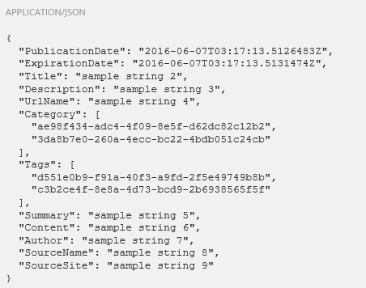

However, although this new module simplifies the process of working with
simple CRUD operations, it is also limited to the set of predefined
operations exposed by the module. If you have custom needs or want to
simplify the interface for working with Sitefinity data via web
services, you might consider creating your own set of services from
scratch.

Choosing the Appropriate Method for Web Services
------------------------------------------------

Because there are several ways to work with web services in Sitefinity,
it is important to understand the limitations of each option and choose
the path that makes the most sense for your requirements. Here are some
considerations to help you decide.

### Supported Content Types

As of the date of publication of this Workshop, only the following
content areas are supported by the new Web Services module:

-   News items

-   Blogs and Blog posts

-   Events and Calendars

-   Images and Image libraries

-   Videos and Video libraries

-   Documents and Document libraries

-   Lists and List items

-   Comments

-   Dynamic content

-   Shared content blocks

-   Flat and Hierarchical taxonomies
  
-   Folders

-   Pages

-   Sites

Although this covers the most commonly used content areas of Sitefinity,
if you need to perform operations related to any other modules you must
rely on the original WCF services or create your own.

### Custom Payloads

Both the new Web Services module and the previous WCF endpoints have
predefined endpoints that require specific payload definitions for
creating, updating, or deleting items. While they are extensible enough
to handle custom fields, they still require Sitefinity-specific
constructs that may not be easily supplied by an external application.

A good example of this is supplying a taxonomy (such as Category or Tag)
to associate a content item. Both the new Web Services and WCF services
require and accept only a Guid to identify the classification, meaning
your application must either query these ahead of time or have knowledge
of the specific IDs you want to associate.

If you want to be able to specify such arguments by name, or otherwise
transform the API request or response, your best bet is to create a
custom API using Sitefinity's support for Web API.

Working with the Web Services Module
------------------------------------

The simplest and fastest way to get started with web services is to use
the new Web Services module introduced in version 9, available in the
Administration \> Web Services.

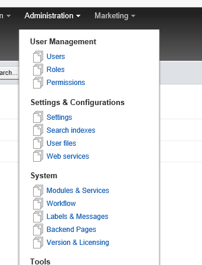

For new installs this module is automatically enabled, and a default
service is also created for you with default settings.


**Note**: If you are upgrading from a previous version of Sitefinity you
may need to enable the module and create a new service, which is fully
documented on the Sitefinity website here: [Create a Web Service](http://docs.sitefinity.com/create-a-web-service).

### Managing Web Services

Sitefinity gives you control over what content is served as well as
permissions for CRUD operations on your content. The default setup is
configured to automatically expose all content types, granting access
rights only to users in the Administrators role.

You can modify this by editing the existing service or creating a new
one and specifying the content and permissions in the editor dialog.

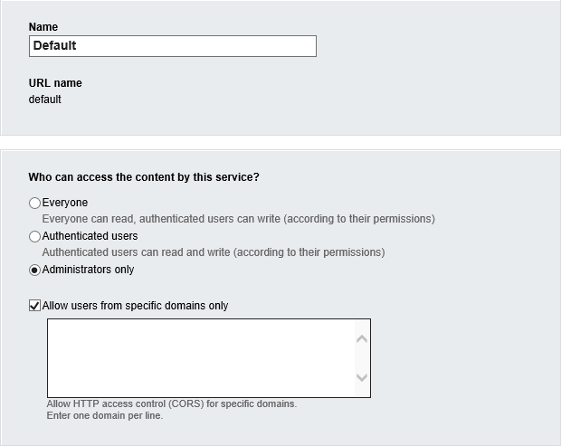


The default configuration to include all content types is a special
case; in addition to exposing an API for all the *currently* supported
modules, when this option is selected, any *future* modules that gain
support for this module will also automatically be enabled when
Sitefinity is upgraded.

If you want to prevent the automatic registration of newly supported
modules or want to restrict APIs to only the supported modules you want
to expose, you can change your selection on this screen.

The default permissions also restrict access to administrators only,
meaning you must be logged in with a user of that role to consume the
API; even read operations are restricted for other users. Besides this
default option there are two others:

-   Authenticated: Read access is no longer restricted to
    Administrators, but the users must be authenticated, and must have
    read permissions within Sitefinity to access the content. Write
    operations are also extended to non-administrators, but only if they
    have the appropriate permissions.

-   Anonymous: Read-only access is allowed for all users, even those
    that are not authenticated. Write operations are restricted to any
    authenticated users that have the appropriate permissions.

### Other configuration settings

The Web Services module gives you a lot of control over many aspects of
its usage. The details of these options are officially documented here:
[Advanced Configuration of Types](http://docs.sitefinity.com/advanced-configuration-of-types)

However, here are some of the highlights of these features.

### Customizing the API Path

By default, the path to the API follows this pattern:

http(s)://\<www.yoursite.com\>/\<RouteUrlName\>/\<ServiceUrlName\>/\<TypeUrlName\>

The default value for \<RouteUrlName\> is "api", but if this conflicts
with an existing route in your site (such as for a custom API you're
already using), you can override this setting in Administration \>
Settings \> Advanced \> WebServices \> Routes \> Frontend.


The \<ServiceUrlName\> in the route represents the *Name* property
entered when the service was created, which has a default value of
"default".

Finally, the \<TypeUrlName\> indicates the content type being accessed,
such as "newsitems" or "taxonomies".

The typical request url for news might look something like this:

http://mysite.com/api/default/newsitems

### Showing or Hiding Content Item Fields

By default, the Web Services module exposes a specific set of properties
for each type. For example, it automatically includes the Author field
for the NewsItem type and EventStart field for the Events type.

You can override these properties in the Advanced Settings under Web
Services \> Routes \> Frontend \> Services \> \[default\] \> Types \>
\[type\] \> Property Mappings, where \[default\] is the name of the API
service, and \[type\] is the content type you wish to modify.


In addition to defining which fields are exposed, you can also modify
additional properties for each field, such as enabling or disabling
filtering and sorting on the field or marking it as read-only.


### Creating Semantic URLs

Another helpful feature exposed by the Web Services module is the
ability to create predefined endpoints that function like aliases to
more complex requests.

For example, instead of having to specify a complete ODATA filter like:

/api/default/newsitems?\$filter=startswith(Title, \'test\')

You can create a simpler endpoint that represents that same request in a
simpler format like this:

/api/default/newsitems/testitems

This is done in the Advanced Settings under Web Services \> Routes \>
Frontend \> Services \> \[default\] \> Types \> \[type\] \> Predefined
methods, where \[default\] is the name of the API service, and \[type\]
is the content type for which you want to define the alias.

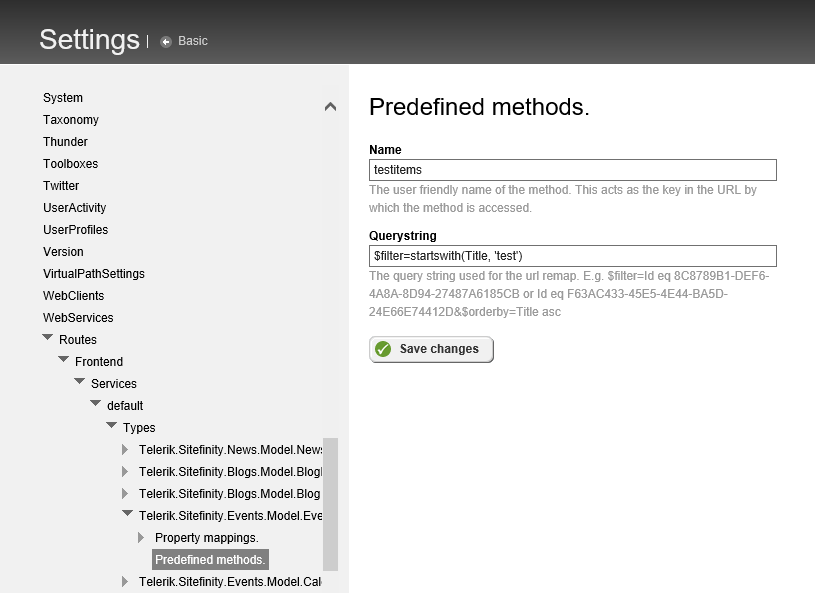

Now that we have a basic understanding of the setup and configuration of
the Web Services module, let's look at how we can execute different
operations against the APIs.

You can use your favorite tool for this such as Fiddler to follow along,
but we'll be using the Postman extension for Chrome, which makes it easy
to send AJAX requests to an API and observe the results.


Also, for the purposes of these tests we are ignoring the issue of
Cross-Origin Resource Sharing, which restricts external access to
web-based resources such as our API. For more information about CORS and
how to configure Sitefinity to allow external access, including some
working samples, please see the section Sitefinity Web Services and
CORS.

### Consuming the Web Service Module API

The APIs exposed by the Web Services are simple REST endpoints, meaning
that you simply need to issue the proper request to the appropriate
endpoint to perform the desired operation.

Thankfully, each endpoint is fully and automatically documented by the
Web Services module, and this information is available from right within
Sitefinity by clicking the link labeled "Use in your app."


This reveals a help page with a complete list of all the endpoints for
your service, the required request type (GET, POST, etc.) as well as
examples of both the required input parameter format and sample output
responses.


To start let's get all the NewsItems in the system via REST API, to make
this simple in the beginning, let's change the permission to access
these API to "everyone".


Using this we can create a sample GET request for the list of news items
in our site using Postman as shown in this sample request:

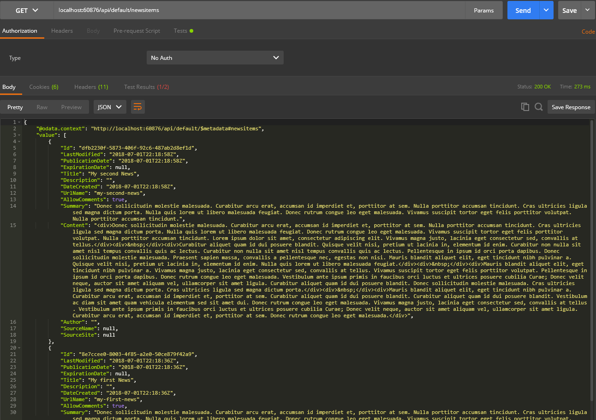

Notice that in this case we didn't have to supply any parameters for
authorization or content type, because we are making a simple GET
request that has been configured for **anonymous** access.

If we were to modify the Web Service to only accept **authenticated**
requests and repeat the above request, we would get an invalid result:


### Authenticating Requests to Web Service Module APIs

If the API is restricted to authorized users, or you want to perform
write operations to content via the API, you must first authenticate and
receive an **access token** which you must include with all subsequent
requests.

To start you will need to set up the authentication for a Client in the
Administration -\> Setting -\> Advanced -\> Authentication area

Under SecurityTokenService -\> Clients, add a new Client and call it
whatever you like, in my case I called it "linoapp"

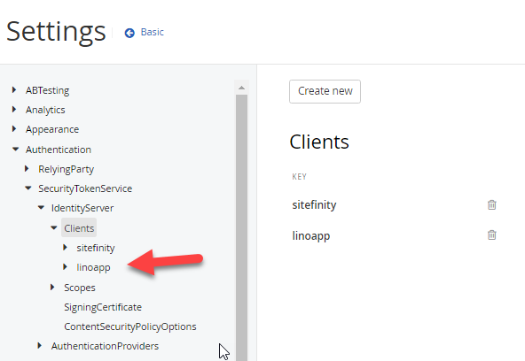

Make sure you name the client and the client id, enable the client and
choose **ResourceOwner** for the Client Flow. Finally allow access to
all scopes. You can leave all the other defaults on that page.


For the secret, you can enter that under the Client Secrets for the app "linoapp"

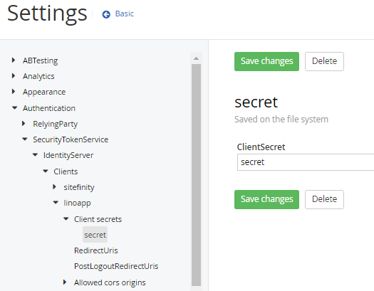

### Making Authenticated Requests

We need to obtain a token before making any API requests to the
Sitefinity APIs, we can pass it as a value to the Authorization header
parameter later.

Let's do this in two different ways so that you can get a sense of how
to do it in C\# and also in JavaScript in case you need to accomplish
this on a web page outside of Sitefinity or in a dotnet application,
Xamarin mobile app or a Nativescript mobile app for iOS or Android.

First, we do it the dotnet way in C\#
-------------------------------------

Whether you are using a Windows Form application, WPF, MVC or Xamarin
Mobile app in C#, you need to establish 4 things:

First, establish your constants that will be needed during the execution

```
public const string ClientId = "linoApp";
public const string ClientSecret = "secret";
public const string TokenEndpoint ="http://<yousitefinitysite>/Sitefinity/Authenticate/OpenID/connect/token";
public const string Username = "test\@test.test";
public const string Password = "password";
public const string Scopes = "openid offline_access";

public static readonly Dictionary\<string, string\> AdditionalParameters = new Dictionary<string, string>()
{
    { "membershipProvider", "Default" }
};

public const string WebApiNewsEndPoint = "http://<yoursitefinitysite>/api/default/newsitems";
```

Second, we will need to call a function that will help us get an **AccessToken**

```
public static TokenResponse RequestToken()
{
    //This is call to the token endpoint with the parameters that are set
    TokenResponse tokenResponse = tokenClient.RequestResourceOwnerPasswordAsync(Username, Password, Scopes, AdditionalParameters).Result;
    if (tokenResponse.IsError)
    {
        throw new ApplicationException("Couldn\'t get access token. Error: " + tokenResponse.Error);
    }

    return tokenResponse;
}
```

Third, we can now execute a Sitefinity API once we received an
AccessToken already from the previous "RequestToken" function

```
public static string CallApi(string accessToken)
{
    HttpWebRequest request = (HttpWebRequest)WebRequest.Create(WebApiNewsEndPoint);
    request.ContentType = "application/json";
    request.Method = "GET";
    request.Headers.Add("Authorization", "Bearer " + accessToken);
    string html = string.Empty;
    WebResponse response = request.GetResponse();
    using (Stream stream = response.GetResponseStream())
    using (StreamReader reader = new StreamReader(stream))
    {
        html = reader.ReadToEnd();
    }
    return html;
}
```

Don't forget also to establish a Refresh of the token in case it is
needed

```
public static TokenResponse RefreshToken(string refreshToken)
{
    //This is call to the token endpoint that can retrieve new access and
    //refresh token from the current refresh token
    return tokenClient.RequestRefreshTokenAsync(refreshToken).Result;
}
```

Finally, the 4th and final step is to bring it all together in a
function of your choice in any platform to call these established
functions:

```
tokenClient = new TokenClient(TokenEndpoint, ClientId, ClientSecret,
AuthenticationStyle.PostValues);
TokenResponse tokenResponse = RequestToken();
string accessToken = tokenResponse.AccessToken;
//The purpose of the refresh token is to retrieve new access token when the it expires

string refreshToken = tokenResponse.RefreshToken;

string reponseHtml = CallApi(accessToken);
```

Voila, you can now access authenticated REST API calls in Sitefinity in
C# from any kind of applications (Web MVC, Web Forms, Windows Forms,
WPF, Xamarin Forms, Xamarin Native, etc...)

Second, let's do this in JavaScript
-----------------------------------

In any HTML page, php, ascx or cshtml, etc... you can load the following
JavaScript to establish exactly what we accomplished in C\# above.

```
<script>

//The token end point from where we can retrieve the access token

var tokenEndPoint = "http://<yourSFsite>/Sitefinity/Authenticate/OpenID/connect/token";

var apiUrl="http://<yoursitefinitysite>/api/default/newsitems";

var client_id = "linoApp";

var client_secret = "secret";

var accessToken;

var refreshToken;

$("#getTokenBtn").on("click", getToken);

$("#getTokenWithRefreshBtn").on("click",

getAccessTokenFromRefreshToken);

$("#apiCallBtn").on("click", callApi);

function getToken() {

//Have an input element on the page for the username

var username = $('#username').val();

//Have an input element on the page for the password

var password = $('#password').val();

//Call that gets the access and refresh token

$.ajax({

url:tokenEndPoint,

data:{

username:username,

password:password,

grant_type:'password',

scope:'openid offline_access',

client_id:client_id,

client_secret:client_secret

},

method:'POST',

success:function(data){

console.log(data.access_token);

console.log(data.refresh_token);

$('#token').text(data.access_token);

$('#refreshToken').text(data.refresh_token);

accessToken=data.access_token;

refreshToken=data.refresh_token;

},

error:function(err){

alert(err.responseText);

}

})

}

//Call that gets new access and refresh token from the current refresh token

function getAccessTokenFromRefreshToken() {

$.ajax({

url:tokenEndPoint,

data:{

refresh_token:refreshToken,

grant_type: 'refresh_token',

client_id:client_id,

client_secret:client_secret

},

method:'POST',

success:function(data){

console.log(data.access_token);

console.log(data.refresh_token);

$('#token').text(data.access_token);

$('#refreshToken').text(data.refresh_token);

accessToken=data.access_token;

refreshToken=data.refresh_token;

},

error:function(err){

alert(err.responseText);

}

})

}

//Sitefinity Web API call with access token as a bearer token

function callApi() {

$.ajax({

url:apiUrl,

method:'GET',

beforeSend:function (xhr) {

xhr.setRequestHeader ("Authorization", "Bearer " + accessToken);

},

success:function(data){

if(data.value.length!==0){

$("#apiResult").text("Item content:"+ data.value[0].Content)

}

else{

$("#apiResult").text("No news items");

}

},

error:function(err){

alert(err.responseText);

}

})

}

</script>
```

Working with the Sitefinity WCF Services
----------------------------------------

The original WCF Services introduced with Sitefinity 4 still remain
available and are still utilized by the backend to perform
Administrative tasks in Sitefinity. As such, they are fully featured and
offer complete coverage of the Sitefinity API.

The new Web Services module in the latest Sitefinity is certainly the
recommended option for creating an API for consuming data. However, as
it is still a new feature, it does not offer the full coverage of the
WCF services.

The list of features is listed in the previous section Supported Content
Types. If you require access to any content type or feature not listed, you would need to leverage the WCF services instead.

The most likely scenario in which you'll encounter this limitation is
when working with Security, such as Creating or adding users, including
their roles and permissions. Another is when you need to create content
items or users with a specific ID (such as when you are migrating items
from another Sitefinity instance).

In this section, we will look at a few samples showing how you can
perform these operations.

### Requirements for Sitefinity WCF Services

As previously mentioned, the WCF services Sitefinity offers are
primarily intended to be used by the backend administration for the
website. Operations such as creating or updating pages, content items,
users, etc., all execute their operations through these services.

As such, they are designed to be consumed from an authenticated context,
namely the logged in user in the backend, sending the user's
authorization (usually via cookies in the user's browser session) to
authenticate the request.

In order to consume these services in your own applications, you need to
authenticate your requests. This is described in a later section:
Authenticating Requests to WCF Services.

In addition, if your application runs on a different website and domain,
you must configure Cross-Origin Resource Sharing (CORS) so that the
requests are not rejected. This is covered in a later section: CORS for
WCF Services.

### Help Pages for WCF Services

Each WCF endpoint in Sitefinity exposes a help section with metadata
information which describes and shows examples for all of the supported
operations for each service.

You can access these by following the path described here:

/sitefinity/Services/\<service folder\>/\<service\>.svc/help

Where \<servicefolder\> is the physical folder in the Sitefinity web
application and \<service\> is the filename that corresponds to the
service you wish to explore. For reference, these endpoints are visible
in the Visual Studio explorer:

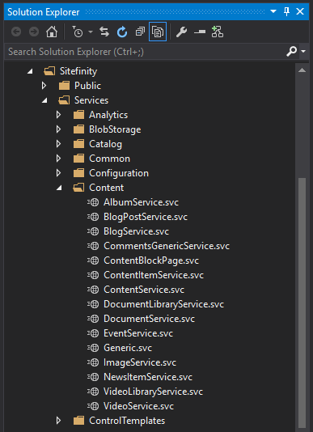

Fill in the path to any of these services and append /help to see the
list of operations and the required parameters for use:


**Important Note**: Accessing these pages in the browser requires that
you are logged in as an Administrator.

Now that we know how to get the information required to issue requests,
let's look at some of the operations we can perform. However, before we
can send any requests, we must first authenticate ourselves.

### Authenticating Requests to WCF Services

Unlike the Web Services module, which has an API endpoint for
authentication, WCF services use same system that is used by the default
login screen shown here:


This form executes a POST operation to the following path:
/Sitefinity/Authenticate/SWT

It accepts FORM parameters for the username and password, using the
respective field names "wrap_name" and "wrap_password". This POST
returns the familiar access token required for authorization that should
be included in subsequent requests.

Here is an example of an authentication request using Postman and the
response containing the access token:

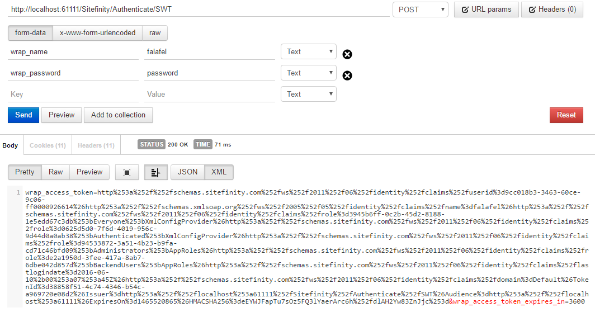

The key portion of the result we're interested is the value of the
section titled "wrap\_access\_token", the full contents of which are
shown highlighted here:


This is the value we want to use to create the Authorization header that
must be included in all subsequent requests.

**Important Note**: Although this token has a name similar to that used
in the previous section for Web Services, the Authorization header for
WCF requests is in a different format, and it's important to remember to
use the correct token for each type of request.

Here is the format for adding the value of the access token above to the
Authorization header:

Authorization: WRAP access_token="<ACCESS_TOKEN>"

Where \<Access\_Token\> is the value returned from the Login request, an
example of which is shown highlighted above.

**Important Note**: When working with Postman, it is important to
remember that the response shown is URL Encoded. If you copy the value
exactly as shown and use it as-is in the Authorization header for
another Postman request, you will get this error:

Invalid formEncodedstring contains a name/value pair missing an =
character

If you want to use the access token from Postman, you should first
decode the response, which can be done using the Bing URL Encoder tool.
Simply search [Bing](http://www.bing.com/search?q=url+decoder) for "URL
Decoder" and you can paste the token into the tool and decode it before
adding it to the Authorization header:


This extra step is only required for tools like Postman, and can be
omitted when sending AJAX requests from a webpage.

Before we look at a working sample of logging in using WCF, let's review
some important requirements that you must configure before you can
proceed.

### Backend Login Restrictions

By default, Sitefinity is configured to only allow logins from requests
issued within the same domain, as well as any domains registered and
associated with the Sitefinity.lic license file used by the site.
Internally Sitefinity compares the requested origin header against the
list of *TrustedLoginDomains* property in the SecurityConfig setting.

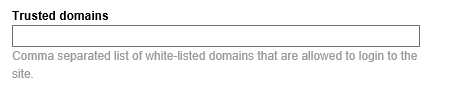

If the external request doesn't match, you will get this somewhat
cryptic exception:

> Access denied
>
> Description: An unhandled exception occurred during the execution of
> the current web request. Please review the stack trace for more
> information about the error and where it originated in the code.
>
> Exception Details: System.Web.HttpException: Access denied
>
> Source Error:
>
> An unhandled exception was generated during the execution of the
> current web request. Information regarding the origin and location of
> the exception can be identified using the exception stack trace below.
>
> Stack Trace:
>
> \[HttpException (0x80004005): Access denied\]
>
> Telerik.Sitefinity.Security.Claims.SecurityTokenServiceHttpHandler.ValidateRequestSource(HttpContextBase
> context) +457
>
> Telerik.Sitefinity.Security.Claims.SecurityTokenServiceHttpHandler.ProcessRequest(HttpContextBase
> context) +605
>
> Telerik.Sitefinity.Security.Claims.SecurityTokenServiceHttpHandler.ProcessRequest(HttpContext
> context) +40
>
> System.Web.CallHandlerExecutionStep.System.Web.HttpApplication.IExecutionStep.Execute()
> +188
>
> System.Web.HttpApplication.ExecuteStep(IExecutionStep step, Boolean&
> completedSynchronously) +69

Add any domains or hostnames that should be granted access to the
*Trusted Domains* field and this error will no longer appear.

**Tip**: When working with Postman in Chrome, the request will be
accompanied by a header such as
chrome-extension://fdmmgilgnpjigdojojpjoooidkmcomcm, and you can
discover this property by inspecting the Network tab of the Chrome
Developer Tools when issuing the login request:


Adding the hostname fdmmgilgnpjigdojojpjoooidkmcomcm (or whatever shows
up for your instance of the plugin) to the SecurityConfig setting will
allow the login to succeed.

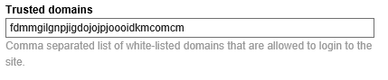

It is important to note, however that accessing WCF services as an
authenticated user counts the user as "logged in" for the purposes of
both the backend user count limitation of your Sitefinity license as
well as the browser session itself. This means if you are logged to the
Sitefinity backend you may be prevented from logging in via WCF, and
vice-versa, since you cannot be logged into more than once
simultaneously.

Attempting to access a WCF service with the same account that is already
logged into the backed will reveal an error that says
UserAlreadyLoggedIn along with a 403 status code:

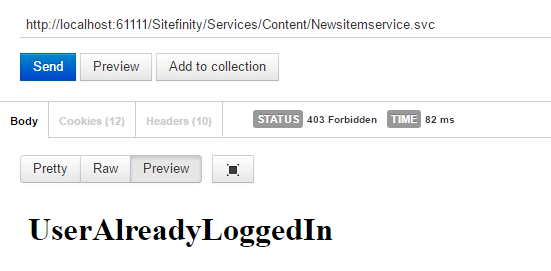

This is similar to the message shown when you attempt to login to more
than one browser session:

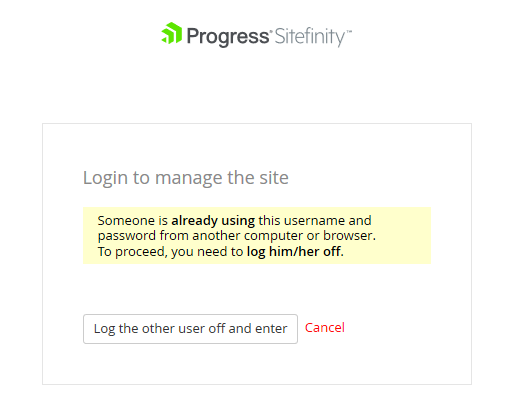

Although you cannot override this behavior to allow simultaneous logins,
you can automate the process of logging out the previous session so that
the WCF request can logout any other session and continue uninterrupted.

To do this, navigate the backend administration to Administration \>
Settings \> Advanced \> Security and check the option labeled:
Automatically logout backend users from other HTTP clients on login.


This does have the consequence of forcibly ending an active session, so
make sure this is indeed the behavior you require.

Alternatively, it is recommended that you instead create a separate
login specifically for use with WCF services so that you can use that
account without risk of kicking out other users (or yourself!).

### Logging in with WCF Sample

To demonstrate logging in via WCF in the browser to an external site, we
will use the freshly setup sample project with the SecurityConfig
properties at their default blank state, running as
<http://localhost:61111>

We also have a separate HTML web page with the code necessary to execute
the login request on page load, using a helper method to parse the
resulting token from the response, and outputting the token to the
console.

\<!DOCTYPE html\>

\<html\>

\<head\>

\<title\>\</title\>

\<meta charset=\"utf-8\" /\>

\<script src=\"http://code.jquery.com/jquery-1.12.4.min.js\"
type=\"text/javascript\"\>\</script\>

\</head\>

\<body\>

\<script type=\"text/javascript\"\>

\$(function () {

var username = \"lino\@tadros.com\";

var password = \"password\";

\$.post(

\"http://localhost:61111/Sitefinity/Authenticate/SWT\",

{ wrap\_name: username, wrap\_password: password },

function (result) {

var resultParams = parseQuery(result);

var token = resultParams.wrap\_access\_token;

console.log(token);

});

function parseQuery(qstr) {

var query = {};

var a = qstr.split(\'&\');

for (var i = 0; i \< a.length; i++) {

var b = a\[i\].split(\'=\');

query\[decodeURIComponent(b\[0\])\] =

decodeURIComponent(b\[1\] \|\| \'\');

}

return query;

}

});

\</script\>

\</body\>

\</html\>

To keep this example simple, we'll keep the page in the same Sitefinity
site so that the request is in the same domain. For more information
about making requests from external applications (as well as a simple
GET example for retrieving content) take a look at the section titled
CORS for WCF Services).

When we load the page we should (assuming we're not already logged in)
execute the login POST and see the token successfully received:

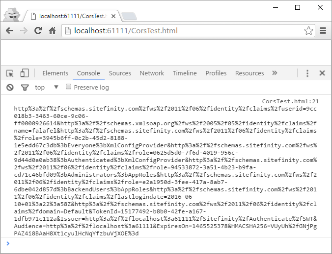

We are now authenticated and ready to use this token to do something
useful. Remember that many of the content operations are better served
using the new Web Services module (from the earlier section). However,
Users are still not supported there, so let's use that as our example.

### Creating a User with WCF Services

For this sample, we have the same Sitefinity website from the previous
example and the sample HTML page to issue the request, this time
modified to demonstrate one way to create a user.

\<!DOCTYPE html\>

\<html\>

\<head\>

\<title\>\</title\>

\<meta charset=\"utf-8\" /\>

\<script src=\"http://code.jquery.com/jquery-1.12.4.min.js"
type=\"text/javascript\"\>\</script\>

\</head\>

\<body\>

\<script type=\"text/javascript\"\>

\$(function () {

var username = \"lino\@tadros.com\";

var password = \"password\";

function createUser(access\_token) {

\$.ajax({

url:
\"http://localhost:61111/Sitefinity/Services/Security/Users.svc/create/00000000-0000-0000-0000-00000000/",

type: \"PUT\",

dataType: \"json\",

contentType: \"application/json\",

data: JSON.stringify(newUser),

beforeSend: function (xhr) {

xhr.setRequestHeader(\'Authorization\', \'WRAP access\_token=\"\' +
access\_token + \'\"\');

},

success: function (result) {

console.log(\"User imported successfully!\");

},

error: function (result) {

console.log(result);

}

});

};

\$.post(

\"http://localhost:61111/Sitefinity/Authenticate/SWT",

{ wrap\_name: username, wrap\_password: password },

function (result) {

var resultParams = parseQuery(result);

var token = resultParams.wrap\_access\_token;

createUser(token);

});

function parseQuery(qstr) {

var query = {};

var a = qstr.split(\'&\');

for (var i = 0; i \< a.length; i++) {

var b = a\[i\].split(\'=\');

query\[decodeURIComponent(b\[0\])\] = decodeURIComponent(b\[1\] \|\|
\'\');

}

return query;

}

var newUser = {

AvatarImageUrl: "/SFRes/images/Telerik.Sitefinity.Resources/Images.DefaultPhoto.png",

AvatarThumbnailUrl: "/SFRes/images/Telerik.Sitefinity.Resources/Images.DefaultPhoto.png",

Email: \"testuser\@site.com\",

IsApproved: true,

IsBackendUser: false,

Password: \"password\",

PasswordAnswer: null,

PasswordQuestion: \"\",

ProfileData:
"{"Telerik.Sitefinity.Security.Model.SitefinityProfile":{"__type":"Telerik.Sitefinity.Security.Model.SitefinityProfile","FirstName":"Test","LastName":"User","ApplicationName":"/UserProfiles","IsProfilePublic":false,"__providerName":"OpenAccessProfileProvider"}}",

ProviderName: \"Default\",

RoleNamesOfUser: \"RegUser\",

RolesOfUser: \[\],

UserName: \"testuser\"

}

});

\</script\>

\</body\>

\</html\>

Here we've hard-coded a user object (including a required basic profile)
which you would want to create yourself, likely from collecting inputs
on the page, reading from an external source or some other method that
makes sense for your project.

Notice that in this case we have to include an empty Guid in the path,
which indicates to the service that this is a CREATE operation rather
than an UPDATE:

/Sitefinity/Services/Security/Users.svc/create/00000000-0000-0000-0000-00000000/

When the page is loaded, the authentication call from before executes
and passes the token on to the PUT call to create the user.

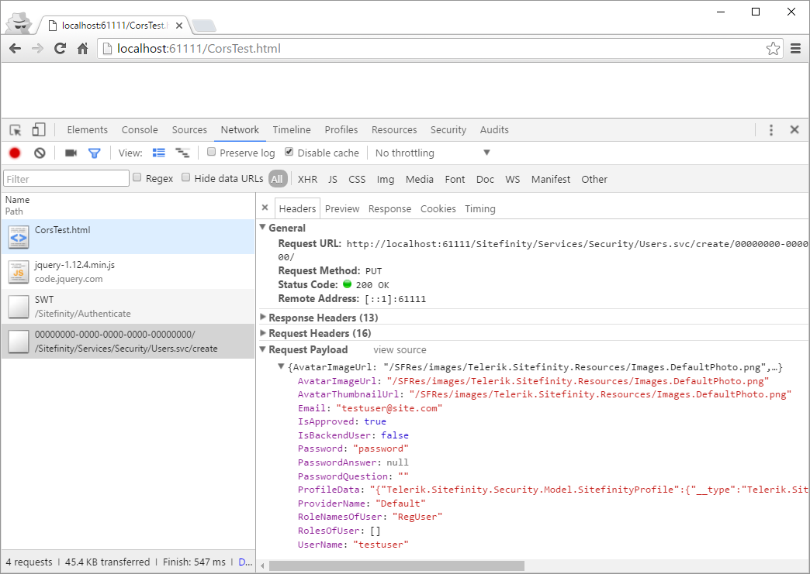

Our request shows a success, and logging into the backend to view the
users reveals the newly created user:


### Creating a User with a Specific ID

The previous example will assign a new Guid value for the created user.
If you're using the WCF service to create users programmatically, it's
possible that you'll want to control this ID of the created user, such
as if you are importing users from another Sitefinity website, so that
it can be assigned a specific value.

You might expect to be able to simply specify the UserID or
ProviderUserKey properties of the User object when submitting the PUT
request to the create endpoint. We can try that by modifying our model
from the previous request:

var newUser = {

AvatarImageUrl:
"/SFRes/images/Telerik.Sitefinity.Resources/Images.DefaultPhoto.png",

AvatarThumbnailUrl:
"/SFRes/images/Telerik.Sitefinity.Resources/Images.DefaultPhoto.png\",

Email: \"testuser\@site.com\",

IsApproved: true,

IsBackendUser: false,

Password: \"password\",

PasswordAnswer: null,

PasswordQuestion: \"\",

ProfileData:
"{"Telerik.Sitefinity.Security.Model.SitefinityProfile":{"__type":"Telerik.Sitefinity.Security.Model.SitefinityProfile","FirstName":"Test","LastName":"User","ApplicationName":"/UserProfiles","IsProfilePublic\":false,"__providerName":"OpenAccessProfileProvider"}}",

ProviderName: \"Default\",

RoleNamesOfUser: \"RegUser\",

RolesOfUser: \[\],

UserName: \"testuser\",

**UserID: \"3853b90d-19e6-68ee-a860-ff00000a783e\",**

**ProviderUserKey: \"3853b90d-19e6-68ee-a860-ff00000a783e\"**

}

Indeed, these are the properties required to update in order to control
this field.

Unfortunately, as of the publication of this book, there is an issue in
Sitefinity that prevents this from running successfully. The reason is
that while the ProviderUserKey property type is *object*, we are passing
the JSON object as a serialized *string*. As a result, when it is
deserialized within the Users.svc endpoint, it receives the property as
a string, which it attempts to cast to a *guid*.

This conversion fails, throwing an exception and returning the error:
*Invalid provider user key*.

The easiest way to resolve this is to create a proxy service that can
correctly convert the *string* property for ProviderUserKey to a Guid.
This is done by creating a new WCF service that accepts the same
original payload, converts the property, then passes it on to the
original endpoint.

A complete discussion of the different components involved in creating a
WCF service is outside of the scope of this book. However, we can look
at a very simple implementation that solves this problem.

Here is the complete code for such a class:

```
using System;

using System.ServiceModel;

using System.ServiceModel.Activation;

using System.ServiceModel.Web;

using Telerik.Sitefinity.Security.Web.Services;

using Telerik.Sitefinity.Utilities.MS.ServiceModel.Web;

namespace SitefinityWebApp.Custom

{

    [AspNetCompatibilityRequirements(RequirementsMode = AspNetCompatibilityRequirementsMode.Required),
        ServiceBehavior(IncludeExceptionDetailInFaults = true,
        InstanceContextMode = InstanceContextMode.Single,
        ConcurrencyMode = ConcurrencyMode.Single)]

    public class UsersCustom : ICustomUser
    {
        /// \<summary\>
        /// Inserts/Updates the user information.
        /// The update user information is returned in JSON.
        /// \</summary\>
        /// \<param name=\"user\"\>User object to be created.\</param\>
        /// \<param name=\"userId\"\>Id of the user to be created.\</param\>
        /// \<param name=\"provider\"\>The name of membership
        /// provider.\</param\>
        /// \<returns\>\</returns\>

        public WcfMembershipUser CreateUserWithGuid(WcfMembershipUser user, string userId, string provider)
        {
            user.ProviderUserKey = Guid.Parse(user.ProviderUserKey.ToString());
            return new Users().CreateUser(user, userId, provider);
        }

    }

    [ServiceContract]
    public interface ICustomUser
    {
        [OperationContract, WebHelp(Comment ="Inserts or updates a user for given membership provider. The results are returned in JSON format."),
            WebInvoke(Method = "PUT", UriTemplate = "/createwithguid/{userId}/?provider={provider}",
            ResponseFormat = WebMessageFormat.Json)]

        WcfMembershipUser CreateUserWithGuid(WcfMembershipUser user, string userId, string provider);

    }

}
```

As expected, the single "CreateUserWithGuid" method here accepts the
same payload as the original endpoint, converts the property to a Guid
by parsing it, then passes it on to a new instance of the original
intended service.

Next, we must register this service for use within Sitefinity. This is
done by adding the following to your site's Global.asax file:

```
protected void Application_Start(object sender, EventArgs e)
{
    SystemManager.ApplicationStart += new EventHandler<EventArgs>(ApplicationStartHandler);
}

private void ApplicationStartHandler(object sender, EventArgs e)
{
    SystemManager.RegisterWebService(typeof(SitefinityWebApp.Custom.UsersCustom),"Services/Sitefinity/UsersCustom");
}
```

You must also add the UsersCustom.svc file to the matching folder under
/Sitefinity/Services/Security with the following content:

```
<%@ ServiceHost

Language="C#"

Debug="false"

Service="SitefinityWebApp.Custom.UsersCustom"

Factory="Telerik.Sitefinity.Web.Services.WcfHostFactory"

%>
```

Finally, we update the URL in our sample HTML page to call our new
service, replacing the original and matching both the registered
endpoint and the new method name. Now the request will hit our proxy
instead of the original service:

```
function createUser(access_token) {

$.ajax({

url:
"http://localhost:61111/Services/Security/UsersCustom.svc/createwithguid/00000000-0000-0000-0000-00000000/",

type: "PUT",

dataType: "json",

contentType: "application/json",

data: JSON.stringify(newUser),

beforeSend: function (xhr) {

xhr.setRequestHeader(\'Authorization\',

'WRAP access_token="' + access_token + '"');

},

success: function (result) {

console.log("User imported successfully!");

},

error: function (result) {

console.log(result);

}

});

};
```

When we reload the page (having deleted the previously created user),
the request succeeds:


Looking at the raw SQL data, we can verify that indeed the new user
receives the exact Guid property for ID that we specified:

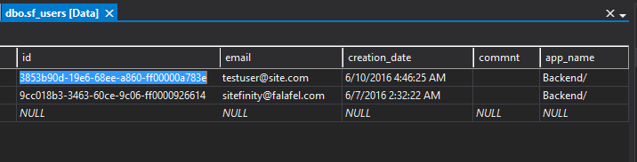

### Sitefinity WCF Gotchas, Pitfalls, and Tips

As we've already seen, working with WCF services can be tricky, as they
are once again primarily designed to be used by the Sitefinity backend.
Here are some tips and notes compiled throughout the production of this
chapter. Some we covered in detail already as well as in the next
section, but hopefully this serves as a quick at-a-glance overview of
some important points to remember.

-   Authentication is done by posting a Sitefinity username and password
    to the same form used to login to the backend, which returns the
    access token for use in each following request

-   The access token should be sent as a header in this format:
    Authorization: WRAP access_token="<ACCESS_TOKEN>"

-   Logging in and issuing requests as a Sitefinity user using WCF
    counts as a "logged in" against the backend user count limitation
    for your license.

-   You cannot be logged into both the Sitefinity backend and the WCF
    services simultaneously.

-   When using Postman to test authentication, you must first URL-decode
    the token before submitting it in the Authorization header.

-   If you are authenticating from an external domain, you must specify
    the origin in the SecurityConfig under *TrustedDomains*.

-   If you are issuing requests from an external domain, you must
    specify the origin in SecurityConfig under
    *AccessControlAllowOrigin* (See section titled CORS for WCF Services
    for more details and a sample).

-   Most WCF requests should end with the trailing slash / character; if
    omitted, your request will be redirected via 301 to that path and
    this may cause your request to fail.

-   Creating users with a specific User ID (Guid) requires that you
    create a proxy service to overcome an issue with the current version
    of Sitefinity (see section titled: Creating a User with a Specific
    ID)

-   If you are using Single Sign On (SSO) the default login form is no
    longer presented, so you will be unable to authenticate and use WCF
    services.

Sitefinity Web Services and CORS
--------------------------------

Requests to an API via a web browser to an endpoint located outside the
page's host domain require special configuration on the receiving end to
enable Cross-Origin Resource Sharing (or CORS). Attempting to access
your web services from an external domain that does not have CORS
configured to allow access will result in an error similar to this:

> XMLHttpRequest cannot load http://\*\*\*\*\*\*\*. No
> \'Access-Control-Allow-Origin\' header is present on the requested
> resource. Origin \'http://\*\*\*\*\*\*\*\' is therefore not allowed
> access.

If all of your requests will be made from within the context of the same
website running the services (for example, if you are developing widgets
that will run in the same domain as the web services), then you can
ignore this setting and accept the default.

However, if the API is being consumed by a different website you must
specify each domain you wish to grant access.

For the Web Services module, this is done in the Edit (or Create) dialog
for the service in the field labeled "Allow users from specific domains
only." When checked, an additional textarea field is revealed to accept
a list of domains allowed to access your services.


Alternatively, you can also input the wildcard \* character to allow all
external requests, but this can be a security risk and is not
recommended.

You can specify this access for each instance of the Web services module
you create, but if this field is left blank, the configuration will fall
back to the *AccessControlAllowOrigin* setting in SecurityConfig of the
advanced settings:

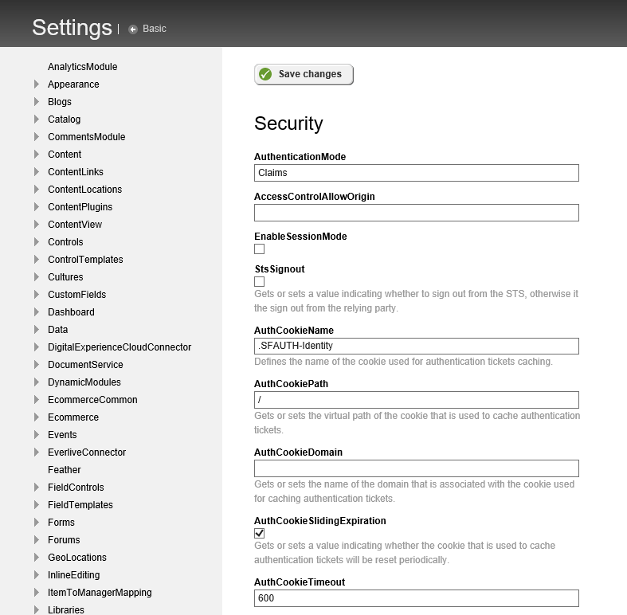

This setting is also blank by default, and if left blank, then only
requests from within the same domain will be accepted by the browser.

### CORS for the Web Services Module in Action

To better demonstrate the configuration of CORS in relation to the Web
Services module, let's look at a few different examples and the results.

For this example, we have setup a fresh Sitefinity website with default
Web Services module set to allow Anonymous access, and currently have
both the CORS field and the SecurityConfig properties at their default
blank state, running as <http://localhost:61111>

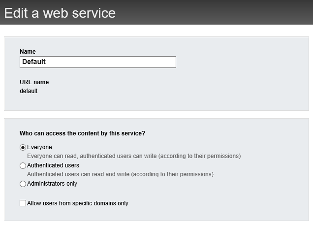

We also have a separate webpage with the following contents, which
simply executes a GET request against the API for the list of news:

\<!DOCTYPE html\>

\<html\>

\<head\>

\<title\>\</title\>

\<meta charset=\"utf-8\" /\>

\<script src=\"http://code.jquery.com/jquery-1.12.4.min.js\"

type=\"text/javascript\"\>\</script\>

\</head\>

\<body\>

\<script type=\"text/javascript\"\>

\$(function () {

\$.get(\"http://localhost:61111/api/default/newsitems\",

function (result) {

console.log(result);

});

});

\</script\>

\</body\>

\</html\>

If we place this page inside the same application as Sitefinity, the
page itself and its request are on the same domain, so CORS does not
apply, and we get a successful result, as shown here in the output of
the Chrome developer tools:


Notice that both the hosted page and the requested API call are on the
same domain and port, and therefore succeed in returning results.

However, let's now move our test html page to a different website
application which runs on an entirely different port (or hostname). When
we issue the exact same request from this new site, the results are
different and we get an error:

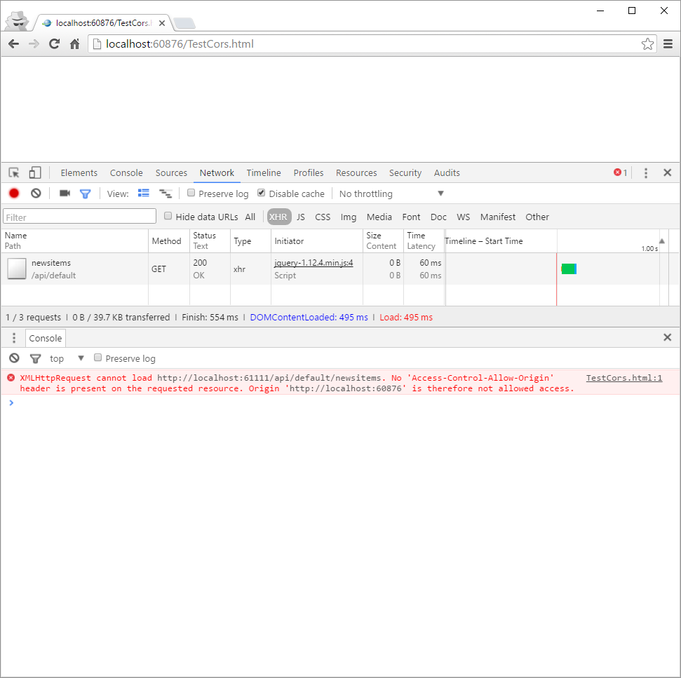

Even though both our test html page and the Sitefinity site are both
running on localhost, because the default Sitefinity setting only allows
same-domain access, the browser will reject the request because the
header is not present.

In fact, even if we modify the original Web Services module instance to
allow the localhost domain:

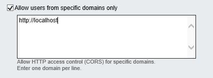

Our previous request would still be rejected as shown here, because the
full domain does not exactly match the origin host:

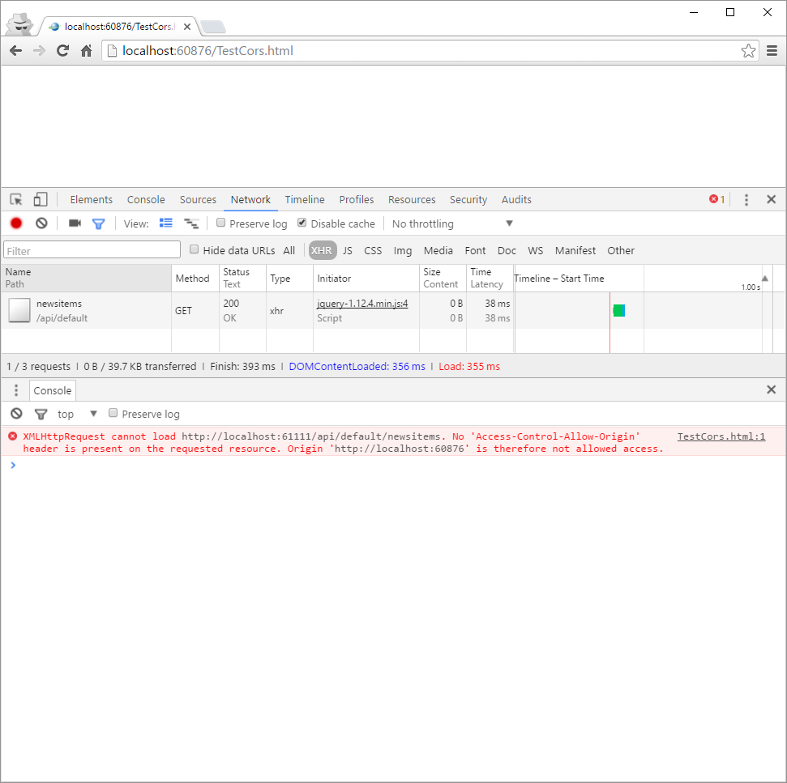
If we update the CORS list to exactly match the remote host:

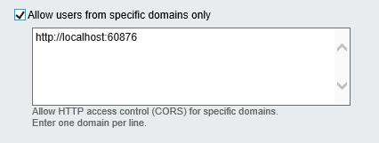

The request at last succeeds:

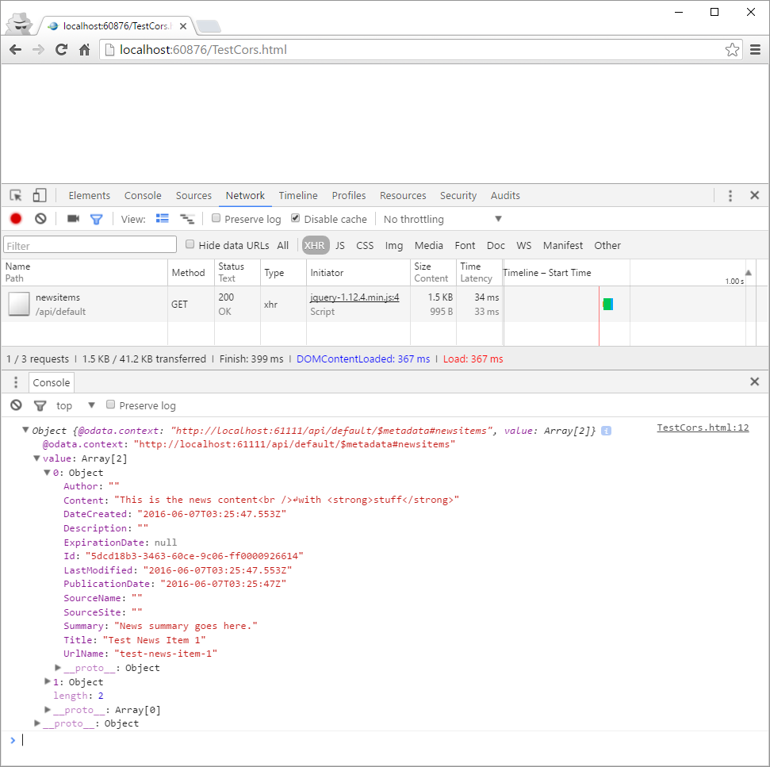

Note that we get the same behavior if we clear the CORS input, and
instead populate the SecurityConfig setting:


### CORS for WCF Services

As previously mentioned, the WCF services in Sitefinity are designed
primarily to support the backend administrative operations, and as a
result, are configured to accept requests only from the within the same
domain.

In the previous section titled "Backend Login Restrictions" we saw how to open up
access to the Login form used by WCF for authorization. However, this is
not the same thing as CORS. To demonstrate the difference (and how to
resolve the issue), let's look at another simple example using the same
Sitefinity sample from that section with the SecurityConfig properties
at their default blank state, running as <http://localhost:61111>

We'll take the same original sample repeated here, modified to instead
issue a simple GET request for news items. This time it will run from a
different web site and port so that the request is going across a
different domain.

\<!DOCTYPE html\>

\<html\>

\<head\>

\<title\>\</title\>

\<meta charset=\"utf-8\" /\>

\<script src=\"http://code.jquery.com/jquery-1.12.4.min.js\"
type=\"text/javascript\"\>\</script\>

\</head\>

\<body\>

\<script type=\"text/javascript\"\>

\$(function () {

var username = \"lino\@tadros.com\";

var password = \"password\";

function getNews(access\_token) {

\$.ajax({

url:
\"http://localhost:61111/Sitefinity/Services/Content/Newsitemservice.svc/\",

type: \"GET\",

beforeSend: function (xhr) {

xhr.setRequestHeader(\'Authorization\', \'WRAP access\_token=\"\'

\+ access\_token + \'\"\');

},

success: function (result) {

console.log(result);

},

error: function (result) {

console.log(result);

}

});

};

\$.post(

\"http://localhost:61111/Sitefinity/Authenticate/SWT\",

{ wrap\_name: username, wrap\_password: password },

function (result) {

var resultParams = parseQuery(result);

var token = resultParams.wrap\_access\_token;

getNews(token);

});

function parseQuery(qstr) {

var query = {};

var a = qstr.split(\'&\');

for (var i = 0; i \< a.length; i++) {

var b = a\[i\].split(\'=\');

query\[decodeURIComponent(b\[0\])\] = decodeURIComponent(b\[1\] \|\|
\'\');

}

return query;

}

});

\</script\>

\</body\>

\</html\>

Because we haven't yet configured the receiving site to accept external
requests, if we try to load the page now, our request will fail.

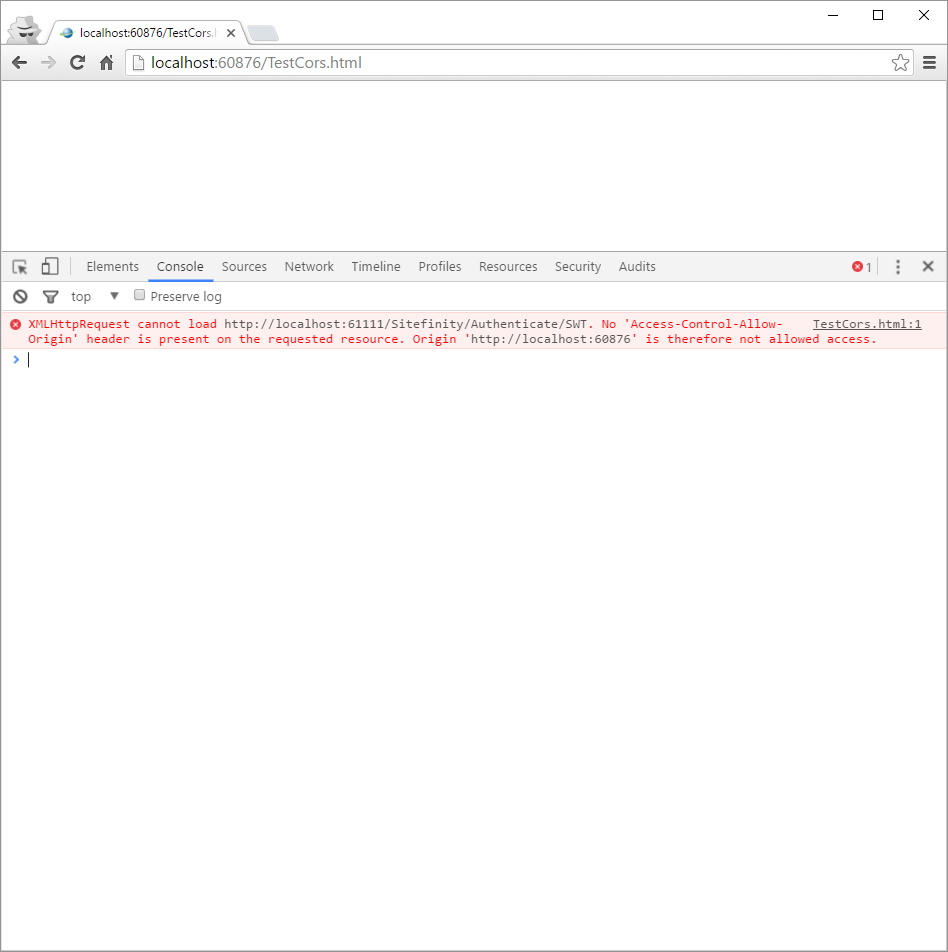

To fix this we need to add our external host to the receiving
SecurityConfig setting under *AccessControlAllowOrigin*:

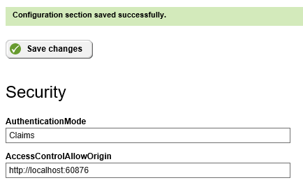

Running our sample again we'll see that this time, although our login
POST request succeeds and we get a token, the subsequent request to
retrieve the news items fails.

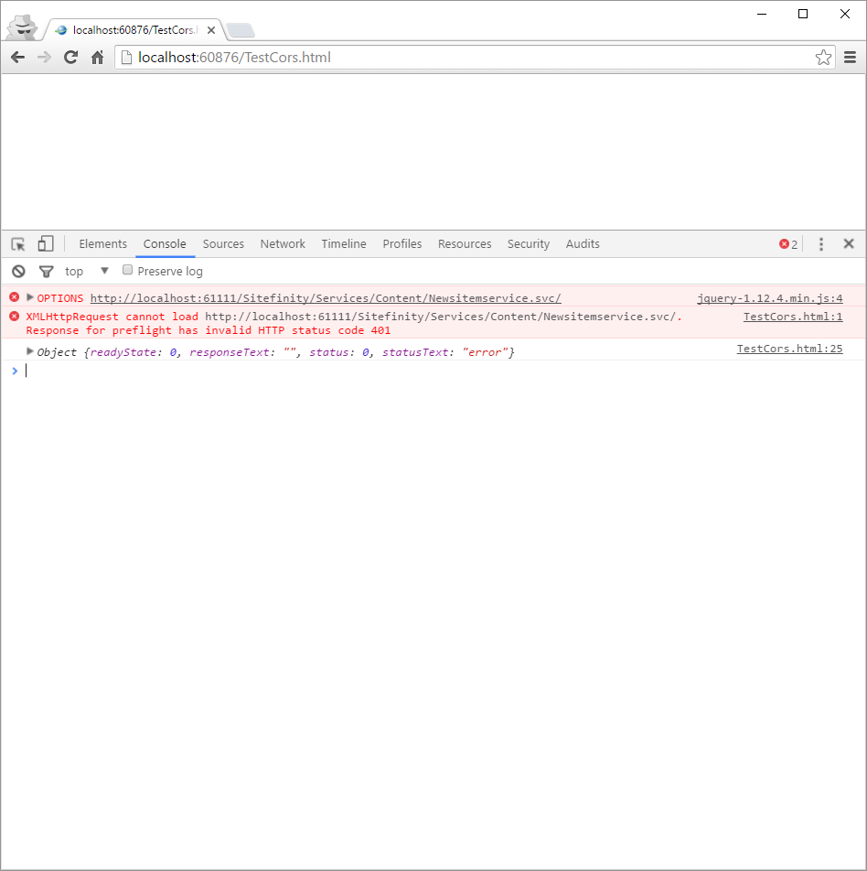

In addition, there is a new OPTIONS request that was not part of our
original request or present in the previous attempt when we were on the
same domain.

The reason this was introduced is due to the specification for CORS,
which requires that such requests include a "preflight" to determine
their validity from the external domain. This is handled automatically
by our jQuery \$.get call, which in turn sends the OPTIONS request to
ensure that it has the access to then submit the actual GET request we
originally intended.

Normally, this OPTIONS call should be returned with the appropriate
response headers from the source site indicating both the acceptable
operations (GET, POST, etc.) as well as the Access-Control-Allow-Origin
header allowing our domain access.

However, Sitefinity is instead returning a 401 Unauthorized error, so
our request fails. This is due to a limitation of the way the web
services work internally within Sitefinity. Remember that these services
were primarily designed to drive the Administrative backend of
Sitefinity, which is of course done within the browser on the same
domain.

As a result, the OPTIONS request is rejected as unauthorized instead of
returning the expected headers.

Fortunately, we can override this behavior by modifying the source
website's Global.asax file to return the headers for an OPTIONS request
instead of continuing through its internal pipeline and failing. Open or
create the Global.asax file for the site and add the following code:

```
protected void Application_BeginRequest(object sender, EventArgs e)
{
    if (HttpContext.Current.Request.HttpMethod == "OPTIONS")
    {
        //These headers are handling the "pre-flight" OPTIONS call sent by the browser
        HttpContext.Current.Response.AddHeader("Access-Control-Allow-Methods", "GET, POST, PUT, DELETE");
        HttpContext.Current.Response.AddHeader("Access-Control-Allow-Headers", "Content-Type, Accept, Authorization");
        HttpContext.Current.Response.AddHeader("Access-Control-Max-Age", "1728000");
        HttpContext.Current.Response.End();
    }
}
```

Here, we detect the method of the request and if it is of type OPTIONS,
we append the expected headers for the allowed methods and allowed
headers. It's important to include these since we will be specifying the
Authorization header and content type with our request.

Notice that we didn't include the Access-Control-Allow-Origin header
here, because this is again handled automatically by our entry in the
*SecurityConfig* setting.

Once the response is setup appropriately, we immediately end the
response so that the OPTIONS request is returned intact instead of
continuing through Sitefinity's pipeline.

With this last piece in place, we can now issue our original GET
request, which sends the OPTIONS preflight, validating the request and
ultimately returning the list of news items.


