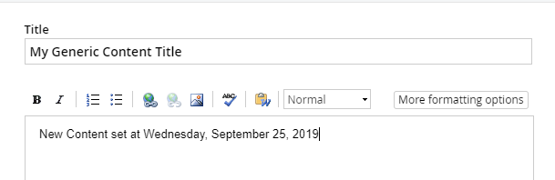

Working with Content Items
--------------------------

The Sitefinity API is consistent between modules, whether you are
working with generic content, blogs, events or news. The first step is
always to get the manager object. Generic content is a relatively simple
starting point, so you will start by getting a reference to the
*ContentManager*.

ContentManager manager = ContentManager.GetManager();

ContentManager knows how to perform basic CRUD operations (Create, Read, Update, and Delete):

-   *CreateContent()* generates a *ContentItem*. ContentItem properties
    can then be populated with Title, Name, Author, and Content.

-   Return a single ContentItem using the *GetContent()* method and
    passing a Guid. *GetItems()* returns an *IQueryable\<T\>* with all
    content items, suitable for \"slicing-and-dicing\" with LINQ. There
    are also several methods for returning the master, temp and live
    versions of a ContentItem.

-   To update a ContentItem, get an instance of the item and simply edit its properties.

-   To delete a ContentItem, use the *Delete()* method.

Three other important ContentManager methods round out the field:

-   *RecompileItemUrls\<T\>()*: This method needs to be called each time
    an item changes. The method generates a URL for the item and saves
    the changes.

-   *Publish()*: Newly created items are in draft mode. Calling the
    manager\'s Publish() method makes managed content visible to the end
    user.

-   *SaveChanges()*: This method commits any changes to the database.

The following references will help you work with content items in the examples that follow:

using System;

using System.Linq;

using Telerik.Sitefinity.GenericContent.Model; // supports ContentItem

using Telerik.Sitefinity.Modules.GenericContent; // ContentManager

using Telerik.Sitefinity.Security; // UserManager

using Telerik.Sitefinity.Security.Model; // User

### Content Lifecycle

A common question is "When I enter a news item, events, blog, etc. there
are multiple rows in the table for that item. Why?" The answer is
because each piece of content can exist in multiple states. Each state
shows as a row in the database.

-   *Master*: This is the primary state of an item and always exists.
    The item is not visible on the front end.

-   *Live*: This is a copy of the item that is visible on the front end.
    Published items are copied from Master to Live.

-   *Temp*: When the item is being edited, the item is copied from
    Master to Temp. If the item is saved as Draft, changes are copied
    back to Master and Temp is discarded. If the item is published, Temp
    is copied to Master, and from Master to Live.

-   *Deleted*: If the Recycle bin module is activated (the default), If
    an item is deleted, the Master version state is changed to Deleted,
    and Live versions are no longer visible (but still exist).

### List Content Items

Each of the content manager objects has a *Get()* method that returns an
*IQueryable\<T\>* of whatever kind of object you\'re working with. You
can use the IQueryable\<T\> as a starting point for both iterating lists
and selecting individual elements in the list. For example, the
ContentManager *GetContent()* method returns an IQueryable of
ContentItem. The example below displays all generic content visible to
the public.

ContentManager contentManager = ContentManager.GetManager();

contentManager.Provider.SuppressSecurityChecks = true;

IQueryable\<ContentItem\> items = contentManager

.GetContent()

.Where(i =\> i.Status == ContentLifecycleStatus.Master);

foreach (ContentItem item in items)

{

ListBox1.Items.Add(item.Title);

};

### Create

The first API call always gets the manager for a specific module. The
manager object can then be used to create some kind of item
(ContentItem, BlogPost, etc.). The last few calls will be to
*RecompileItemUrls()*, *Publish()* and *SaveChanges()*. The example
below creates a generic content item, populates the properties and
finally performs housekeeping methods to generate the item URL, publish
and save the item to the database. Setting the *SuppressSecurityChecks*
property to true avoids having to deal with permissions issues for just
now. See the [Permissions](#create-roles-and-permissions) section for
more information.

var id = Guid.NewGuid();

ContentManager contentManager = ContentManager.GetManager();

contentManager.Provider.SuppressSecurityChecks = true;

ContentItem item = contentManager.CreateContent(id);

// set item properties

item.Title = \"My Generic Content Title\";

item.Name = \"MyGenericContent\";

item.Author = \"Bob Smith\";

item.Content = \"My content \<b\>HTML\</b\>\";

item.UrlName = \"my-generic-content-url\";

item.DateCreated = DateTime.UtcNow;

item.PublicationDate = DateTime.UtcNow;

item.LastModified = DateTime.UtcNow;

// generates the URL and save changes, called each time \"item\" changes

contentManager.RecompileItemUrls\<ContentItem\>(item);

// has been in draft till now, so publish

contentManager.Lifecycle.Publish(item);

// commit to database

contentManager.SaveChanges();

The resulting item displays in the list of content blocks.

Editing the content block shows that the Title and Content properties
have persisted.

You may have noticed in the list of content blocks that the Owner column
shows "User Not Found". The Owner is a Guid property and can be returned
by way of the UserManager.

UserManager userManager = new UserManager();

userManager.Provider.SuppressSecurityChecks = true;

User user = userManager.GetUsers()

.Where(u =\> u.UserName.Equals(\"bsmith\"))

.FirstOrDefault();

// assign ContentItem Properties\...

item.Owner = user.Id;

### Modify

To modify a content item:

Locate the master version of the content item.

-   Use the manager's *Lifecycle.Checkout()* method to create a
    temporary copy of the item. This step locks the item so that it
    cannot be checked out by someone else.

-   Modify the properties of the item.

-   Check the temporary copy of the item back in.

-   Publish the master version of the item and save changes.

Here's an example of these steps being performed in order:

ContentManager manager = ContentManager.GetManager();

manager.Provider.SuppressSecurityChecks = true;

// get the master version of the content

var master = manager.GetContent()

.Where(i =\>

i.Status == ContentLifecycleStatus.Master &&

i.Title == \"My Generic Content Title\")

.SingleOrDefault();

// check out a temporary copy of the item

var temp = manager.Lifecycle.CheckOut(master) as ContentItem;

// modify the temp copy

temp.Content = \"New content set at \" + DateTime.Now.ToLongDateString();

// check the item back in and assign back to master for saving and publishing

master = manager.Lifecycle.CheckIn(temp) as ContentItem;

manager.Lifecycle.Publish(master);

manager.SaveChanges();

Editing the content block manually shows the changed content.

### Delete

To delete a content item, first retrieve it with the manager's
*GetContent()* method, then filtering on any property of the ContentItem
that uniquely identifies it. If the item exists, call the manager's
*Delete()* method and pass the ContentItem instance.

ContentManager manager = ContentManager.GetManager();

manager.Provider.SuppressSecurityChecks = true;

ContentItem item = manager

.GetContent()

.Where(i =\> i.Title.Equals(\"My Generic Content Title\"))

.FirstOrDefault();

if (item != null)

{

manager.Delete(item);

manager.SaveChanges();

}
