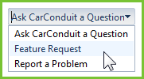
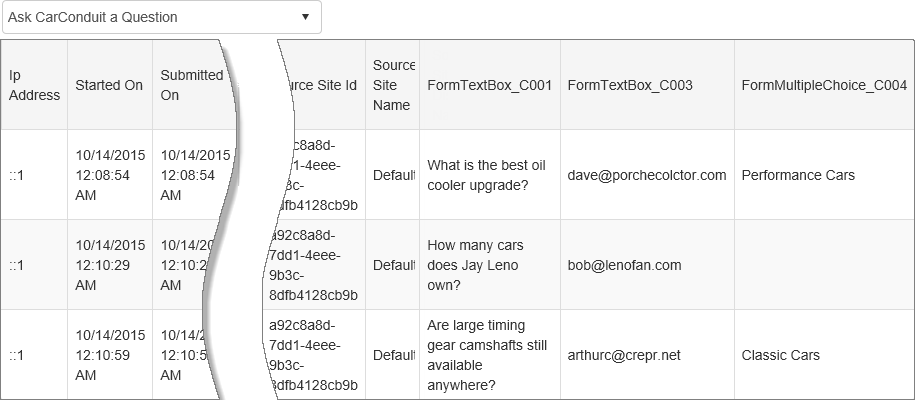
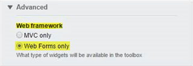
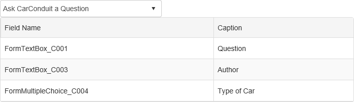
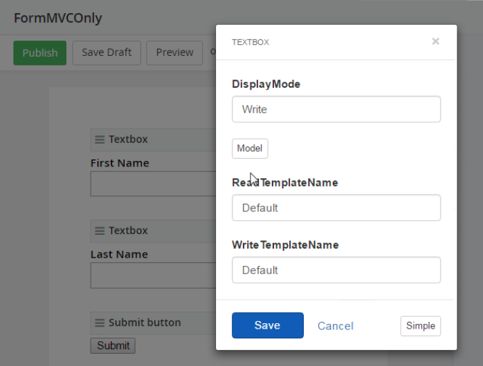

Working with Forms
------------------

To work with forms programmatically, use the *FormsManager*. The
FormsManager can retrieve lists of forms, a single form description and
all the entries for a form.

List All Forms
--------------

To list every form on your website, use the *GetForms()* method. The
method returns an *IQueryable* of *FormDescription* objects.

You can also bind the collection directly to ASP.NET controls. The
example below populates a *RadComboBox* with the names of each form.
Notice that the *DataValueField*, a string property, contains the string
representation of a Guid *Id* for a given form.

```
protected void Page_Load(object sender, EventArgs e)
{

    if (!IsPostBack)

    {

        FormsManager manager = FormsManager.GetManager();

        RadComboBox1.DataSource = manager.GetForms();

        RadComboBox1.DataTextField = "Title";

        RadComboBox1.DataValueField = "Id";

        RadComboBox1.DataBind();

    }
}
```

The screenshot below shows the titles for each form in a *RadComboBox*.



Get a Single Form
-----------------

You can use LINQ to filter Forms to access a specific member. If you
have the Guid, you can pass it to the *GetForm()* method.

```
protected void RadComboBox1_SelectedIndexChanged(object sender, Telerik.Web.UI.RadComboBoxSelectedIndexChangedEventArgs e)
{
    string id = RadComboBox1.SelectedValue;

    FormsManager manager = FormsManager.GetManager();

    FormDescription form = manager.GetForm(new Guid(id));

    // access the FormDescription Title and collection of Entries...
}
```

Get Form Entries
----------------

The forms Responses page stores entries from all the people that have
used the form and entered data. The *FormsManager.GetFormEntries()*
method gets this list of data. Pass a *FormDescription* to
*GetFormEntries()* to return a collection of *FormEntry* objects.

To get values from a single column, use the *FormEntry.GetValue()*
method and pass the name of the column. To use the GetValue() extension
method, be sure to add *Telerik.Sitefinity.Model* to your *using*
statements.

The example below iterates all form entries and retrieves the value for
a field named *FormTextBox_C001*. Both the form and field developer
names can be found by editing the form manually.

```
FormsManager manager = FormsManager.GetManager();

FormDescription form = manager.GetForms()

    .Where(f => f.Title.Equals("Ask CarConduit a Question"))

    .SingleOrDefault();

if (form != null)
{

    var entries = manager.GetFormEntries(form);

    foreach (var entry in entries)

    {

        var question = entry.GetValue("FormTextBox_C001").ToString();

        ListBox1.Items.Add(question);

    }

}
```

The list box displays the values for each entry.


Binding Form Entries
--------------------

You can bind a list of form entries directly to a control. The example
below binds a collection of FormEntry to the DataSource of a RadGrid.

```
FormsManager manager = FormsManager.GetManager();

FormDescription form = manager.GetForms()

    .Where(f => f.Title.Equals("Ask CarConduit a Question"))

    .SingleOrDefault();

if (form != null)

{

    RadGrid1.AutoGenerateColumns = true;

    RadGrid1.DataSource = manager.GetFormEntries(form);

    RadGrid1.DataBind();

}
```

This brings back information for each entry, including various Ids
associated with the entry, DateTime values, source keys, etc. The
dynamically created form entry fields are shown in the last columns on
the right, such as "FormParagraphTextBox_C003", that the actual user
entries are contained in.



Get Column Names and Captions
-----------------------------

What if I only want the show form entry field names and captions created
by user entry? You can extract both field names and labels from
form-control properties. The next sections show how it's done using Web
Forms only and MVC only web frameworks.

Web Forms Only Option
---------------------

The following example is designed for the *Web Forms Only* web framework
option. The MetaField and Title properties described below are not
exposed by the Form Manager's Form.Controls collection in MVC projects.



With a *FormDescription* you can spelunk into both the input *Controls*
and output *Entries* of the form. To get the field names
programmatically, parse the properties of the controls. The LINQ methods
below get:

-   The *MetaField* property that holds the field name used to access a
    particular column in code

-   The *Title* property that acts as a label that the user sees when
    entering data to the form.

The form control properties are both deep and somewhat variable, so
you'll need to make sure that the MetaField is not null. From there you
can get the *FieldName* from the MetaField property's child properties
collection.

```
private static IEnumerable GetFormColumns(FormDescription form)

{

    var result = form.Controls

        .Select(c => new

            {

                metaField = c.Properties.FirstOrDefault(p => p.Name.Equals("MetaField")),

                labelField = c.Properties.FirstOrDefault(p => p.Name.Equals("Title"))

            })

        .Where(c => c.metaField != null)

        .Select(c => new

            {

                FieldName = c.metaField

                    .ChildProperties

                    .FirstOrDefault(m => m.Name.Equals("FieldName")).Value, Caption = c.labelField == null ? String.Empty : c.labelField.Value

            });

    return result;

}
```

Here is an example result of GetFormColumns() bound to a grid:



MVC Only Option
---------------

In the MVC Only framework, the form fields *Model* property lets you
access metadata from Sitefinity Feather form widgets.

The Sitefinity MVC form fields all have a *Model* property, which has
its own collection of properties. The *Title* field returns the textbox
caption.



When using MVC Forms, you can use the *GetFormColumns()* method (below)
to retrieve a collection of names and captions from the form.

```
private static IEnumerable GetFormColumns(FormDescription form)
{

    var result = form.Controls.Select(c => new

        {

            metaField = c.Properties.FirstOrDefault(p => p.Name.Equals("Settings")) 
        })
        .Where(c => c.metaField != null)

        .Select(c => new

            {

                FieldName = c.metaField

                    .ChildProperties

                    .FirstOrDefault(m => m.Name.Equals("Model"))

                    .ChildProperties.FirstOrDefault(p => p.Name.Equals("MetaField"))

                    .ChildProperties.FirstOrDefault(p => p.Name.Equals("FieldName"))

                    .Value,

                Caption = c.metaField

                    .ChildProperties

                    .FirstOrDefault(m => m.Name.Equals("Model"))

                    .ChildProperties.FirstOrDefault(p => p.Name.Equals("MetaField"))

                    .ChildProperties.FirstOrDefault(p => p.Name.Equals("Title"))

                    .Value

            });

    return result;

}
```

Note that the *Caption* property is fetching the *Title* property, which
is on *MetaField*. In the Sitefinity backend, the value of Caption is
whatever you put in the form's *Label*. The other property, *FieldName*,
is the programmatic identifier for the field.

Delete Forms
------------

To delete a form, use the *FormsManager Delete()* method and pass the
FormDescription parameter. The example below iterates the list looking
for forms where the *Name* property contains the word \"test\" and
deletes each matching instance.

```
var manager = FormsManager.GetManager();

var forms = manager.GetForms().Where(f => f.Name.ToLower().Contains("test"));

foreach (var form in forms)

{

    manager.Delete(form);

}

manager.SaveChanges();
```