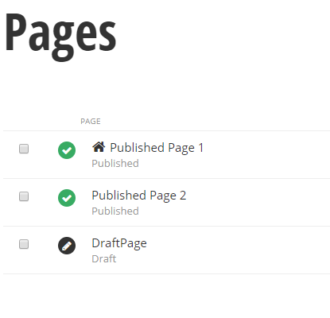
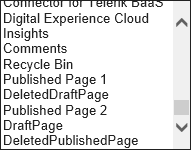

Working with Pages
------------------

The two key objects that describe Sitefinity pages are *PageNode* and
*PageData*. PageNode refers to the meta-data about the page container
itself, including the page name, description and title. The PageNode
also tracks its parent node and child nodes. Here are some key
properties used to filter lists of PageNode objects:

-   *IsBackend* indicates that the page is part of the administration
    backend, not a page presented to end users of the site.

-   *NodeType* describes the type of the page node. For example,
    *Standard* is a normal page displaying content, *Group* is a page
    without content that contains other pages, *External* is a page
    from the file system, *Deleted* is a page that has been sent to the Recycle bin and no longer available through the UI.

**PageData** is concerned with page presentation, the actual content of the
page. It tracks elements used to compose the page such as templates,
controls, personalization info, etc. Here are some key properties used
to filter lists of PageData:

-   *Status* is the current lifecycle state of the page such as *Master* or *Live* or *Temp*.

-   *Visible* indicates if the page is publicly viewable.

The PageData's *NavigationNode* property links a PageData object to a
PageNode. To traverse the other direction, use the PageNode's
*GetPageData()* method to return the PageData object.

Let's start with a raw list of PageData and filter it to show standard,
published pages. The screenshot below shows an example set of pages
where we have two published pages and one in draft status. In the
recycle bin, there is a published page and a draft page.

### List All Pages

To list all the pages in a Sitefinity website:

1.  Add a standard ASP.NET ListBox to the page.

\<asp:ListBox ID=\"ListBox1\" runat=\"server\"Height=\"300px\"\>\</asp:ListBox\>

2.  Add using references for *System.Linq* and *Telerik.Sitefinity.Modules.Pages* namespaces.

3.  In the code behind for the page, add the code below to the Page\_Load event handler.

> // get an instance of the PageManager
>
> PageManager manager = PageManager.GetManager();
>
> // get the list of all pages on your site
>
> var pages = manager.GetPageDataList();
>
> // bind the list
>
> ListBox1.DataSource = pages;
>
> ListBox1.DataTextField = \"Title\";
>
> ListBox1.DataBind();

The first step is to get the Sitefinity manager object for the part of
the API we\'re working with, such as *BlogsManager*, *EventsManager*,
*ContentManager* and so on. The manager object *GetManager()* method
returns a single manager instance that you can use to get, create and
delete the content type you're working with. In this example, the
PageManager *GetPageNodes()* method returns a list of PageNode objects
and binds the data to the list box.

Next, login to the Sitefinity backend, then navigate to
MyPageList.aspx.\
The list box displays all page titles from the site, including front and
backend pages, unpublished pages and deleted pages that are in the
recycle bin.

**Note**: Be sure to login to the Sitefinity back end before running the
example. The logged in user must have sufficient permissions to perform
the Sitefinity API operation. The screenshot shows a Sitefinity security
exception during the call to GetPageNodes() when the logged in user did
not have permission to view pages.

### List Frontend Pages

We can reduce the list drastically by filtering for only frontend pages.
Change the filtering to look at the *IsBackend* property of the
PageNode. Because the IsBackend property is available only on the
PageNode, use the PageData NavigationNode property to get there. The
LINQ methods in this example transform the list of PageData and create a
list of PageNode instead.

// get the list of frontend pages on your site

var pages = manager.GetPageDataList()

.Select(pd =\> pd.NavigationNode)

.Where(pageNode =\> pageNode.IsBackend == false);

Much better. Only frontend pages show in the list, but we still have
pages in draft status and deleted pages in the recycle bin.

### Ignore Pages in the Recycle Bin

To ignore deleted pages in the recycle bin, check for the *IsDeleted*
property. While you're at it, you can verify that only Standard pages
are shown (not Group, External, etc.) by looking at the *NodeType*
property.

// get the list of standard, frontend, undeleted pages on your site

var pages = manager.GetPageDataList()

.Select(pd =\> pd.NavigationNode)

.Where(p =\>

p.NodeType == NodeType.Standard &&

p.IsBackend == false &&

p.IsDeleted == false);

The list includes the two published front-end pages, but stills shows a
draft page.

### List Only Published Pages

To only look at published pages, filter on the PageData *Status*
property. Verifying that the Status is *Live* works for most situations
but will not return published pages that have a newer draft version. To
deal with that issue, check that the Status is either Live *OR*, that
Status is *Master* *AND* *Visible* is true.

// get the list of published, standard, frontend, undeleted pages

var pages = manager.GetPageDataList()

.Where(pd =\>

pd.Status == ContentLifecycleStatus.Live \|\|

pd.Status == ContentLifecycleStatus.Master &&

pd.Visible == true)

.Select(pd =\> pd.NavigationNode)

.Where(p =\>

p.NodeType == NodeType.Standard &&

p.IsBackend == false &&

p.IsDeleted == false);

This version has only the published, standard, frontend pages that
haven't been deleted. This example may be overkill for your purpose, but
you can borrow the logic you need to slice-and-dice pages to get
whatever you need.

### Create Pages Programmatically

Creating standard Sitefinity pages involves the following steps:

1.  Get a *PageManager* instance.

2.  Get a parent PageNode that your page will appear under. The
    PageManager *GetPageNode(id)* method will return a PageNode for a
    given PageNode Id. If there's no existing page yet or you want the
    page to appear at the root, the
    *SiteInitializer.CurrentFrontendRootNodeId* property can be used to
    establish the parent.

3.  Call the manager's *CreatePage()* method to create a brand new
    PageNode object. CreatePage() takes the parent PageNode, a new Guid
    to act as the page's id, and the type of page you want to create
    (Standard, Group, etc.).

4.  Assign PageNode properties such as *Title* and *UrlName*. Most
    importantly, assign *Published* to the *ApprovalWorkflowState*
    property.

5.  Call the PageNode *GetPageData()* method to retrieve the PageData
    object that relates to the PageNode.

6.  Assign properties of the PageData object, like the *HtmlTitle*. Be
    sure to set *Visible* to true.

### Create a Minimal Page

Before coding the page creation logic, first add the following references:

using System.Linq; // slice-and-dice collections

using Telerik.Sitefinity.Abstractions; // supports SiteInitializer

using Telerik.Sitefinity.Modules.Pages; // supports PageManager

using Telerik.Sitefinity.Pages.Model; // supports PageNode, PageData,
NodeType

using Telerik.Sitefinity.Security; // Sitefinity authentication

The properties assigned in the example below are about the fewest you
can get away with. This is a starting point so you can experiment with
to understand how the properties here relate to the Title and Properties
settings of the page.

var name = \"MyPage\";

var id = Guid.NewGuid();

PageManager manager = PageManager.GetManager();

// get the root parent of the page hierarchy

PageNode parent = manager.GetPageNode(SiteInitializer.CurrentFrontendRootNodeId);

// Create a new PageNode at the root level

PageNode pageNode = manager.CreatePage(parent, id, NodeType.Standard);

// name used programmatically

pageNode.Name = name.ToLower();

// displayed in the \"Name\" for the page

pageNode.Title = name;

pageNode.UrlName = \"url-\" + name.ToLower();

// publish the page when changes are saved

pageNode.ApprovalWorkflowState = \"Published\";

// get the PageData object related to the PageNode

PageData pageData = pageNode.GetPageData();

// populate minimal properties

pageData.HtmlTitle = name + \" Title for search engines\";

pageData.Visible = true;

// make it happen!

manager.SaveChanges();

After creating the page, look at the Title and Properties dialog. It
displays the *PageNode.Title* under the Name section. Also notice that
*At Top Level* is selected because the page is at the root of the site.
The URL section contains the value from *PageNode.UrlName*. *Show in
navigation* is enabled by default as of this writing. Consider making
the *PageNode.ShowInNavigation* assignment explicit in your code. The
*PageData HtmlTitle* property shows up in the *Title for search engines*
section.

### URL Naming Rules

When you enter page names when creating pages manually, you may notice
that invalid characters are cleaned up automatically. This is gratis of
a regular expression replacement function built into Sitefinity. You can
see the expression for yourself from the advanced Administration
Settings at:

ContentView \> Controls \> FrontendPages \> Views \> FrontendPagesEdit
\> Sections \> MainSection \> Fields \> UrlName

The expression is stored under *RegularExpressionFilter*. Any character
that is not a Unicode letter, an exclamation mark, dollar sign, dash,
parenthesis, apostrophes, equal sign, asterisk, digits or underscore, is
replaced with a dash. The names are also converted to lower case during
the process.

So a page named "My Other\^+\#\~Page" becomes "my-other-page".

To get the same effect in your own code, use the *Regex* object from the
*System.Text.RegularExpressions* namespace to replace invalid characters
with a dash.

pageNode.UrlName = Regex.Replace(name.ToLower(),

@\"\[\^\\w\\-\\!\\\$\\\'\\(\\)\\=\\@\\d\_\]+\", \"-\");

### Add Description and Keywords to a Page

The page *Description* and *Keywords* fields are populated by assigning
PageData properties. The assignments in the code example below
correspond to the screenshot.

pageData.Description = \"Goes to the Description area of the page\";

pageData.Keywords = \"Lino,Telerik,Sitefinity,API\";

### Add Advanced Options to a Page

The screenshot below shows a subset of the *Advanced options* area.

The PageData *EnableViewState* property selects the corresponding check
box, the *IncludeScriptManager* property controls the *Include
RadScriptManager* checkbox and the *HeadTagContent* is added under the
*HTML included in the \<head\> tag* label.

pageData.EnableViewState = true;

pageData.IncludeScriptManager = true;

pageData.HeadTagContent = \"http-equiv=\'refresh\' content=\'30\'\";

### Add a Template to a Page

To select a page template, you can use the PageManager *GetTemplates()*
method to get all templates, and then filter with LINQ methods to get a
template you'd like to use.

pageData.Template = manager.GetTemplates()

.Where(t =\> t.Title.Equals(\"Left Sidebar, Content\"))

.FirstOrDefault();

### Create a Group Page

Group pages act as containers for pages but have no content or page
presentation in themselves. Creating a group page requires a PageNode
(meta-data) but no PageData (presentation).

The code example below calls the *CreatePage()* method passing a
*NodeType* parameter of *Group*. The *ApprovalWorkflowState* property
relates to content workflow, so you don't need to set it for group
pages.

// create a group page at the root of the site

var id = Guid.NewGuid();

var name = \"Partners\";

PageManager manager = PageManager.GetManager();

PageNode parent = manager.GetPageNode(SiteInitializer.CurrentFrontendRootNodeId);

PageNode pageNode = manager.CreatePage(parent, id, NodeType.Group);

pageNode.Name = name;

pageNode.Title = name;

pageNode.UrlName = name;

Use the PageNode returned by CreatePage() as the parent of child pages.
The code below creates a new standard page under the group page.

// create a child page under the group page

var childId = Guid.NewGuid();

name = \"Child\";

PageNode childNode = manager.CreatePage(pageNode, childId,
NodeType.Standard);

childNode.Name = name;

childNode.Title = name;

childNode.ApprovalWorkflowState = \"Published\";

PageData childData = childNode.GetPageData();

childData.HtmlTitle = name + \" Title for search engines\";

childData.Visible = true;

manager.SaveChanges();

A simplified look at the group page Title and Properties dialog shows
the key change. The *Use this page only to group other pages* checkbox
is selected.

The backend Pages listing shows the new group page and its child page.
The group page has no actions to view or publish because it has no
content.

The navigation widget below shows both the group and child pages.
Clicking on the group page navigates to content for the child page.

To list group pages, filter a list of PageNode where the NodeType is
Group. See the next section [Filtering on Transient
Properties](#filtering-on-transient-properties) for information on
optimizing this query.

var pages = manager.GetPageNodes().ToList()

.Where(p =\>

p.NodeType == NodeType.Group &&

p.IsBackend == false &&

p.IsDeleted == false

);

### Filtering on Transient Properties

In the previous example, Create a Group Page, the code example calls the *ToList()* method before filtering. ToList()
forces all the data to be retrieved, so why call this?

The *IsBackend* property of *PageNode* is tagged as a *Transient*
attribute. Transient indicates that the property is not persisted in the
database, but is populated at a later time from other data in the table.
When GetPageNodes() is called, IsBackend is not viable just yet.
Filtering on IsBackend generates an error:

> "Identifier \'IsBackend\' is not a parameter or variable or field of
> \'Telerik.Sitefinity.Pages.Model.PageNode\'. If \'IsBackend\' is a
> property, please add the FieldAlias or Storage attribute to it or
> declare it as a field\'s alias."

Calling *ToList()* or *AsEnumerable()* forces the property to be
populated. If you have lots of objects and are concerned with
performance, use IQueryable as long as you can to cut down the query's
scope, then bring back the data and perform any final filtering
involving transient properties. The example below first returns an
*IQueryable\<PageNode\>* for standard, undeleted pages. *ToList()*
converts the query to a *List\<PageNode\>* where IsBackend can be
filtered.

var pages = manager.GetPageNodes()

.Where(p =\>

p.NodeType == NodeType.Standard &&

p.IsDeleted == false)

.Select(p =\> p)

.ToList()

.Where(p =\> p.IsBackend == false);

Redirecting to Other Pages
--------------------------

Sitefinity can redirect to other pages by using one of these NodeTypes:

-   *InnerRedirect* is used to link out to pages inside of Sitefinity
    and has no content of its own. Assign the *PageNode LinkedNodeId* to
    the id of the target page.

-   *OuterRedirect* links to a page completely outside of the Sitefinity
    site. Assign the page's address to the *PageNode RedirectUrl*
    property.

To redirect from one page to another, first get the node of the target
Sitefinity page. In the example below, the page is titled "Company". If
the page exists, then create a new PageNode with the *NodeType* property
of *InnerRedirect*. Finally, assign the target page's id to the
*LinkedNodeId* property.

// get the page we want to link to

PageNode targetPageNode = manager.GetPageNodes()

.Where(p =\>

p.Title == \"Company\" &&

p.NodeType == NodeType.Standard &&

p.IsDeleted == false)

.Select(p =\> p)

.ToList()

.Where(p =\> p.IsBackend == false)

.SingleOrDefault();

if (targetPageNode != null)

{

// create the redirect page

var id = Guid.NewGuid();

PageNode parent =

manager.GetPageNode(SiteInitializer.CurrentFrontendRootNodeId);

PageNode pageNode = manager.CreatePage(parent, id,

NodeType.InnerRedirect);

pageNode.Name = \"aboutUs\";

pageNode.Title = \"About Us\";

pageNode.UrlName = \"about-us\";

pageNode.LinkedNodeId = targetPageNode.Id;

pageNode.ApprovalWorkflowState = \"Published\";

manager.SaveChanges();

}

The screenshot below shows a simplified view of the Title and Properties
for the resulting page. The URL is "about-us", and that the page
redirects to "Company".

Redirecting to an external page is relatively simple in comparison. You
only have to set the NodeType parameter of CreatePage() to
*OuterRedirect* and then assign the node's *RedirectUrl* property.

var id = Guid.NewGuid();

PageManager manager = PageManager.GetManager();

PageNode parent =
manager.GetPageNode(SiteInitializer.CurrentFrontendRootNodeId);

PageNode pageNode = manager.CreatePage(parent, id, NodeType.OuterRedirect);

pageNode.Name = \"linotadrosblogsite\";

pageNode.Title = \"Lino Tadros Blog site\";

pageNode.UrlName = \"lino-tadros-blog-site\";

pageNode.RedirectUrl = \"http://www.linotadros.com\";

pageNode.ApprovalWorkflowState = \"Published\";

manager.SaveChanges();

Show Page Hierarchy
-------------------

Each PageNode has an *Id* Guid property that identifies it and a
*Parent* property that itself is a PageNode. Using the manager\'s
*GetPageNodes()* method we can retrieve the nodes for all the pages in
the web site and display them as a tree. The example below displays page
titles in a RadTreeView control.

1.  Drag a *RadTreeView* from the Toolbox onto an ASP.NET page.

2.  In the *Page\_Load* event handler, add the code below. There are a
    few things to note in the example below. We aren\'t handling
    security directly in this example, so we need to set the
    *SuppressSecurityChecks* property true to avoid security exceptions.
    The *Select()* clause projects the elements of the *PageNode* into
    something more compatible with the *RadTreeView*. RadTreeView
    expects a *DataFieldID* for the current node and a
    *DataFieldParentID* to point at the id for its parent. For root
    nodes, the *PageNode.Parent* object is null, so we check for that
    and pass *Guid.Empty* in those cases.

3.  Don't forget to add an \<asp:ScriptManager runat=\"server\"\>\</asp:ScriptManager\> in the MyPagesList.aspx for this RadTreeView to work correctly.

protected void Page\_Load(object sender, EventArgs e)

{

PageManager manager = PageManager.GetManager();

manager.Provider.SuppressSecurityChecks = true;

var list = manager.GetPageNodes()

.ToList()

.Select(p =\> new

{

Id = p.Id,

ParentId = p.Parent == null ? Guid.Empty : p.Parent.Id,

Title = p.Title

});

RadTreeView1.DataSource = list;

RadTreeView1.DataTextField = \"Title\";

RadTreeView1.DataFieldID = \"Id\";

RadTreeView1.DataFieldParentID = \"ParentId\";

RadTreeView1.DataBind();

}

Run the example project. Pages defined in your site should show up in a
tree layout. You can refine the query to only return front end pages or
provide other filtering.

Add Widgets to a Page
---------------------

Adding controls to the page at runtime involves the following steps:

-   Get the PageData of the page you want to add widgets to.

-   Get a reference to the template placeholder where the widget will be placed.

-   Get a draft of the page for editing.

-   Create a widget object, such as NewsView.

-   Create a PageDraftControl to join the widget and the placeholder together.

-   Add the PageDraftControl to the page draft's Controls collection.

-   Publish and save changes.

The first step is to get the PageData of the target page.

PageManager manager = PageManager.GetManager();

manager.Provider.SuppressSecurityChecks = true;

// get the target page

PageNode pageNode = manager

.GetPageNodes().ToList()

.Where(p =\>

p.Title.Equals(\"Latest News\") &&

p.IsBackend == false)

.FirstOrDefault();

PageData pageData = pageNode.GetPageData();

The next step is to locate the exact target on the page where the widget
will be placed. When you add a content widget to a page manually, you
actually drop a widget on a page template placeholder. For example, you
might drag a News widget to the "Content" placeholder of a page that
uses the Right Sidebar, Header Footer template (see screenshot below).

The *PageData Template* property *Controls* elements roughly correspond
to rows in a template. Each row has a *Caption* and a *PlaceHolders*
array that contains the areas where controls are dropped. For example,
you can retrieve the middle row of the template shown above and grab the
"Content" placeholder from it.

var sideBarAndContentControl = pageData.Template.Controls

.Where(c =\> c.Caption == \"Sidebar + Content\")

.SingleOrDefault();

var contentPlaceholder = sideBarAndContentControl.PlaceHolders\[0\];

Next, get a draft of the page that you can edit.

The PageManager *EditPage()* method takes the *Id* of the PageData
object. You could also use the PageNode's *PageId* property. The
EditPage() methods returns a PageDraft.

PageDraft page = manager.EditPage(pageData.Id);

Create a widget object.

var newsWidget = new NewsView();

Call the PageManager's CreateControl method to create a
*PageDraftControl* instance. The PageDraftControl joins the widget and
placeholder. You also can set the control's *Caption* that displays in
the designer. The PageManager's *SetControlDefaultPermissions()* method
grants a basic set of permissions required to use the widget, for
example, permission for everyone to view the control, but modification
only allowed by the owner.

var control = manager.CreateControl\<PageDraftControl\>(newsWidget,
contentPlaceholder);

control.Caption = \"News Widget\";

Finally, add the control to the page draft's Controls collection,
publish the draft and save the changes.

page.Controls.Add(control);

manager.PublishPageDraft(page);

manager.SaveChanges();

After the code executes, you can see the News Widget in the design view
of the page.

{width="6.5in" height="3.057407042869641in"}

The complete code listing:

PageManager manager = PageManager.GetManager();

manager.Provider.SuppressSecurityChecks = true;

// get the target page to add content to

PageNode pageNode = manager

.GetPageNodes().ToList()

.Where(p =\>

p.Title.Equals(\"Latest News\") &&

p.IsBackend == false)

.FirstOrDefault();

PageData pageData = pageNode.GetPageData();

var sideBarAndContentControl = pageData.Template.Controls

.Where(c =\> c.Caption == \"Sidebar + Content\")

.SingleOrDefault();

var contentPlaceholder = sideBarAndContentControl.PlaceHolders\[0\];

// allow the page to be edited.

PageDraft pageDraft = manager.EditPage(pageData.Id);

// get a news widget to display on the page

var newsWidget = new NewsView();

// create a control to contain the widget

var control = manager.CreateControl\<PageDraftControl\>(newsWidget,
contentPlaceholder);

control.Caption = \"NewsWidget\";

// add control to the page draft controls collection

pageDraft.Controls.Add(control);

// publish the page draft and save

manager.PublishPageDraft(pageDraft);

manager.SaveChanges();